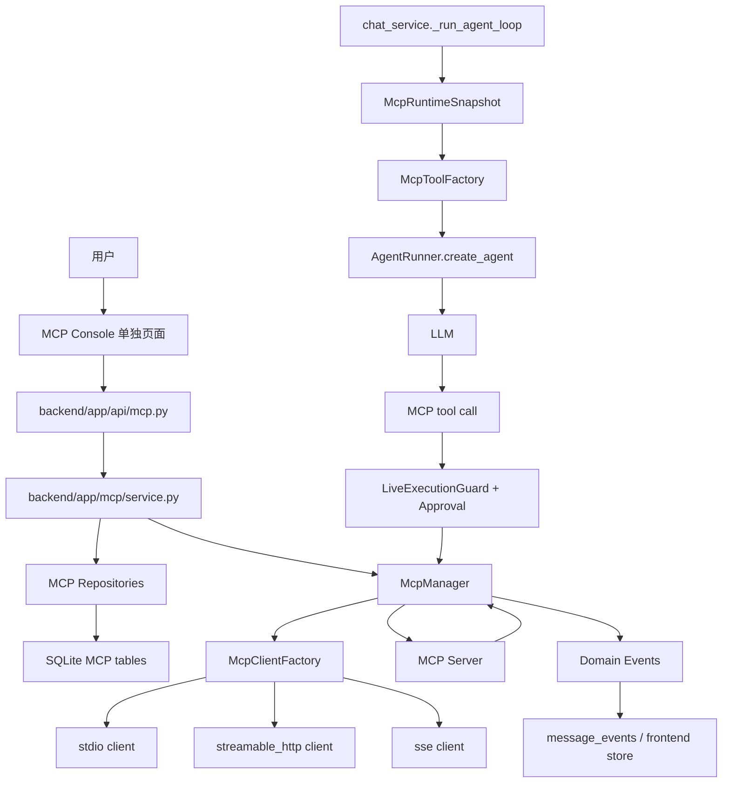
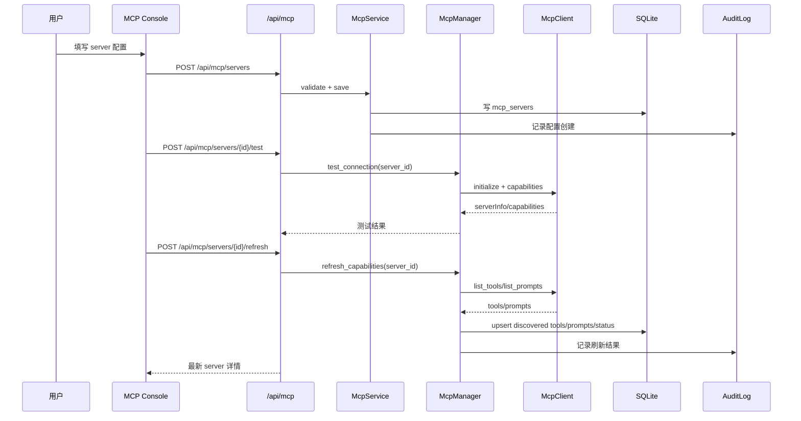
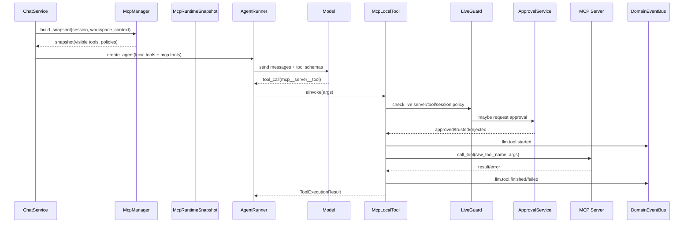
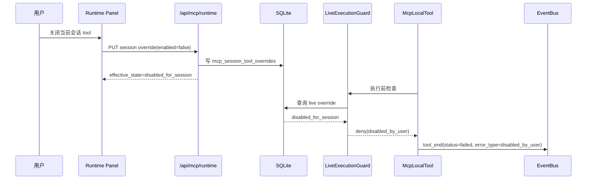
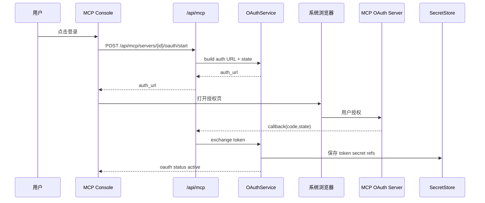
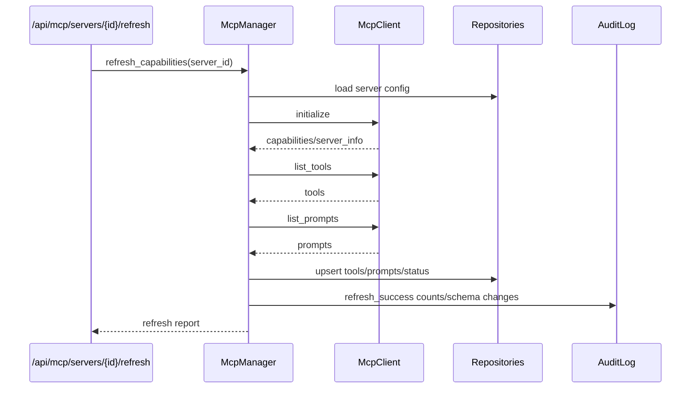
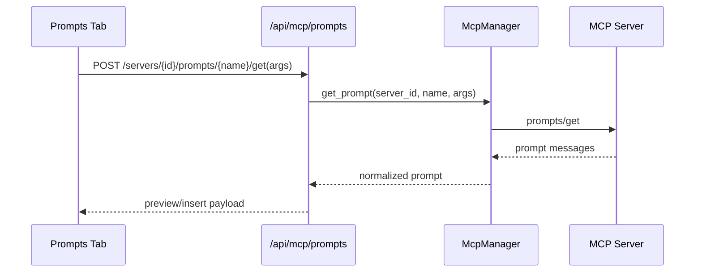
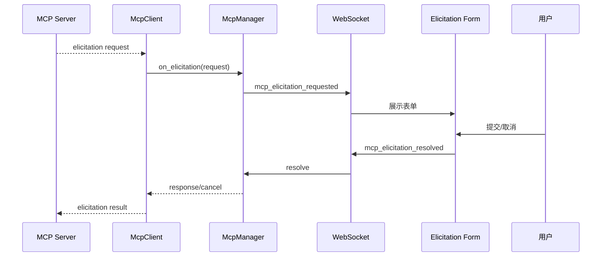
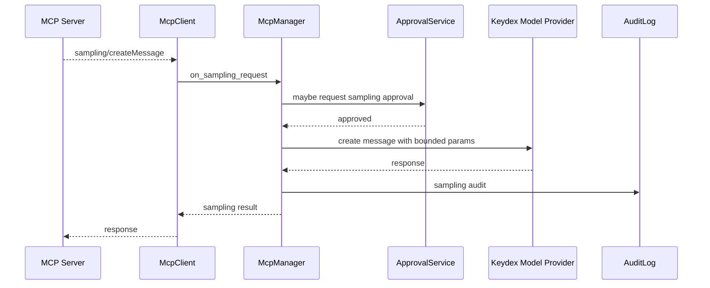

# DES-20260704-001-MCP运行时

| 字段 | 值 |
|------|-----|
| 文档编号 | DES-20260704-001-MCP运行时 |
| 关联需求 | 用户对话需求：基于前期 MCP 方案讨论结论与本轮 5 点决策产出完整 MCP 设计 |
| 创建日期 | 2026-07-04 |
| 负责人 | Codex |
| 状态 | 草稿 |
| 最后更新 | 2026-07-04 |
| 需求类型 | 混合型：MCP 外部能力接入 + Agent Runtime 机制改造 + 前端管理页 |

---

## 一、概述与阅读导航

### 1.1 设计目标

本设计用于在 Keydex 中实现完整成熟的 MCP Client Runtime。目标不是只让后端能调用一个 MCP tool，而是把 MCP 作为 Keydex Agent Runtime 的一等外部能力层：全局配置、连接生命周期、能力发现、工具暴露、工具执行、Prompts、Elicitation、Sampling、OAuth/密钥、审批与信任、运行时开关、审计日志、导入导出、单独管理页面、端到端测试全部形成闭环。

本 DES 明确覆盖前期 MCP 方案讨论中已确认的能力点，并以本轮最新决策覆盖其中早期不再采用的建议：

| 决策项 | 最新结论 |
|--------|----------|
| 实现目标 | 一期除 `resources` 实际读取/暴露外，其余按完整成熟方案实现，不做最小纵切、不做隐式降级、不做临时桥接 |
| 配置作用域 | MCP Server 配置是全局配置，不按 workspace 或 project 持久归属 |
| 工具默认策略 | 参考 Codex：默认 server enabled 后所有通过过滤和 model visibility 的 tools 可见，审批默认 `Auto`，由 annotations/risk 决定是否询问 |
| Resources | 一期只预留数据模型、接口边界和 runtime 扩展点；不向模型暴露 resource tools，不在 UI 提供可执行读取入口 |
| 前端页面 | 单独 MCP 页面，不塞进现有普通设置项或扩展页 |

### 1.2 需求来源

| 来源 | 说明 |
|------|------|
| 前期 MCP 方案讨论结论 | 已汇总 Codex、kt-agent-framework、Keydex 三方对比、后端设计、API、审批、前端设置页、运行时面板、tool 级开关、配置页面字段、风险与实施建议 |
| 本轮用户确认 | 明确一期做完整成熟方案；全局配置；默认策略参考 Codex；resources 只预留；单独页面；除 resources 外不做 MVP、降级、临时策略 |
| Keydex 当前代码 | `D:\Pycharm Projects\keydex` 当前仓库，尚无 MCP 代码，需要接入现有工具、审批、事件、设置和前端运行时 |
| Codex 参考项目 | `D:\Pycharm Projects\codex`，主要借鉴 MCP 配置模型、连接管理、runtime snapshot、工具过滤/命名、审批 Auto 规则、resources handler、app-server 管理接口 |
| kt-agent-framework 参考项目 | `D:\Pycharm Projects\kt-agent-framework`，主要借鉴 MCP server/tool 落库、刷新/轮询、错误分类、运行时装配、lazy tool/search_tools 机制和管理 API 形态 |

### 1.3 范围边界

#### 本次设计覆盖

- MCP 全局 Server 配置管理。
- `stdio`、`streamable_http`、`sse` 三类 transport 的正式支持。
- headers、env reference、secret reference、Bearer Token Env、OAuth 授权与凭据状态。
- Tools discovery、schema 规范化、model-visible name 生成、allowlist/denylist、tool 级策略。
- Prompts discovery、prompt 参数、prompt materialization、手动使用和 Agent 可选择使用的策略。
- Elicitation：MCP server 向用户请求输入时，通过 Keydex 前端生成表单并回传结果。
- Sampling：MCP server 请求模型采样时，按 server 策略、审批、模型调用预算和审计执行。
- Runtime Snapshot：每轮 Agent 运行固定一份 MCP 工具视图。
- Live Execution Guard：用户在运行时关闭 tool/server 后，后端执行前再次拦截。
- MCP Tool Execution：调用、超时、取消、结果截断、错误分类、事件投影。
- 审批、风险分类、信任规则、审批记忆和审计。
- Runtime Panel：当前会话 MCP server/tool 有效状态、会话级开关和正在运行调用。
- 单独 MCP Console 页面：server 列表、连接配置、tools、prompts、审批与信任、运行策略、日志、导入导出。
- REST API、WebSocket payload、前端 TypeScript 协议类型。
- 数据库 DDL 和迁移边界。
- 单元测试、功能/集成测试、E2E 测试全覆盖设计。

#### 本次明确不做

- 不实现 `resources` 的实际 list/read 调用，不向模型注册 `list_mcp_resources`、`list_mcp_resource_templates`、`read_mcp_resource`。
- 不把 MCP 配置挂到 workspace 或 project 作为持久所有权；workspace 只作为 runtime context。
- 不以 `langchain_mcp_adapters.MultiServerMCPClient` 作为 Keydex 的核心 runtime 主体；它只能作为参考或测试辅助。
- 不用 settings 表保存全部 MCP 配置；MCP 有状态、策略、审计和发现结果，需要独立表。
- 不把 MCP 审批伪装成命令审批；需要独立的 approval kind 和 payload。
- 不做用户不可见的静默 fallback；server/tool 不可用必须有状态、原因和审计。

### 1.4 设计原则

- Runtime 主权在 Keydex：MCP tool 可以包装成 LangChain tool，但连接、策略、审批、状态和事件由 Keydex 掌控。
- 全局配置，局部上下文：server 配置全局持久，workspace/session 只提供 cwd、roots、session id、用户输入和会话级 override。
- Snapshot 保证一致性：模型每轮看到的 tool inventory 固定；启用新 tool 下一轮生效，禁用 tool 立即由 live guard 阻断。
- Tool 可见性和审批分离：启用/可见不等于自动执行，approval/trust 另行判断。
- Codex 风格默认策略：默认所有 model-visible tools 可见，审批默认 Auto；Auto 由 annotations 和风险判断触发审批。
- 显式错误和审计：连接失败、认证失败、schema 变化、审批拒绝、用户禁用、取消都要有明确状态。
- 不泄露密钥：secret 不回显、不进日志、不进 trace、不进导出。
- UI 单独成面：MCP 是运行时能力和安全边界，不是普通扩展开关。

### 1.5 阅读建议

先阅读第二章建立整体链路，再看第三章的代码依据与借鉴矩阵。第四章按功能点详细展开，可以直接转成后续 dev-plan Issue。第五章汇总接口、库表、配置和协议。第六章是测试合同的来源，拆执行任务时必须逐项保留。

---

## 二、需求整体总览视图

### 2.1 总体架构图



说明：

- MCP Console 负责长期全局配置和策略，不负责每轮 tool schema 的直接拼装。
- `McpManager` 是全局生命周期管理器，持有 server 状态、连接池、刷新任务、调用入口。
- 每轮 Agent 运行时由 `chat_service._run_agent_loop` 请求 `McpManager` 生成 `McpRuntimeSnapshot`，并将 MCP tools 与本地 tools 一起传给 `AgentRunner.create_agent`。
- 模型调用 MCP tool 前，后端不只相信 snapshot，还要走 live guard、审批、信任规则、tool/server 当前状态。
- 所有 MCP 调用继续走 Keydex 现有 tool lifecycle 事件，前端复用 tool card，但 metadata 标记为 MCP。

### 2.2 关键链路总览

#### 2.2.1 新建/测试/刷新 Server



#### 2.2.2 Agent 运行与 MCP Tool 调用



#### 2.2.3 运行中禁用 Tool



### 2.3 功能点总表

| 编号 | 功能点 | 目标 | 关键参与模块 | 关键数据/状态 | 需要详细时序 |
|------|--------|------|--------------|----------------|--------------|
| F01 | 全局数据模型与迁移 | 为 server、tools、prompts、策略、状态、审计、snapshot 建立持久基础 | `backend/app/storage/db.py`、新增 MCP repositories | MCP tables、索引、状态字段 | 是 |
| F02 | MCP Manager 与客户端生命周期 | 统一管理连接、刷新、调用、取消、状态 | `backend/app/mcp/manager.py`、`client.py` | client state、connection status | 是 |
| F03 | Transport 支持 | 正式支持 stdio、streamable_http、sse | `McpClientFactory` | transport config、timeouts | 是 |
| F04 | Auth、Secret 与 OAuth | 安全管理 headers、env、secret、OAuth | `auth.py`、`secret_store.py`、API | secret refs、oauth tokens | 是 |
| F05 | 能力发现与刷新 | 发现 tools/prompts，预留 resources | `McpDiscoveryService` | discovery revision、schema hash | 是 |
| F06 | Tool 命名、过滤与默认策略 | 生成稳定 model name，按 Codex 默认策略暴露 | `naming.py`、`policy.py` | raw/model name、allow/deny | 是 |
| F07 | Runtime Snapshot | 每轮固定 tool inventory | `runtime.py`、`chat_service.py` | snapshot id、visible tools | 是 |
| F08 | Agent 集成与工具包装 | 将 MCP tool 接入现有 LangChain agent | `tools.py`、`runner.py` | `McpLocalTool`、metadata | 是 |
| F09 | 直接注入预算与能力目录 | 支持工具多时通过预算外优先白名单直接注入，其余经统一能力发现入口按需激活 | `exposure.py`、`discover_mcp_tools` | direct budget、priority whitelist、capability directory、active window | 是 |
| F10 | Tool 调用、超时、取消、截断 | 成熟执行 MCP tool 并稳定投影事件 | `execution.py`、event processor | call audit、result status | 是 |
| F11 | 审批、风险与信任 | 参考 Codex Auto 审批并扩展 Keydex 通用审批 | `approval.py`、frontend approval card | risk、trust rules | 是 |
| F12 | Prompts | 支持发现、查看、参数化和手动/Agent 使用 | `prompts.py`、MCP Console | prompt schema、policy | 是 |
| F13 | Elicitation | MCP server 请求用户输入时暂停 tool call 并回传 | `elicitation.py`、WebSocket | pending elicitation | 是 |
| F14 | Sampling | MCP server 请求模型采样时按策略执行 | `sampling.py`、model provider | sampling policy、audit | 是 |
| F15 | Resources 预留 | 保留 resource 能力边界但一期不执行 | `resources.py` 占位接口、DDL 字段 | reserved state | 否 |
| F16 | Runtime Panel 会话级开关 | 当前会话临时启停 tool/server | frontend runtime panel、API | session overrides、live denylist | 是 |
| F17 | MCP Console 单独页面 | 完整管理 server/tools/prompts/policy/log/import-export | desktop settings/router/runtime API | UI state、forms | 是 |
| F18 | 审计、日志与状态 | 记录配置、刷新、调用、审批、错误 | audit repository、status events | audit rows、status codes | 是 |
| F19 | 导入导出 | 支持 JSON、Codex config、Claude Desktop config 导入导出 | import/export service | import report、secret policy | 是 |
| F20 | 测试基建 | 提供 mock MCP server、fixtures、E2E 场景 | backend tests、desktop tests、Playwright | deterministic fixtures | 否 |

### 2.4 核心设计总览

| 设计主题 | 结论 | 原因 |
|----------|------|------|
| 配置作用域 | 全局持久配置 | 用户已确认 workspace 或 project 概念弱，配置归属不好管理 |
| 运行上下文 | workspace/session 只作为 runtime context | stdio cwd、roots、session id 需要动态注入，但不拥有配置 |
| 默认工具策略 | Codex-like：默认 visible，审批 `Auto` | Codex 源码默认 `AppToolApproval::Auto`，`enabled_tools` 为空表示无 allowlist |
| Resources | 预留，不实现执行 | 用户明确一期 resources 可不实现但要预留 |
| 前端形态 | 单独 MCP Console 页面 | MCP 涉及安全、凭据、运行时能力，不适合藏在普通设置 |
| 核心 runtime | 自研 `McpManager` | kt-agent adapter 形态不足以覆盖 snapshot、approval、elicitation、sampling、状态 |
| 事件复用 | 复用 Keydex tool lifecycle | Keydex 已有 `LLM_TOOL_*` 到前端 `tool_start/tool_end` 的通道 |
| 审批模型 | 新增 MCP approval kind | 现有 command approval payload 语义不足 |

---

## 三、项目现状分析与设计约束

### 3.1 技术栈概览

| 层级 | 当前技术 | 依据 |
|------|----------|------|
| 后端运行时 | Python + FastAPI + Pydantic + LangChain + SQLite | `requirements.txt:3-8`、`pyproject.toml:14-19`、`backend/app/main.py:48` |
| 后端测试 | pytest + pytest-asyncio | `requirements.txt:12-13`、`pyproject.toml:27-28` |
| 前端 | React 19 + Vite + Tauri 2 + lucide-react | `desktop/package.json:29-43` |
| 前端测试 | Vitest + Testing Library + Playwright | `desktop/package.json:48-63` |
| 当前工具系统 | `ToolRegistry` + `LocalTool`/`FunctionTool` + LangChain tool adapter | `backend/app/tools/base.py:39`、`backend/app/tools/base.py:166`、`backend/app/tools/registry.py:12`、`backend/app/agent/langchain_tools.py:98` |
| 当前事件系统 | DomainEvent -> ChatAction/ReplayAction -> frontend store | `backend/app/events/event_types.py:32-38`、`backend/app/events/chat_projection.py:19-24`、`desktop/src/renderer/stores/agentSessionStore.ts:164-177` |
| 当前审批 | command 专用审批 | `backend/app/command_approval.py:193`、`desktop/src/types/protocol.ts:272-300` |

### 3.2 Keydex 当前相关模块

```text
D:\Pycharm Projects\keydex
├── backend/app/main.py
├── backend/app/api/
├── backend/app/services/chat_service.py
├── backend/app/agent/runner.py
├── backend/app/agent/langchain_tools.py
├── backend/app/tools/
├── backend/app/events/
├── backend/app/storage/
├── backend/tests/
├── desktop/src/runtime/
├── desktop/src/types/protocol.ts
├── desktop/src/renderer/pages/settings/
├── desktop/src/renderer/stores/agentSessionStore.ts
└── desktop/tests/
```

| 现有模块 | 位置 | 当前行为 | 本次设计关系 |
|----------|------|----------|--------------|
| FastAPI app 初始化 | `backend/app/main.py:48`、`backend/app/main.py:112`、`backend/app/main.py:187-198` | 创建 repositories、静态 tool registry、注册 routers | 新增 `app.state.mcp_manager`，注册 `/api/mcp` |
| Tool 抽象 | `backend/app/tools/base.py:39`、`backend/app/tools/base.py:166` | 定义工具上下文和函数工具 | 新增 `McpLocalTool` 复用工具执行协议 |
| Tool registry | `backend/app/tools/registry.py:12`、`backend/app/tools/factory.py:12` | 创建静态默认工具集合 | MCP tools 不写死进默认 registry，而是在每轮 snapshot 后动态合并 |
| LangChain adapter | `backend/app/agent/langchain_tools.py:98` | 将 Keydex 工具转 LangChain tool | MCP tool 最终仍复用该适配层 |
| Agent 创建 | `backend/app/agent/runner.py:69` | 基于 registry 创建 agent | 扩展 `create_agent` 输入，接收 snapshot 生成的动态 tools |
| Chat 主链路 | `backend/app/services/chat_service.py:1382`、`backend/app/services/chat_service.py:1507` | 每轮构建 `ToolExecutionContext`，workspace session 启用工具 | 在 `_run_agent_loop` 中生成 `McpRuntimeSnapshot`，只在 workspace session 注入 MCP |
| 事件投影 | `backend/app/agent/event_processor.py:154-203`、`backend/app/events/chat_projection.py:19-24` | tool start/end/approval 投影到前端 | MCP tool 复用事件，payload 增加 `mcp` metadata |
| 审批服务 | `backend/app/command_approval.py:193-271` | 命令审批请求和等待决策 | 抽象/新增 MCP approval service，不能直接伪装成命令审批 |
| 前端协议 | `desktop/src/types/protocol.ts:85-123`、`desktop/src/types/protocol.ts:445-450` | approval/tool 类型和 runtime actions | 增加 MCP server/tool/prompt/policy 类型和 MCP metadata |
| 设置页 shell | `desktop/src/renderer/pages/settings/SettingsShell.tsx:29-38` | 常规、外观、供应商、模型、扩展、策略、用量 | 新增单独 MCP 页面入口 |
| 前端 store | `desktop/src/renderer/stores/agentSessionStore.ts:1039-1087`、`desktop/src/renderer/stores/agentSessionStore.ts:1142-1236` | 处理 approval/tool start/end/progress | MCP approval/tool 复用状态流，新增展示差异 |
| 当前数据库 | `backend/app/storage/db.py:15`、`backend/app/storage/db.py:243`、`backend/app/storage/db.py:286` | settings、message_events、command_approval_requests | 新增 MCP 独立表，不塞进 settings |

### 3.3 Codex 借鉴矩阵

| 借鉴功能点 | Codex 代码依据 | Keydex 采用方式 |
|------------|----------------|-----------------|
| MCP 配置模型 | `D:\Pycharm Projects\codex\codex-rs\config\src\mcp_types.rs:156`、`:197`、`:201`、`:205`、`:213`、`:434` | 设计 `McpServerConfig`，覆盖 transport、enabled/required、timeouts、OAuth、tool allow/deny、approval default |
| 默认审批枚举 | `mcp_types.rs:21` | 采用 `Auto / Prompt / Approve`，默认 `Auto` |
| Tool allow/deny 规则 | `D:\Pycharm Projects\codex\codex-rs\codex-mcp\src\tools.rs:85-134` | `enabled_tools` 为空表示无 allowlist；`disabled_tools` 最终剔除 |
| Model visibility | `connection_manager.rs:90`、`:94` | 没有 visibility metadata 的工具默认 model-visible；显式不含 model 则隐藏 |
| Tool 命名归一 | `tools.rs:41-45`、`:144-149`、`:149-245` | 保留 raw identity，生成 sanitized model-visible name，处理冲突和长度 |
| 连接管理器 | `connection_manager.rs:113`、`:484`、`:590`、`:661`、`:735`、`:815` | 设计 `McpManager` 管理 list tools/prompts/resources reserved/call tool/status |
| Runtime snapshot | `session/mcp_runtime.rs:9`、`state/service.rs:53`、`:107-140` | 每轮 agent run 生成不可变 `McpRuntimeSnapshot` |
| Direct/deferred exposure | `core/src/mcp_tool_exposure.rs:13-43`、`:51`、`:74` | 借鉴“工具少直接暴露、工具多通过搜索入口发现”的机制；Keydex 落地为 `discover_mcp_tools` 单入口 |
| Tool 调用审批 | `core/src/mcp_tool_call.rs:114`、`:1034`、`:1203`、`:2163-2178` | 按 annotations/risk 和 approval mode 判断审批 |
| Resources handler | `tools/handlers/mcp_resource/list_mcp_resources.rs:29-37`、`read_mcp_resource.rs:28-36` | 本期只预留接口/模型，不注册执行工具 |
| App-server 管理接口 | `app-server/src/request_processors/mcp_processor.rs:28-66`、`:112`、`:225` | Keydex 新增 `/api/mcp` 负责 status、refresh、OAuth、server tool call 管理 |

### 3.4 kt-agent-framework 借鉴矩阵

| 借鉴功能点 | kt-agent-framework 代码依据 | Keydex 采用方式 |
|------------|-----------------------------|-----------------|
| Server 落库字段 | `common/models/mcp_server.py:16-20`、`:31-49` | 借鉴 name/url/headers/status/enabled/timeouts/status indexes，但扩展为三 transport 和全局配置 |
| Tool 落库字段 | `common/models/mcp_tool.py:16-19`、`:29-32` | 借鉴 server-tool 唯一键、description、input_schema 持久化 |
| 管理 API | `admin_backend/api/mcp_router.py:34-59`、`:101-134`、`:145-168` | 借鉴 list/create/update/delete/toggle/refresh/refresh-config 形态，Keydex 改为 RESTful `/api/mcp` |
| Python MCP SDK 刷新 | `admin_backend/services/mcp_poller.py:15-16`、`:111-150`、`:177` | 借鉴 `ClientSession` + `streamable_http_client` 的 initialize/list_tools 刷新方式 |
| 错误分类 | `mcp_poller.py:89-103`、`:231-284` | 连接/协议/超时/认证/DNS/TLS/process exit 统一分类展示 |
| 定时刷新 | `admin_backend/services/mcp_polling_manager.py:21-50`、`:79-125` | 借鉴 scheduler 和 refresh config，但 Keydex 需与全局 manager lifecycle 结合 |
| 运行时装配 | `common/common_service/mcp_service.py:348-411`、`:483-630` | 借鉴按 server/tool plan 生成运行时工具、缓存、失败 server ids，但 Keydex 不把 adapter 作为核心 runtime |
| 请求上下文 header | `common/common_service/mcp_service.py:116`、`:348-411` | Keydex 设计 runtime headers 注入 user/session/workspace/task 元信息 |
| Lazy tool/search_tools | `agent_backend/tools/search_tools.py:18-54`、`lazy_tool_middleware.py:38-103`、`assembler.py:1341-1347` | 借鉴大工具集下通过搜索入口发现未直接注入工具的机制 |
| Tool 超时与 runtime alert | `agent_backend/engine/assembler.py:95-185`、`:1262-1347` | Keydex MCP tool wrapper 必须有超时、错误事件、失败 server 上报 |
| FastMCP server 参考 | `evolution_backend/mcp_server/server.py:9-51` | 仅作为未来 Keydex 对外暴露 MCP Server 的参考；本 DES 设计 Keydex 消费 MCP，不设计对外 server |

### 3.5 设计约束

- 当前仓库未发现 `.ktaicoding/CONSTITUTION.md`。本 DES 无法引用项目宪法条款，只能记录为风险：后续若补充宪法，需要复核命名、目录、DB、测试约束是否冲突。
- Keydex 当前工具只在 workspace session 启用，`chat_service._build_tool_context` 是工具注入边界；MCP 应遵守该边界，普通 chat session 不自动获得文件/外部 MCP 能力。
- MCP 配置是全局，不能把 workspace/project 作为配置持久归属；但 runtime context 必须传入当前 workspace cwd/roots。
- 当前 command approval 是命令专用，MCP 需要独立 payload 和 UI 展示，不能把 `server/tool/arguments` 塞进 command 字段假装命令。
- Keydex 现有前端 tool card 已能展示通用工具，MCP 只需新增 metadata 和 label，不应重做一套聊天消息系统。

---

## 四、功能点详细设计

### 4.1 F01 全局数据模型与迁移

#### 4.1.1 功能目标与边界

建立 MCP 完整运行时的数据底座，覆盖全局 server 配置、server 状态、tool/prompt discovery、tool/prompt policy、OAuth/secret reference、trust rules、会话级 overrides、runtime snapshots、audit logs。Resources 只保留预留表/字段，不实现发现写入和读取执行。

#### 4.1.2 触发方式 / 入口

- 应用启动时执行 SQLite schema 初始化。
- `/api/mcp` CRUD、refresh、policy、trust、runtime override 写入这些表。
- Agent run 开始时读取有效配置生成 snapshot。

#### 4.1.3 核心逻辑

1. `mcp_servers` 保存全局 server 配置，不含 workspace/project ownership。
2. `mcp_server_status` 保存动态状态，避免污染配置表。
3. `mcp_tools` 保存最近一次 discovery 的 raw tool 信息和 model-visible name。
4. `mcp_tool_policies` 保存全局持久 tool 策略，按 `server_id + raw_tool_name` 唯一。
5. `mcp_prompts` 和 `mcp_prompt_policies` 保存 prompt discovery 与使用策略。
6. `mcp_session_tool_overrides` 保存当前 session 临时启停，不修改全局配置。
7. `mcp_runtime_snapshots` 保存每轮暴露给模型的 tool inventory，便于审计和历史复盘。
8. `mcp_trust_rules` 保存审批信任规则。
9. `mcp_audit_log` 保存配置变更、连接刷新、调用、审批、错误。
10. `mcp_resources` 和 `mcp_resource_templates` 仅建表预留，当前不由 refresh 写入，不暴露 UI 操作。

#### 4.1.4 数据库表设计（DDL）

```sql
create table if not exists mcp_servers (
  id text primary key,
  name text not null,
  description text,
  enabled integer not null default 1,
  required integer not null default 0,
  transport text not null check (transport in ('stdio', 'streamable_http', 'sse')),
  command text,
  args_json text,
  cwd text,
  inherit_environment integer not null default 1,
  env_json text,
  url text,
  sse_url text,
  message_url text,
  headers_json text,
  env_headers_json text,
  bearer_token_env_var text,
  auth_type text not null default 'none' check (auth_type in ('none', 'header_token', 'bearer_env', 'oauth')),
  secret_refs_json text,
  oauth_config_json text,
  oauth_resource text,
  oauth_scopes_json text,
  startup_timeout_sec integer not null default 30,
  tool_timeout_sec integer not null default 60,
  read_timeout_sec integer not null default 60,
  sse_read_timeout_sec integer not null default 300,
  shutdown_timeout_sec integer not null default 10,
  restart_policy text not null default 'on_failure' check (restart_policy in ('never', 'on_failure', 'always')),
  connect_mode text not null default 'on_demand' check (connect_mode in ('on_startup', 'on_demand')),
  auto_refresh integer not null default 1,
  refresh_interval_sec integer not null default 1800,
  default_tool_exposure_mode text not null default 'allow_all_except_disabled'
    check (default_tool_exposure_mode in ('allow_all_except_disabled', 'allow_selected_only', 'read_only_auto')),
  default_tool_approval_mode text not null default 'auto'
    check (default_tool_approval_mode in ('auto', 'prompt', 'approve')),
  supports_parallel_tool_calls integer not null default 0,
  elicitation_enabled integer not null default 1,
  sampling_enabled integer not null default 0,
  prompt_discovery_enabled integer not null default 1,
  resource_reserved_policy_json text,
  created_at text not null,
  updated_at text not null,
  unique(name)
);

create index if not exists idx_mcp_servers_enabled on mcp_servers(enabled);
create index if not exists idx_mcp_servers_transport on mcp_servers(transport);

create table if not exists mcp_server_status (
  server_id text primary key references mcp_servers(id) on delete cascade,
  status text not null default 'unknown'
    check (status in ('unknown', 'online', 'offline', 'auth_required', 'error', 'disabled', 'refreshing')),
  capabilities_json text,
  server_info_json text,
  last_connected_at text,
  last_refresh_at text,
  last_refresh_revision integer not null default 0,
  last_error_code text,
  last_error_message text,
  last_error_detail_json text,
  tools_count integer not null default 0,
  prompts_count integer not null default 0,
  resources_reserved_count integer not null default 0,
  updated_at text not null
);

create table if not exists mcp_tools (
  id text primary key,
  server_id text not null references mcp_servers(id) on delete cascade,
  raw_name text not null,
  model_name text not null,
  callable_namespace text not null,
  callable_name text not null,
  display_name text,
  description text,
  input_schema_json text not null default '{}',
  annotations_json text,
  meta_json text,
  schema_hash text not null,
  risk_level text not null default 'unknown'
    check (risk_level in ('low', 'medium', 'high', 'unknown')),
  discovery_status text not null default 'active'
    check (discovery_status in ('new', 'active', 'removed', 'schema_changed')),
  first_seen_at text not null,
  last_seen_at text not null,
  removed_at text,
  last_used_at text,
  call_count integer not null default 0,
  failure_count integer not null default 0,
  unique(server_id, raw_name),
  unique(model_name)
);

create index if not exists idx_mcp_tools_server on mcp_tools(server_id);
create index if not exists idx_mcp_tools_status on mcp_tools(discovery_status);
create index if not exists idx_mcp_tools_risk on mcp_tools(risk_level);

create table if not exists mcp_tool_policies (
  id text primary key,
  server_id text not null references mcp_servers(id) on delete cascade,
  raw_tool_name text not null,
  enabled integer not null default 1,
  hidden integer not null default 0,
  approval_mode text not null default 'inherit'
    check (approval_mode in ('inherit', 'auto', 'prompt', 'approve', 'deny')),
  risk_override text check (risk_override in ('low', 'medium', 'high', 'unknown')),
  parameter_constraints_json text,
  schema_change_action text not null default 'require_review'
    check (schema_change_action in ('keep_enabled', 'require_review', 'disable')),
  updated_at text not null,
  unique(server_id, raw_tool_name)
);

create table if not exists mcp_prompts (
  id text primary key,
  server_id text not null references mcp_servers(id) on delete cascade,
  raw_name text not null,
  display_name text,
  description text,
  arguments_schema_json text not null default '{}',
  meta_json text,
  discovery_status text not null default 'active'
    check (discovery_status in ('new', 'active', 'removed', 'schema_changed')),
  first_seen_at text not null,
  last_seen_at text not null,
  removed_at text,
  unique(server_id, raw_name)
);

create table if not exists mcp_prompt_policies (
  id text primary key,
  server_id text not null references mcp_servers(id) on delete cascade,
  raw_prompt_name text not null,
  enabled integer not null default 1,
  exposure_mode text not null default 'manual'
    check (exposure_mode in ('hidden', 'manual', 'slash_command', 'agent_selectable')),
  updated_at text not null,
  unique(server_id, raw_prompt_name)
);

create table if not exists mcp_resources (
  id text primary key,
  server_id text not null references mcp_servers(id) on delete cascade,
  uri text not null,
  name text,
  description text,
  mime_type text,
  meta_json text,
  last_seen_at text,
  reserved_only integer not null default 1,
  unique(server_id, uri)
);

create table if not exists mcp_resource_templates (
  id text primary key,
  server_id text not null references mcp_servers(id) on delete cascade,
  uri_template text not null,
  name text,
  description text,
  mime_type text,
  meta_json text,
  last_seen_at text,
  reserved_only integer not null default 1,
  unique(server_id, uri_template)
);

create table if not exists mcp_oauth_tokens (
  id text primary key,
  server_id text not null references mcp_servers(id) on delete cascade,
  account_label text,
  token_ref text not null,
  refresh_token_ref text,
  scopes_json text,
  expires_at text,
  status text not null default 'active'
    check (status in ('active', 'expired', 'revoked', 'error')),
  created_at text not null,
  updated_at text not null
);

create table if not exists mcp_trust_rules (
  id text primary key,
  server_id text references mcp_servers(id) on delete cascade,
  raw_tool_name text,
  rule_kind text not null
    check (rule_kind in ('server_readonly', 'tool', 'tool_with_params', 'deny_tool')),
  scope text not null check (scope in ('session', 'global')),
  session_id text,
  condition_json text,
  approval_mode text not null check (approval_mode in ('approve', 'deny')),
  hit_count integer not null default 0,
  created_from_approval_id text,
  expires_at text,
  last_hit_at text,
  created_at text not null,
  updated_at text not null
);

create index if not exists idx_mcp_trust_rules_server_tool on mcp_trust_rules(server_id, raw_tool_name);
create index if not exists idx_mcp_trust_rules_scope on mcp_trust_rules(scope, session_id);

create table if not exists mcp_session_tool_overrides (
  id text primary key,
  session_id text not null,
  server_id text not null references mcp_servers(id) on delete cascade,
  raw_tool_name text not null,
  enabled integer not null,
  reason text,
  created_at text not null,
  expires_at text,
  unique(session_id, server_id, raw_tool_name)
);

create index if not exists idx_mcp_session_tool_overrides_session
  on mcp_session_tool_overrides(session_id);

create table if not exists mcp_runtime_snapshots (
  id text primary key,
  session_id text not null,
  turn_id text,
  tool_inventory_revision integer not null,
  visible_tools_json text not null,
  server_status_json text not null,
  policy_summary_json text not null,
  created_at text not null
);

create index if not exists idx_mcp_runtime_snapshots_session_turn
  on mcp_runtime_snapshots(session_id, turn_id);

create table if not exists mcp_audit_log (
  id text primary key,
  event_type text not null,
  server_id text,
  raw_tool_name text,
  prompt_name text,
  session_id text,
  turn_id text,
  call_id text,
  approval_id text,
  actor text,
  status text,
  duration_ms integer,
  summary text,
  detail_json text,
  created_at text not null
);

create index if not exists idx_mcp_audit_log_server_created
  on mcp_audit_log(server_id, created_at desc);
create index if not exists idx_mcp_audit_log_session_created
  on mcp_audit_log(session_id, created_at desc);
create index if not exists idx_mcp_audit_log_event_created
  on mcp_audit_log(event_type, created_at desc);
```

#### 4.1.5 与现有项目关联

- 修改：`backend/app/storage/db.py` 增加 schema。
- 修改：`backend/app/storage/repositories.py` 增加 `McpServerRepository`、`McpToolRepository`、`McpPromptRepository`、`McpTrustRuleRepository`、`McpAuditLogRepository`、`McpRuntimeSnapshotRepository`。
- 修改：`StorageRepositories` 初始化挂载 MCP repositories。
- 借鉴：kt-agent 的 `mcp_servers`/`mcp_tools` 表结构和索引思路来自 `common/models/mcp_server.py:16-49`、`common/models/mcp_tool.py:16-32`；Codex 的 config 字段来自 `mcp_types.rs:156-221`。

#### 4.1.6 边界与失败处理

- 配置写入时必须校验 transport 互斥字段：stdio 不允许 url/sse_url，streamable_http 不允许 command/args，sse 要求 sse_url。
- secret 字段只能保存引用，不保存明文。
- discovery 时 raw tool 被移除，不删除历史行，标记 `removed_at` 和 `discovery_status='removed'`，便于策略保留和 UI 提示。
- schema hash 变化时标记 `schema_changed`，并按 policy 处理。

### 4.2 F02 MCP Manager 与客户端生命周期

#### 4.2.1 功能目标与边界

新增全局 `McpManager`，负责 server 配置加载、client 创建/复用、状态维护、capability refresh、tool call、prompt call、elicitation/sampling 回调、取消和 shutdown。它是 Keydex MCP runtime 的唯一入口。

#### 4.2.2 触发方式 / 入口

- app 启动：`backend/app/main.py:create_app` 创建 `app.state.mcp_manager`。
- API：`/api/mcp/*` 调用 manager 做 test、refresh、OAuth、status。
- Agent：`chat_service._run_agent_loop` 调用 `build_snapshot`。
- App shutdown：关闭 stdio 进程和连接。

#### 4.2.3 核心逻辑

```python
class McpManager:
    async def start(self) -> None:
        load_enabled_servers()
        schedule_auto_refresh_jobs()

    async def build_snapshot(self, session_context: McpSessionContext) -> McpRuntimeSnapshot:
        servers = repositories.mcp_servers.list_enabled()
        status = await ensure_required_server_status(servers)
        tools = repositories.mcp_tools.list_active_for_servers(servers)
        visible = exposure_policy.resolve(tools, session_context)
        snapshot = McpRuntimeSnapshot.freeze(servers, visible, policies, status)
        repositories.mcp_runtime_snapshots.save(snapshot)
        return snapshot

    async def call_tool(self, snapshot_id, server_id, raw_tool_name, args, call_context):
        live_guard.assert_allowed(server_id, raw_tool_name, call_context)
        client = await get_or_connect_client(server_id)
        return await client.call_tool(raw_tool_name, args, timeout=tool_timeout)
```

#### 4.2.4 生命周期状态

| 状态 | 含义 | 进入条件 | 退出条件 |
|------|------|----------|----------|
| `disabled` | server 被全局停用 | `mcp_servers.enabled=0` | 用户启用 |
| `unknown` | 尚未连接或刚启动 | app 启动/新建 server | test/refresh/connect |
| `refreshing` | 正在发现能力 | 手动/自动 refresh | 成功或失败 |
| `online` | 连接与 initialize 成功 | test/refresh 成功 | 调用失败、断开、用户禁用 |
| `offline` | 连接失败但非认证问题 | timeout/DNS/process exit | 下次 refresh 成功 |
| `auth_required` | 需要 OAuth/token | 401/OAuth required | 授权成功/清除配置 |
| `error` | 协议或未知错误 | initialize/list_tools 协议错误 | 修改配置或 refresh 成功 |

#### 4.2.5 借鉴依据

- Codex `McpConnectionManager` 管理 list/call/read/status，见 `connection_manager.rs:113`、`:484`、`:735`、`:815`。
- kt-agent `MCPPoller` 使用 Python MCP SDK 做 initialize/list_tools，见 `mcp_poller.py:111-150`。
- kt-agent `MCPPollingManager` 管理定时刷新，见 `mcp_polling_manager.py:21-50`、`:79-125`。

#### 4.2.6 边界与失败处理

- 非 required server 连接失败不阻止 Agent run，但必须从 snapshot 中剔除该 server tools，并在 MCP Console 显示原因。
- required server 连接失败时，Agent run 在构建 snapshot 阶段失败，前端显示明确错误。
- stdio client 退出时状态更新为 `offline`，如 restart policy 允许则按退避重启。
- 所有 client call 必须支持 timeout 和 cancellation token。

### 4.3 F03 Transport 支持

#### 4.3.1 功能目标与边界

一期正式支持三类 transport：`stdio`、`streamable_http`、`sse`。SSE 不作为临时兼容分支，而作为配置模型里的正式 transport 类型，有独立字段、校验、测试和错误分类。

#### 4.3.2 stdio 配置与逻辑

字段：

- `command` 必填。
- `args_json` 为字符串数组，不允许 shell 拼接字符串。
- `cwd` 可选，支持固定路径和 runtime workspace root 变量。
- `env_json` 为 key/value，value 可以是 plain、secret ref、env ref。
- `inherit_environment` 默认 true。
- `startup_timeout_sec`、`shutdown_timeout_sec`、`restart_policy`。

执行逻辑：

1. 校验 command 存在或可由 PATH 解析。
2. 将 args 作为数组传给 subprocess，不通过 shell。
3. 合成 env：进程环境 + server env + runtime context env，secret 值只在进程启动前解引用。
4. 启动 MCP stdio client，执行 initialize。
5. shutdown 时先发协议关闭，再按超时终止进程。

#### 4.3.3 streamable_http 配置与逻辑

字段：

- `url` 必填。
- `headers_json`、`env_headers_json`、`bearer_token_env_var`。
- `auth_type` 可为 none/header_token/bearer_env/oauth。
- `read_timeout_sec`、`tool_timeout_sec`。
- TLS verify/proxy 可作为高级字段放入 `headers/auth/options` 扩展 JSON。

逻辑：

1. 初始化 http client，合成 headers。
2. OAuth server 若未授权，状态置 `auth_required`。
3. 连接 MCP endpoint，initialize。
4. 对 tool call 使用 server/tool timeout。
5. 认证失败时不重试明文 secret，不在日志打印 header。

#### 4.3.4 sse 配置与逻辑

字段：

- `sse_url` 必填。
- `message_url` 视 server 协议要求填写。
- `headers_json`、`env_headers_json`。
- `sse_read_timeout_sec`。

逻辑：

1. 建立 SSE read stream。
2. 对 message endpoint 写 JSON-RPC message。
3. read timeout 独立于普通 HTTP response timeout。
4. SSE 断流按 offline/error 分类，并支持重连策略。

#### 4.3.5 借鉴依据

- Codex `McpServerTransportConfig` 当前覆盖 stdio/streamable_http，见 `mcp_types.rs:434`。
- Codex streamable HTTP bearer/env headers 字段见 `mcp_types.rs:260`、`:266`。
- kt-agent HTTP/SSE read timeout 字段见 `common/schemas/mcp_schemas.py:32-59`、`mcp_service.py:385`。

### 4.4 F04 Auth、Secret 与 OAuth

#### 4.4.1 功能目标与边界

支持无鉴权、Header Token、Bearer Token Env、OAuth。Secret 永不回显、不导出明文、不进入 audit detail、tool args/result 日志需脱敏。

#### 4.4.2 UI 交互

连接页中有“鉴权”区域：

- 鉴权方式 segmented control：无 / Header Token / Bearer Env / OAuth。
- Header Token：字段显示“已配置”，提供“替换”“清除”。
- Bearer Env：输入 env var 名称，例如 `GITHUB_TOKEN`。
- OAuth：显示授权状态、账号 label、scope、过期时间，按钮“登录/重新授权/清除凭据”。

#### 4.4.3 OAuth 时序



#### 4.4.4 借鉴依据

- Codex OAuth config 与 resource/scopes 字段：`mcp_types.rs:213-217`。
- Codex app-server OAuth login 入口：`mcp_processor.rs:28-32`、`:112-195`。
- 前期方案讨论明确要求 token 存储方式、OAuth 状态、登录/重新授权、清除凭据、secret 不回显。

#### 4.4.5 失败处理

- OAuth state 不匹配：拒绝并审计 `oauth_state_invalid`。
- token exchange 失败：server status `auth_required`，错误分类为 `auth`。
- secret 清除后：server 不自动连接，直到用户测试或刷新。
- 导出配置：只导出 env var 或 secret ref 名称，不导出 secret 值。

### 4.5 F05 能力发现与刷新

#### 4.5.1 功能目标与边界

发现 server capabilities、tools、prompts；resources 仅记录 capability 是否存在，不执行 list/read。刷新可以手动、定时、保存后触发。

#### 4.5.2 主流程



#### 4.5.3 Schema 变化处理

| 变化 | 处理 |
|------|------|
| 新 tool | 插入 `mcp_tools`，按 server default exposure 生成/更新 policy |
| tool 消失 | 标记 `removed`，保留 policy |
| schema hash 变化 | 标记 `schema_changed`，按 `schema_change_action` 处理 |
| description 变化 | 更新描述，写 audit |
| annotations 变化 | 重算 risk，必要时提升审批 |

#### 4.5.4 借鉴依据

- kt-agent `MCPPoller._connect_and_fetch` 执行 initialize/list_tools 并缓存 `_cached_tools`，见 `mcp_poller.py:111-177`。
- kt-agent 管理 API refresh 入口见 `mcp_router.py:127-134`。
- Codex `McpConnectionManager.list_all_tools` 支持工具列表和失败重连，见 `connection_manager.rs:484`。

### 4.6 F06 Tool 命名、过滤与默认策略

#### 4.6.1 功能目标与边界

为每个 raw MCP tool 生成稳定的 model-visible name，并按 Codex-like 规则决定是否暴露。命名是 ABI，后续不能因显示名变化随意改变。

#### 4.6.2 命名规则

```text
raw identity: server_id + raw_tool_name
namespace: mcp__{server_slug}
callable_name: {tool_slug}
model_name: mcp__{server_slug}__{tool_slug}
```

规则：

- 非 `[a-zA-Z0-9_-]` 替换为 `_`。
- 连续 `_` 压缩。
- 保留 server/tool raw name 到 metadata。
- 超过模型工具名限制时截断并追加短 hash。
- 冲突时追加 hash suffix。
- server rename 不改变已有 tools 的 model_name，除非用户显式执行“重新生成 model name”。

#### 4.6.3 默认曝光策略

本期默认策略参考 Codex：

1. server `enabled=true` 且状态允许时参与 snapshot。
2. 若 `enabled_tools`/`allow_selected_only` 没有形成 allowlist，则默认允许全部 discovered tools。
3. `disabled_tools`/tool policy disabled 永远剔除。
4. `_meta.ui.visibility` 没有声明时默认 model-visible；声明后必须包含 `model` 才可见。
5. approval 默认 `Auto`，不是曝光策略的一部分。

Keydex UI 仍提供三种 server 默认工具策略：

| 策略 | 语义 |
|------|------|
| `allow_all_except_disabled` | Codex-like 默认：新发现 tool 默认启用，用户禁用少数工具 |
| `allow_selected_only` | 新发现 tool 默认不暴露，用户手动启用 |
| `read_only_auto` | 新发现 read-only tools 默认启用，其余默认禁用 |

全局默认值为 `allow_all_except_disabled` + `default_tool_approval_mode=auto`，与用户“参考 Codex 默认策略”的决策一致。对于高风险 server，UI 可以在保存前提醒用户选择更收紧策略，但不静默替换。

#### 4.6.4 模型可见 Tool Contract

Agent 能看到的 MCP tool contract 与本地 tool 保持同一形态，但来源必须更严格：

1. 直接注入模型的字段仅来自 snapshot 内的可见工具：`model_name`、`description`、`input_schema` 和 host/tool-call 协议必要 metadata。
2. `description` 默认就是 MCP server 在 `Tool.description` 中声明的内容；`input_schema` 默认就是 MCP server 在 `Tool.inputSchema` 中声明的 schema。
3. server 描述、UI 备注、风险标签、审批策略说明、schema_changed 提示、auth 提示、`_meta` 与 annotations 不拼接进 tool description，也不作为额外自然语言提示注入模型；这些信息只参与 UI 展示、策略判断、审批判断、审计和日志。
4. 被全局禁用、server 禁用、会话禁用、hidden、removed 或离线剔除的 tool 不进入直接可用工具或能力目录，也不进入 snapshot 的 `visible_tools_json`；因此它的 `model_name`、`description`、`input_schema` 都不会出现在下一次 Agent tool 注入内容中。
5. 如果 tool 在请求已经发送给模型后被禁用，已经发出的本轮模型请求无法物理删除旧 schema；此时 live execution guard 是安全边界，立即拒绝后续调用，并保证下一轮 snapshot 不再包含该 tool contract。

这条规则避免把 MCP Console 的管理性说明误当成 prompt 拼接来源，也避免“禁用只是不能执行、模型仍可见”的歧义。

#### 4.6.5 借鉴依据

- Codex allow/deny：`tools.rs:85-134`。
- Codex model-visible metadata：`connection_manager.rs:90-94`。
- Codex 命名字段与归一化：`tools.rs:41-45`、`:144-245`。
- 前期方案讨论中的“大 MCP Server 默认策略”“Tool 级开关必须支持”作为交互设计来源，但默认值按本轮最新决策修订为 Codex-like。

### 4.7 F07 Runtime Snapshot

#### 4.7.1 功能目标与边界

每轮 Agent run 开始时生成不可变 snapshot，固定模型可见 MCP tools、server 状态、policy summary。snapshot 解决“模型看到的 schema 和执行时工具集合不一致”的问题。

#### 4.7.2 核心逻辑

```python
async def build_mcp_runtime_snapshot(session, workspace_context):
    enabled_servers = server_repo.list_enabled()
    status_by_server = await manager.ensure_status(enabled_servers)
    discovered_tools = tool_repo.list_active(enabled_servers)
    policies = policy_repo.list_for_servers(enabled_servers)
    session_overrides = override_repo.list_for_session(session.id)
    visible_tools = exposure.resolve(
        servers=enabled_servers,
        tools=discovered_tools,
        policies=policies,
        session_overrides=session_overrides,
        workspace_context=workspace_context,
    )
    snapshot = McpRuntimeSnapshot.freeze(
        session_id=session.id,
        turn_id=session.turn_id,
        servers=enabled_servers,
        visible_tools=visible_tools,
        policy_summary=policies.summary(),
    )
    snapshot_repo.save(snapshot)
    return snapshot
```

#### 4.7.3 生效语义

| 用户操作 | 当前轮 | 下一轮 |
|----------|--------|--------|
| 启用新 server | 不注入当前已发送给模型的请求 | 刷新成功后可进入 snapshot |
| 启用新 tool | 不注入当前已发送给模型的请求 | 根据策略进入 snapshot |
| 禁用 tool | live guard 立即阻断后续执行；若当前请求已发送给模型，不尝试修改已发送 schema | 不再进入 snapshot，不再注入 `model_name`/`description`/`input_schema` |
| 停用 server | 正在执行的调用尝试取消；后续执行阻断 | 不再进入 snapshot |
| 修改审批策略 | 对未执行调用即时生效 | 进入新 snapshot policy summary |

#### 4.7.4 借鉴依据

- Codex `McpRuntimeSnapshot`：`session/mcp_runtime.rs:9`。
- Codex 通过 `ArcSwapOption` 发布最新 runtime：`state/service.rs:53`、`:107-140`。
- 前期方案讨论明确要求 runtime snapshot 和 live execution guard 同时存在。

### 4.8 F08 Agent 集成与工具包装

#### 4.8.1 功能目标与边界

将 MCP tools 包装成 Keydex `LocalTool`，与本地 read/write/search/command tools 一起注入 agent。MCP 不写入静态默认 registry，而由每轮 snapshot 动态生成工具列表。

`McpLocalTool` 只能从 `mcp_snapshot.visible_tools` 构造。它暴露给模型的 description 不做 host 侧拼接，默认等于 MCP `Tool.description`；`input_schema` 默认等于 MCP `Tool.inputSchema`。UI-only 信息和策略说明不得通过 wrapper 注入模型。

#### 4.8.2 设计落点

- `backend/app/mcp/tools.py` 新增 `McpLocalTool`。
- `backend/app/services/chat_service.py:_run_agent_loop` 在 `_build_tool_context` 后生成 `mcp_snapshot`。
- `backend/app/agent/runner.py:create_agent` 接收 `extra_tools` 或 `runtime_tools`。
- `backend/app/agent/langchain_tools.py` 复用当前 registry adapter，或新增 `tools_to_langchain_tools` 支持 list 输入。

#### 4.8.3 McpLocalTool 伪代码

```python
class McpLocalTool(LocalTool):
    def __init__(self, tool_info: McpRuntimeToolInfo, manager: McpManager):
        self.name = tool_info.model_name
        self.description = tool_info.model_description
        self.input_schema = tool_info.model_input_schema
        self.metadata = tool_info.metadata
        self._manager = manager

    async def run(self, args: dict[str, Any], context: ToolExecutionContext) -> ToolExecutionResult:
        call_context = McpToolCallContext.from_tool_context(context, self.metadata)
        return await self._manager.execute_tool(
            snapshot_id=call_context.snapshot_id,
            server_id=self.metadata.server_id,
            raw_tool_name=self.metadata.raw_tool_name,
            arguments=args,
            call_context=call_context,
        )
```

#### 4.8.4 与现有项目关联

- 复用 `ToolExecutionContext`：`backend/app/tools/base.py:39`。
- 复用 `FunctionTool`/LangChain adapter：`backend/app/tools/base.py:166`、`backend/app/agent/langchain_tools.py:98`。
- 注入点在 `AgentRunner.create_agent`：`backend/app/agent/runner.py:69`。
- 每轮工具上下文来自 `chat_service._build_tool_context`：`backend/app/services/chat_service.py:1507`。

### 4.9 F09 直接注入预算与能力目录

#### 4.9.1 功能目标与边界

当 MCP tools 数量较少时全部直接暴露给模型；当工具数量超过直接注入预算时，“优先可用”工具表达最高级用户意愿，始终直接注入且不占用预算，其余工具进入能力目录，模型同时看到统一的 MCP 能力发现入口 `discover_mcp_tools`。该入口无 query 时返回服务器级能力目录，有 query 时返回匹配工具并激活命中项；激活后的普通工具在同一 agent 执行链路的后续模型调用中成为直接可用工具，并单独受直接注入预算限制。

#### 4.9.2 策略

| 模式 | 触发 | 暴露给模型 |
|------|------|------------|
| 直接可用 | 可见 MCP tools 数量小于等于直接注入预算；或超过预算后工具被标记为“优先可用”/被发现入口命中激活。全部优先工具预算外直接注入，已激活普通工具单独受预算上限约束 | 对应 MCP tools |
| 按需加载 | tools 数量超过直接注入预算时，除全部优先工具和预算内已激活普通工具外，其余进入能力目录 | `discover_mcp_tools` 能力发现入口和服务器能力目录 |
| selected direct | `allow_selected_only` 且用户已选择少量 tools | 已选择 tools |

“优先可用”是全局、预算外直接注入白名单，表示用户显式选择的最高级可用意愿。只要 server/tool 本身处于启用、在线且模型可见状态，所有 `priority_available=true` 工具都必须直接注入，不参与懒加载阈值计数，不受 `KEYDEX_MCP_DIRECT_TOOL_BUDGET` 限制，也不限制配置数量。MCP Console 只展示优先工具数量和普通工具按需激活预算，不得因预算已满禁用优先开关。

#### 4.9.3 discover_mcp_tools 逻辑

- 输入：关键词、server filter、limit。
- 数据来源：runtime snapshot 中按需加载工具的 raw name、model name、description、参数字段摘要，以及服务器能力目录。
- 输出：服务器目录摘要、匹配 tool model name、server、description、activation hint；不输出完整 input schema。
- 激活：会话级 active window，参考 kt-agent lazy tool active window，但 Keydex 与 snapshot 语义一致。命中工具激活后，chat service 在同一 agent 执行链路中重建后续模型调用工具列表，使目标工具直接可用。

#### 4.9.4 借鉴依据

- Codex `McpToolExposure`：`mcp_tool_exposure.rs:13-43`。
- kt-agent `search_tools` 是纯内存名称匹配：`search_tools.py:18-54`。
- kt-agent `LazyToolMiddleware` active window：`lazy_tool_middleware.py:38-103`。

### 4.10 F10 Tool 调用、超时、取消、截断

#### 4.10.1 功能目标与边界

提供成熟 MCP tool call 执行链路：参数校验、live guard、审批、调用、超时、取消、结果截断、错误分类、审计、事件投影。

#### 4.10.2 主流程

1. 从 model-visible name 解析 snapshot tool info。
2. 校验 arguments 是 JSON object，并按 input schema 做基础校验。
3. live guard 检查 server/tool 当前是否禁用、server 是否 offline、session override 是否禁止。
4. 计算风险和审批模式。
5. 若需要审批，发 `approval_requested`，等待前端决策。
6. 获取 client，调用 raw MCP tool。
7. 对结果做大小限制、结构化提取和敏感信息脱敏。
8. 发 `tool_end`，写 `mcp_audit_log`，更新 tool usage counters。

#### 4.10.3 错误分类

| error_type | 场景 | 前端展示 |
|------------|------|----------|
| `server_disabled` | server 被停用 | 服务器已停用 |
| `server_offline` | 无可用连接 | MCP 服务器离线 |
| `tool_disabled_by_policy` | 持久策略禁用 | 工具被策略禁用 |
| `tool_disabled_by_session` | 会话级禁用 | 当前会话已禁用该工具 |
| `approval_rejected` | 用户拒绝 | 用户未批准 |
| `auth_required` | token/OAuth 缺失 | 需要重新授权 |
| `timeout` | 调用超时 | 工具调用超时 |
| `cancelled_by_user` | 用户停止 | 调用已停止 |
| `protocol_error` | MCP 协议错误 | 服务器协议响应异常 |
| `result_too_large` | 返回超过限制 | 结果过大已截断或失败 |

#### 4.10.4 借鉴依据

- Codex `handle_mcp_tool_call`：`mcp_tool_call.rs:114`。
- Codex 调用前审批：`mcp_tool_call.rs:236`、`:1203`。
- kt-agent wrapper 超时和 runtime alert：`assembler.py:140-185`。
- kt-agent failed server ids 上报：`assembler.py:1303-1325`。

### 4.11 F11 审批、风险与信任

#### 4.11.1 功能目标与边界

新增 MCP approval kind，审批策略参考 Codex `Auto / Prompt / Approve`。审批和 tool enable 分离。审批可以记住信任规则，但默认不提供过宽的一键全信任。

#### 4.11.2 风险判断

```python
def requires_mcp_tool_approval(tool, args, server_policy):
    mode = resolve_approval_mode(tool, server_policy)
    if mode == "approve":
        return False
    if mode == "prompt":
        return True
    if mode == "deny":
        raise ToolDeniedByPolicy

    annotations = tool.annotations or {}
    if annotations.get("destructiveHint") is True:
        return True
    if annotations.get("readOnlyHint") is True and annotations.get("openWorldHint") is not True:
        return False
    if annotations.get("openWorldHint", True):
        return True
    if schema_or_args_look_sensitive(tool.input_schema, args):
        return True
    return True
```

#### 4.11.3 审批请求 payload

```json
{
  "approval_kind": "mcp_tool_call",
  "server_id": "srv_123",
  "server_name": "GitHub",
  "tool_name": "create_issue",
  "model_tool_name": "mcp__github__create_issue",
  "display_title": "允许 GitHub MCP 创建 Issue？",
  "risk_level": "high",
  "risk_reasons": ["该工具可能写入外部系统", "服务器标记为 open world"],
  "arguments_preview": {},
  "trust_options": ["once", "session", "persistent_tool", "server_readonly"],
  "matched_rule": null
}
```

#### 4.11.4 信任规则

| 规则 | 作用域 | 条件 |
|------|--------|------|
| once | 当前 call | 不写 trust rule，只记录审批 |
| session | 当前 session | `scope=session + session_id` |
| persistent_tool | 全局 | server_id + raw_tool_name |
| server_readonly | 全局 | server_id + annotations.readOnlyHint=true |
| deny_tool | 全局或 session | 自动拒绝某 tool |

#### 4.11.5 借鉴依据

- Codex 默认审批枚举：`mcp_types.rs:21`。
- Codex `custom_mcp_tool_approval_mode`：`mcp_tool_call.rs:1034`。
- Codex Auto 下判断 destructive/readOnly/openWorld：`mcp_tool_call.rs:2163-2178`。
- Keydex 当前 command approval 生命周期：`command_approval.py:193-271`、`desktop/src/renderer/stores/agentSessionStore.ts:1039-1087`。

### 4.12 F12 Prompts

#### 4.12.1 功能目标与边界

支持 MCP prompts discovery、查看、参数化获取和使用策略。Prompts 可以在 MCP Console 中手动使用，也可以被 Agent 在允许策略下选择。Prompt 不默认注入上下文。

#### 4.12.2 交互形态

MCP Console 的 Prompts tab：

- 列表展示 server、prompt 名称、描述、参数数量、状态。
- 支持搜索和按 server 过滤。
- 点击 prompt 展开参数 schema。
- 操作：获取 prompt、复制 prompt、插入当前对话草稿、启用为 slash command、允许 Agent 选择。
- 默认 exposure mode 为 `manual`。

#### 4.12.3 Prompt materialization 时序



#### 4.12.4 借鉴依据

- Codex config/runtime 对 MCP capabilities 的分层是参考；当前已核准 Codex resources/tools，prompts 在 Keydex 作为同级 discovery 能力设计。
- 前期方案讨论明确要求 Prompts 配置：启用 prompt discovery、暴露方式、参数 schema、默认注入策略、allowlist。

### 4.13 F13 Elicitation

#### 4.13.1 功能目标与边界

当 MCP server 在 tool call 中请求用户输入时，Keydex 将请求转成前端表单，暂停当前 tool call 等待用户提交或取消。它类似 approval，但 payload 是 server 请求的字段，而不是允许/拒绝。

#### 4.13.2 时序



#### 4.13.3 UI 规则

- 表单展示 server/tool、请求标题、字段、风险说明。
- 字段类型从 schema 映射为 input/select/textarea/checkbox。
- secret 类型字段默认遮蔽。
- 用户取消时 tool call 返回 cancelled，不继续执行。
- Elicitation 请求必须写审计。

#### 4.13.4 借鉴依据

- Codex session MCP 集成包含 elicitation 管理，`session/mcp.rs` 中 install/runtime context 与 elicitation 相关路径可作为参考。
- 前期方案讨论已将 elicitation 作为对话感知能力之一。

### 4.14 F14 Sampling

#### 4.14.1 功能目标与边界

支持 MCP server 请求 Keydex 代表其进行模型采样。Sampling 默认关闭，用户必须在 server 配置中显式启用，并可要求每次审批。启用后走 Keydex 已配置模型供应商，不允许 MCP server 指定任意外部模型凭据。

#### 4.14.2 策略

| 配置 | 默认 | 说明 |
|------|------|------|
| `sampling_enabled` | false | server 级总开关 |
| `sampling_approval_mode` | prompt | 每次 sampling 请求默认审批 |
| `sampling_model_policy` | current_default | 使用 Keydex 当前默认模型或指定允许模型 |
| `sampling_max_tokens` | 2048 | 防止 server 滥用预算 |
| `sampling_audit_detail` | summary | 保存摘要和 token，不保存敏感全文时可配置 |

#### 4.14.3 时序



#### 4.14.4 边界与失败处理

- 未启用 sampling：明确返回 policy denied。
- 超出 token/temperature/model allowlist：拒绝并写 audit。
- 用户拒绝：返回 cancellation/denied，不重试。
- Sampling 结果不进入普通对话消息，除非 tool result 显式返回。

### 4.15 F15 Resources 预留

#### 4.15.1 功能目标与边界

一期不实现 resources 的实际 list/read，不注册 resource tools，不提供 UI 可执行读取入口。只预留：

- DDL 表：`mcp_resources`、`mcp_resource_templates`。
- 类型：`McpResourceSummary`、`McpResourceTemplateSummary`。
- Manager 接口签名：`list_resources_reserved`、`read_resource_reserved` 不接入路由和 tool registry。
- Server capability 中记录 `resources=true/false`。

#### 4.15.2 不暴露规则

- 不注册 `list_mcp_resources`、`list_mcp_resource_templates`、`read_mcp_resource`。
- MCP Console 中不显示可点击 Resources tab；可以在 server capabilities 摘要显示“Resources: supported, reserved”。
- E2E 测试必须确认模型工具列表不包含 resource tools。

#### 4.15.3 借鉴依据

- Codex resources handler 是未来实现参考：`list_mcp_resources.rs:29-37`、`read_mcp_resource.rs:28-36`。
- 本轮用户明确“一期可以先不实现但是要预留”。

### 4.16 F16 Runtime Panel 会话级开关

#### 4.16.1 功能目标与边界

在对话运行时提供当前会话 MCP 状态面板，允许用户临时禁用/启用当前 session 的 tools，查看本轮 snapshot、server status、正在运行的 MCP calls。会话级开关不修改全局配置。

#### 4.16.2 UI 形态

入口建议放在工作区对话页工具栏或状态区，打开侧边 drawer：

- 顶部：当前 snapshot id、server online 数、visible tools 数、pending approvals 数。
- Server 分组：server 名称、transport、状态、最后错误。
- Tool 行：开关、tool 名称、MCP description 预览、risk badge、approval mode、effective state、下一轮/立即生效提示。
- 正在运行：call id、tool、耗时、停止按钮。

#### 4.16.3 生效规则

- 关闭 tool：立即写 `mcp_session_tool_overrides`，live guard 立即阻断后续执行。
- 打开 tool：如果当前 run 正在进行，显示“下一轮生效”；如果空闲，下次发送消息生效。
- 持久禁用 tool：运行时不能无提示打开；若允许临时打开，必须确认并保留审计。
- server offline：开关置灰，显示原因。
- 会话级禁用只影响当前会话；它会从后续 snapshot 的直接可用工具和能力目录中移除该 tool 的 `model_name`、`description`、`input_schema`，审批策略仍保持全局配置不变。

#### 4.16.4 借鉴依据

- 前期方案讨论中的“运行时面板里的 Tool 开关设计”“运行中的开关细节”。
- Keydex 前端 store 已有 running/waiting approval 状态：`agentSessionStore.ts:162-177`、`:1623-1629`。

### 4.17 F17 MCP Console 单独页面

#### 4.17.1 功能目标与边界

新增单独 MCP Console 页面，用于长期全局配置和策略管理。不是现有 `extensions` 页面的一小块，也不是简单 name/url 表单。

#### 4.17.2 路由与导航

- 新增 route：`/settings/mcp` 或顶级 `/mcp`。鉴于用户要求单独页面，推荐顶级 `/mcp`，同时可在 SettingsShell 加入口。
- 页面标题：`MCP`。
- 左侧 server list，中间详情，右侧 activity/summary 或详情 tabs。

#### 4.17.3 页面结构

| 区域 | 内容 |
|------|------|
| Server 列表 | 搜索、状态过滤、transport 过滤、添加、导入、刷新全部 |
| 概览 tab | 状态、transport、tools/prompts 数、最近刷新、最近错误、快捷操作 |
| 连接 tab | 基本信息、transport、auth/secret/OAuth、timeouts |
| Tools tab | 搜索、过滤、单 tool 开关、审批策略、MCP description/schema 查看、批量操作、schema changed |
| Prompts tab | prompt 列表、参数 schema、暴露方式、手动获取 |
| 审批与信任 tab | server 默认审批、tool 策略、trust rules、撤销 |
| 运行策略 tab | auto refresh、connect mode、restart、parallel、cancel |
| 日志 tab | 连接、刷新、调用、审批、配置变更 |
| 导入导出 | Codex config、Claude config、JSON，secret 不导出 |

#### 4.17.4 新建流程

1. 选择 transport。
2. 填基础信息和连接参数。
3. 测试连接。
4. 发现 capabilities。
5. 选择 tool 默认策略，默认 `allow_all_except_disabled + Auto`，高风险时显示提醒但不替用户改。
6. 保存。
7. 进入 server 详情管理 tools/prompts/policy。

#### 4.17.5 编辑时需确认的操作

- transport 类型变化。
- stdio command 变化。
- HTTP/SSE URL 变化。
- 默认 tool 策略从 selected/read-only 改为 allow all。
- 审批策略改为 `Approve`。
- 启用 sampling。
- 清除 OAuth/token。
- 删除 server。

#### 4.17.6 与现有前端关联

- 当前 SettingsShell sections 在 `SettingsShell.tsx:29-38`，需要新增入口或顶级页面导航。
- Runtime API 扩展位置：`desktop/src/runtime/settings.ts` 目前有 settings/approval API，新增 `desktop/src/runtime/mcp.ts` 更清晰。
- 协议类型扩展：`desktop/src/types/protocol.ts`。

### 4.18 F18 审计、日志与状态

#### 4.18.1 功能目标与边界

为 MCP 建立用户可读和开发可查的审计体系，覆盖配置、连接、刷新、调用、审批、信任、OAuth、sampling、elicitation。

#### 4.18.2 审计事件类型

| event_type | 触发 |
|------------|------|
| `server.created` | 新建 server |
| `server.updated` | 修改配置 |
| `server.deleted` | 删除 server |
| `server.tested` | 测试连接 |
| `server.refreshed` | 刷新 capabilities |
| `tool.policy_updated` | tool 策略变化 |
| `prompt.policy_updated` | prompt 策略变化 |
| `tool.called` | tool call 完成 |
| `tool.failed` | tool call 失败 |
| `tool.cancelled` | tool call 取消 |
| `approval.requested` | MCP 审批请求 |
| `approval.resolved` | 审批决策 |
| `trust.created` | 创建信任规则 |
| `trust.hit` | 命中信任规则 |
| `oauth.started` | OAuth 开始 |
| `oauth.completed` | OAuth 成功 |
| `oauth.failed` | OAuth 失败 |
| `elicitation.requested` | server 请求用户输入 |
| `sampling.requested` | server 请求模型采样 |

#### 4.18.3 前端日志展示

- 默认按 server 过滤。
- 关键字段：时间、事件、状态、摘要、耗时、错误。
- detail 可展开 JSON，但 secret 已脱敏。
- 错误要显示用户可读说明和技术 detail。

#### 4.18.4 借鉴依据

- kt-agent admin router 使用 audit_log 装饰器记录创建/删除/刷新等操作，见 `mcp_router.py:53`、`:101`、`:127`、`:155`。
- kt-agent poller 错误分类见 `mcp_poller.py:231-284`。

### 4.19 F19 导入导出

#### 4.19.1 功能目标与边界

支持导入 JSON、Codex MCP config、Claude Desktop config；支持导出 Keydex MCP config。导入导出不包含 secret 明文。

#### 4.19.2 导入流程

1. 用户选择来源类型。
2. 前端解析基础 JSON 结构，后端做完整校验。
3. 后端转换为 `McpServerConfigDraft`。
4. 展示导入预览：server 数量、transport、缺失 secret、冲突 name。
5. 用户确认后写入。
6. 可选择立即测试/刷新。

#### 4.19.3 导出规则

- 导出 server 基本配置、transport、timeouts、tool policies、prompt policies、trust rules 可选。
- secret 明文永不导出；只导出 env var 或 secret ref placeholder。
- OAuth token 不导出。

#### 4.19.4 借鉴依据

- Codex config shape 来自 `mcp_types.rs:156-221` 和 transport enum `mcp_types.rs:434`。
- 前期方案讨论明确要求导入来源 JSON、Codex config、Claude Desktop config 和 secret 不导出。

### 4.20 F20 测试基建

#### 4.20.1 功能目标与边界

建立可重复的 MCP 测试基建，避免依赖真实外部 server。

#### 4.20.2 后端测试基建

- `backend/tests/mcp/fixtures/mock_mcp_servers.py`
  - stdio mock server。
  - streamable_http mock server。
  - sse mock server。
  - OAuth mock provider。
  - tool annotations variants。
  - prompt variants。
  - elicitation request fixture。
  - sampling request fixture。
- `backend/tests/mcp/test_*`
  - 单元测试 policy/naming/risk。
  - 集成测试 manager/client/discovery/execution。

#### 4.20.3 前端测试基建

- `desktop/tests/mcp-console-page.spec.tsx`
- `desktop/tests/mcp-runtime-panel.spec.tsx`
- `desktop/tests/mcp-approval-prompt.spec.tsx`
- `desktop/tests/mcp-protocol-types.spec.ts`

#### 4.20.4 E2E 测试基建

- 新增 Playwright smoke：启动后端 + 前端，使用 mock streamable_http server。
- 场景覆盖：新建 server、测试连接、刷新 tools、启用/禁用 tool、发起对话触发 tool call、审批、查看审计。

---

## 五、横切设计汇总

### 5.1 后端模块汇总

```text
backend/app/mcp/
├── __init__.py
├── types.py
├── errors.py
├── config.py
├── client.py
├── transports.py
├── manager.py
├── runtime.py
├── discovery.py
├── naming.py
├── exposure.py
├── tools.py
├── prompts.py
├── resources.py
├── approval.py
├── trust.py
├── auth.py
├── secrets.py
├── oauth.py
├── elicitation.py
├── sampling.py
├── audit.py
├── import_export.py
└── service.py
```

| 模块 | 职责 |
|------|------|
| `types.py` | Pydantic DTO、协议类型、状态枚举 |
| `client.py` | transport-neutral MCP client interface |
| `transports.py` | stdio/http/sse client factory |
| `manager.py` | 全局 manager、client lifecycle、status、call |
| `runtime.py` | `McpRuntimeSnapshot` 和 session context |
| `discovery.py` | capabilities/tools/prompts refresh |
| `naming.py` | raw/model name 生成与冲突处理 |
| `exposure.py` | 直接注入预算、按需加载、allow/deny/model-visible |
| `tools.py` | `McpLocalTool` 和 `discover_mcp_tools` 能力发现入口 |
| `prompts.py` | prompt discovery/materialization |
| `resources.py` | resources reserved types and future interface |
| `approval.py` | risk、approval decision、approval payload |
| `trust.py` | trust rule match/hit/create/delete |
| `auth.py` | headers/env/secret 解析 |
| `oauth.py` | OAuth flow |
| `elicitation.py` | server 请求用户输入 |
| `sampling.py` | server 请求模型采样 |
| `audit.py` | audit log writer |
| `import_export.py` | Codex/Claude/JSON import-export |
| `service.py` | API-facing orchestration |

### 5.2 API 设计汇总

#### 5.2.1 Server 管理

| 接口 | 方法 | 路径 | 说明 |
|------|------|------|------|
| List servers | GET | `/api/mcp/servers` | 列出全局 MCP servers |
| Create server | POST | `/api/mcp/servers` | 新建 server |
| Get server | GET | `/api/mcp/servers/{server_id}` | 详情含 status/tools/prompts counts |
| Update server | PATCH | `/api/mcp/servers/{server_id}` | 修改配置 |
| Delete server | DELETE | `/api/mcp/servers/{server_id}` | 删除 server 和策略 |
| Toggle server | POST | `/api/mcp/servers/{server_id}/toggle` | 启停 server |
| Test server | POST | `/api/mcp/servers/{server_id}/test` | 测试连接，不写 discovery |
| Refresh server | POST | `/api/mcp/servers/{server_id}/refresh` | 刷新 tools/prompts/status |
| Refresh all | POST | `/api/mcp/servers/refresh` | 刷新所有 enabled servers |

#### 5.2.2 Tool 和 Prompt

| 接口 | 方法 | 路径 | 说明 |
|------|------|------|------|
| List tools | GET | `/api/mcp/servers/{server_id}/tools` | tools 列表 |
| Update tool policy | PATCH | `/api/mcp/servers/{server_id}/tools/{tool_id}/policy` | 单 tool 策略 |
| Bulk tool policy | POST | `/api/mcp/servers/{server_id}/tools/bulk-policy` | 批量启停/审批策略 |
| List prompts | GET | `/api/mcp/servers/{server_id}/prompts` | prompts 列表 |
| Update prompt policy | PATCH | `/api/mcp/servers/{server_id}/prompts/{prompt_id}/policy` | prompt 暴露策略 |
| Get prompt | POST | `/api/mcp/servers/{server_id}/prompts/{prompt_id}/get` | 参数化获取 prompt |

#### 5.2.3 Runtime

| 接口 | 方法 | 路径 | 说明 |
|------|------|------|------|
| Runtime status | GET | `/api/mcp/runtime/status?session_id=` | 当前会话 MCP 状态 |
| Session override | PUT | `/api/mcp/runtime/sessions/{session_id}/tools/{tool_id}/override` | 会话级启停 |
| Clear override | DELETE | `/api/mcp/runtime/sessions/{session_id}/tools/{tool_id}/override` | 清除会话覆盖 |
| Cancel call | POST | `/api/mcp/runtime/calls/{call_id}/cancel` | 停止正在执行的 MCP call |

#### 5.2.4 Approval、Trust、OAuth、Audit

| 接口 | 方法 | 路径 | 说明 |
|------|------|------|------|
| Resolve MCP approval | POST | `/api/mcp/approvals/{approval_id}/decision` | MCP 审批决策 |
| List trust rules | GET | `/api/mcp/trust-rules` | 信任规则列表 |
| Create trust rule | POST | `/api/mcp/trust-rules` | 手动创建规则 |
| Delete trust rule | DELETE | `/api/mcp/trust-rules/{rule_id}` | 删除规则 |
| OAuth start | POST | `/api/mcp/servers/{server_id}/oauth/start` | 开始 OAuth |
| OAuth clear | POST | `/api/mcp/servers/{server_id}/oauth/clear` | 清除 OAuth |
| List audit | GET | `/api/mcp/audit` | 审计日志 |
| Import config | POST | `/api/mcp/import` | 导入配置 |
| Export config | POST | `/api/mcp/export` | 导出配置 |

#### 5.2.5 Resources 预留接口

以下接口名保留但一期不注册路由、不出现在前端可操作入口：

- `GET /api/mcp/servers/{server_id}/resources`
- `GET /api/mcp/servers/{server_id}/resource-templates`
- `POST /api/mcp/servers/{server_id}/resources/read`

### 5.3 前端协议类型

新增到 `desktop/src/types/protocol.ts`：

```ts
export type McpTransport = "stdio" | "streamable_http" | "sse";
export type McpServerStatus = "unknown" | "online" | "offline" | "auth_required" | "error" | "disabled" | "refreshing";
export type McpApprovalMode = "auto" | "prompt" | "approve" | "deny" | "inherit";
export type McpToolExposureMode = "allow_all_except_disabled" | "allow_selected_only" | "read_only_auto";
export type McpRiskLevel = "low" | "medium" | "high" | "unknown";

export interface McpServerSummary {
  id: string;
  name: string;
  description?: string | null;
  enabled: boolean;
  required: boolean;
  transport: McpTransport;
  status: McpServerStatus;
  tools_count: number;
  prompts_count: number;
  resources_reserved: boolean;
  last_refresh_at?: string | null;
  last_error_message?: string | null;
}

export interface McpToolSummary {
  id: string;
  server_id: string;
  server_name: string;
  raw_name: string;
  model_name: string;
  display_name?: string | null;
  description?: string | null;
  enabled: boolean;
  hidden: boolean;
  effective_state:
    | "enabled"
    | "disabled_persistently"
    | "disabled_for_session"
    | "disabled_by_server"
    | "server_offline"
    | "approval_required"
    | "removed"
    | "schema_changed";
  risk_level: McpRiskLevel;
  approval_mode: McpApprovalMode;
  annotations?: Record<string, unknown>;
  last_used_at?: string | null;
}

export interface McpRuntimeSnapshotSummary {
  snapshot_id: string;
  session_id: string;
  turn_id?: string | null;
  servers_total: number;
  servers_online: number;
  tools_visible: number;
  tools_disabled_for_session: number;
  pending_approvals: number;
  created_at: string;
}
```

Tool event metadata：

```ts
export interface McpToolEventMetadata {
  kind: "mcp_tool";
  server_id: string;
  server_name: string;
  raw_tool_name: string;
  model_tool_name: string;
  risk_level: McpRiskLevel;
  snapshot_id?: string;
}
```

### 5.4 WebSocket Action 扩展

继续复用：

- `tool_start`
- `tool_progress`
- `tool_end`
- `approval_requested`
- `approval_resolved`

新增 MCP-specific actions：

- `mcp_server_status_changed`
- `mcp_runtime_snapshot_created`
- `mcp_tool_policy_changed`
- `mcp_elicitation_requested`
- `mcp_elicitation_resolved`
- `mcp_oauth_required`

### 5.5 配置变更

#### 5.5.1 Python 依赖

`requirements.txt` / `pyproject.toml` 增加：

```text
mcp~=1.26
```

是否引入 `langchain_mcp_adapters`：

- 不作为核心 runtime 依赖。
- 可作为测试辅助或对比工具，若引入必须明确不参与生产调用主链路。

#### 5.5.2 App Settings

新增可选环境变量：

| 变量名 | 默认值 | 说明 |
|--------|--------|------|
| `KEYDEX_MCP_ENABLED` | `true` | MCP 总开关 |
| `KEYDEX_MCP_DEFAULT_STARTUP_TIMEOUT_SEC` | `30` | 默认启动超时 |
| `KEYDEX_MCP_DEFAULT_TOOL_TIMEOUT_SEC` | `60` | 默认工具调用超时 |
| `KEYDEX_MCP_MAX_TOOL_RESULT_BYTES` | `262144` | tool result 最大字节 |
| `KEYDEX_MCP_AUTO_REFRESH_INTERVAL_SEC` | `1800` | 自动刷新间隔 |
| `KEYDEX_MCP_DIRECT_TOOL_BUDGET` | `10` | 通过能力发现临时激活的普通 MCP 工具预算；“优先可用”白名单不占用该预算，其他工具进入能力目录按需加载 |

### 5.6 安全 / 权限 / 审计

- secret 不保存明文，不回显，不导出。
- tool args/result 日志脱敏。
- `stdio` 不通过 shell 拼接启动。
- OAuth state 必须校验。
- Sampling 默认关闭，启用后也要审批和预算限制。
- Elicitation 表单字段来自 server schema，但前端必须做长度和类型限制。
- Live guard 是执行前最后一道强制检查，不能只靠前端开关。
- Audit log 必须记录配置变更、审批、信任命中、调用失败和 OAuth 操作。

---

## 六、测试与验证

### 6.1 功能点测试追溯矩阵

| 功能点 | 单元测试 | 功能/集成测试 | E2E 测试 |
|--------|----------|---------------|----------|
| F01 数据模型 | DDL 初始化后表/索引存在；repository CRUD；JSON 字段 roundtrip | 新建 server/tool/prompt/policy/trust/snapshot 后可查询；删除 server cascade 生效 | MCP Console 创建 server 后刷新页面仍存在 |
| F02 Manager 生命周期 | 状态机 transition；required server 判定；client cache key | app 启动创建 manager；shutdown 关闭 stdio；非 required 失败不阻止 snapshot | 禁用 server 后页面状态变灰，对话不暴露 tool |
| F03 Transport | stdio/http/sse 配置校验互斥；args 不经 shell | mock stdio/http/sse initialize/list_tools 成功；timeout 分类 | 新建三类 server，测试连接展示正确 capabilities |
| F04 Auth/OAuth | header 合成；secret 脱敏；OAuth state 校验 | mock OAuth start/callback/token save/clear | OAuth server 显示未授权，登录后状态变已授权，清除后变未授权 |
| F05 Discovery | schema hash；new/removed/schema_changed 判断 | refresh 写入 tools/prompts/status/audit | 点击刷新后 tools/prompts 数量更新，schema changed 有提示 |
| F06 命名和默认策略 | sanitize、hash、冲突、allow/deny、visibility | 新 tool 默认按 Codex-like 可见；disabled tool 剔除 | Tools tab 显示 raw/model name，禁用后会话不再暴露 |
| F07 Snapshot | snapshot freeze 不受后续启用影响；禁用 live guard 生效 | `_run_agent_loop` 保存 snapshot；visible_tools_json 正确 | 运行中启用 tool 显示下一轮生效 |
| F08 Agent 集成 | `McpLocalTool` metadata 和 schema 正确 | mock MCP tool 被 LangChain agent 调用并返回结果 | 发起对话触发 MCP tool card |
| F09 直接注入预算与能力目录 | search index、active window、预算外优先白名单、普通工具直接注入预算 | 大工具集始终保留全部优先 tools，并暴露 `discover_mcp_tools` 和服务器能力目录；搜索后激活的普通 tools 单独受预算限制 | 59 工具 server 显示优先数量与按需预算；优先工具数量超过预算仍全部直接可用；发现入口激活后目标工具可调用且不挤出优先工具 |
| F10 Tool 执行 | result truncation、error mapping、cancel token | mock tool success/error/timeout/cancel；audit 写入 | tool 成功/失败/取消 card 正确展示 |
| F11 审批与信任 | Auto/Prompt/Approve；readOnly/destructive/openWorld 判断；trust match | 高风险 tool 触发审批；session/persistent trust 命中 | 审批卡显示 server/tool/risk，批准后继续，拒绝后失败 |
| F12 Prompts | prompt policy；argument schema 校验 | list/get prompt；manual/slash/agent selectable policy | Prompts tab 获取 prompt 并插入草稿 |
| F13 Elicitation | schema 到表单字段映射；取消处理 | mock server 发 elicitation，后端等待并回传 | 前端弹出表单，提交后 tool 继续，取消后 tool cancelled |
| F14 Sampling | sampling policy、token limit、model allowlist | mock sampling request 经过审批调用模型 provider | 启用 sampling 后请求审批，禁用时显示 policy denied |
| F15 Resources 预留 | resource types 存在；resource tools 未注册 | refresh 不调用 list_resources；snapshot 不含 resource tools | UI 不出现可执行 Resources tab，capability 仅显示 reserved |
| F16 Runtime Panel | effective_state 合成；session override CRUD | 禁用 tool 后 live guard 拒绝；清除 override 恢复 | 运行时关闭 tool，当前轮调用被阻断并显示原因 |
| F17 MCP Console | 表单校验、tab 状态、批量策略 reducer | API mock 下创建/编辑/刷新/批量操作 | 页面完整流程：创建、测试、刷新、配置 tool、查看日志 |
| F18 Audit/状态 | audit writer 脱敏；错误分类 | 所有关键操作写 audit；日志分页过滤 | 日志 tab 能看到刷新/调用/审批记录 |
| F19 导入导出 | Codex/Claude parser；secret stripping | 导入预览冲突检测；导出不含 secret 明文 | 导入 Codex config 后生成 server，导出文件不含 token |
| F20 测试基建 | mock server fixtures 单测 | 后端集成 tests 复用 fixtures | Playwright smoke 使用 mock server 全链路 |

### 6.2 后端单元测试建议

新增目录：`backend/tests/mcp/`

- `test_mcp_config_validation.py`
  - stdio 必填 command。
  - streamable_http 必填 url。
  - sse 必填 sse_url。
  - transport 互斥字段报错。
  - secret 明文不出现在 public dict。
- `test_mcp_naming.py`
  - raw name 中空格、中文、符号被安全转换。
  - 超长 name 截断并追加 hash。
  - 不同 server 同名 tool 不冲突。
  - server rename 不改变已有 model name。
- `test_mcp_policy.py`
  - `allow_all_except_disabled` 默认启用。
  - `allow_selected_only` 默认禁用。
  - `read_only_auto` 只启用 readOnlyHint。
  - `disabled_tools` 优先级高于 allowlist。
  - `_meta.ui.visibility` 不含 model 时隐藏。
- `test_mcp_approval.py`
  - `Auto` + readOnlyHint true 不审批。
  - `Auto` + destructiveHint true 审批。
  - `Auto` + unknown annotations 审批。
  - `Prompt` 始终审批。
  - `Approve` 跳过审批。
  - trust rule session/global 命中。
- `test_mcp_runtime_snapshot.py`
  - snapshot freeze 后新增 tool 不进入当前 snapshot。
  - session override disabled 后 snapshot 剔除或 live guard 拒绝。
  - required server offline 抛明确错误。
- `test_mcp_result_sanitization.py`
  - token/api_key/password 脱敏。
  - 超大 result 截断并标记。

### 6.3 后端功能/集成测试建议

- `test_mcp_manager_stdio.py`
  - mock stdio server initialize/list_tools/call_tool。
  - stdio process shutdown。
  - process exit 状态更新。
- `test_mcp_manager_streamable_http.py`
  - mock HTTP MCP server refresh。
  - header/env/bearer 注入。
  - 401 -> `auth_required`。
- `test_mcp_manager_sse.py`
  - mock SSE read/write。
  - SSE read timeout。
- `test_mcp_discovery_refresh.py`
  - new/removed/schema_changed 全覆盖。
  - prompts discovery。
  - resources capability 只标记 reserved，不 list/read。
- `test_mcp_tool_execution.py`
  - success/error/timeout/cancel。
  - tool_start/tool_end domain events。
  - audit log。
- `test_mcp_api.py`
  - server CRUD。
  - test/refresh。
  - tool policy patch/bulk。
  - prompt get。
  - runtime override。
  - trust rules。
  - import/export。
- `test_mcp_chat_service_integration.py`
  - workspace session 注入 MCP tools。
  - non-workspace session 不注入。
  - `AgentRunner.create_agent` 收到 local + MCP tools。
  - running 中禁用 tool 后 live guard 拒绝。

### 6.4 前端单元/组件测试建议

- `desktop/tests/mcp-console-page.spec.tsx`
  - server list 状态和过滤。
  - 添加 server 表单三 transport 切换。
  - stdio args 数组编辑。
  - secret 字段只显示已配置/替换/清除。
  - OAuth 状态按钮。
  - Tools tab 搜索、风险过滤、批量操作。
  - Prompts tab 参数 schema 展示。
  - Logs tab 分页和脱敏。
- `desktop/tests/mcp-runtime-panel.spec.tsx`
  - snapshot summary 展示。
  - 关闭 tool 显示 disabled_for_session。
  - 打开 tool 在 running 状态显示下一轮生效。
  - server offline 开关置灰。
- `desktop/tests/mcp-approval-prompt.spec.tsx`
  - MCP approval card 展示 server/tool/risk/args preview。
  - trust options 按 payload 展示。
  - approve/reject 调用正确 API。
- `desktop/tests/agent-session-store-mcp.spec.ts`
  - tool event metadata `kind=mcp_tool` 被保留。
  - approval_requested/resolved 更新 pendingApproval。
  - mcp_server_status_changed 更新 runtime panel state。
- `desktop/tests/settings-shell.spec.tsx`
  - MCP 单独入口出现，路由正确。

### 6.5 E2E 测试建议

新增 `.dev/e2e/mcp-smoke.mjs` 或 Playwright spec：

1. 启动 mock streamable_http MCP server，提供：
   - `get_issue` readOnly tool。
   - `create_issue` destructive/openWorld tool。
   - `summarize_ticket` prompt。
   - resources capability true 但测试断言不暴露。
2. 打开 MCP Console。
3. 新建 streamable_http server。
4. 测试连接成功，显示 tools=2、prompts=1、resources=reserved。
5. 刷新并进入 Tools tab。
6. 禁用 `create_issue`。
7. 发起 workspace 对话，mock 模型请求 `get_issue`，tool 成功。
8. 再让 mock 模型请求 `create_issue`，后端 live guard 阻止并显示 `tool_disabled_by_policy`。
9. 启用 `create_issue`，设置 approval Prompt。
10. 发起对话触发审批，用户拒绝，tool card 失败且 audit 出现拒绝记录。
11. 审批通过并选择 session trust，再次调用无需审批。
12. 打开 Logs tab，确认 refresh/tool/approval/trust 记录存在且无 secret。

### 6.6 验证命令建议

后端：

```powershell
.venv\Scripts\python.exe -m pytest backend/tests/mcp
.venv\Scripts\python.exe -m pytest backend/tests/services/test_chat_service.py backend/tests/agent/test_agent_runner.py
```

前端：

```powershell
pnpm --dir desktop exec vitest run tests/mcp-console-page.spec.tsx tests/mcp-runtime-panel.spec.tsx tests/mcp-approval-prompt.spec.tsx
pnpm --dir desktop exec vitest run tests/agent-session-store.spec.ts tests/settings-shell.spec.tsx
```

E2E：

```powershell
node .dev/e2e/mcp-smoke.mjs
```

说明：验证命令按用户偏好保持聚焦，不默认要求生产 build/packaging。

---

## 七、风险与注意事项

### 7.1 技术风险

| 风险项 | 影响 | 缓解措施 |
|--------|------|----------|
| MCP Python SDK 对 SSE/stdio 行为差异 | 三 transport 生命周期不一致 | 建立 transport adapter contract 和 mock server 集成测试 |
| Tool schema 与模型接口不兼容 | tool 无法注册或调用失败 | schema normalization + 单元测试覆盖 JSON Schema 边界 |
| Snapshot 与 live policy 语义混乱 | 用户误解工具开关是否生效 | 明确“启用下一轮，禁用立即阻断”，UI 提示和测试覆盖 |
| OAuth/secret 泄露 | 安全事故 | secret ref、脱敏、导出剥离、审计过滤 |
| Sampling 被滥用 | token 成本和上下文泄露 | 默认关闭、审批、token limit、model allowlist、audit |
| Elicitation 阻塞 tool call | 对话长时间等待 | 超时、取消按钮、pending 状态恢复 |
| 大 MCP server 工具过多 | prompt/tool schema 过大 | 直接注入预算、能力目录、`discover_mcp_tools` |
| Required server 失败 | Agent run 阻塞 | required 默认 false，失败信息明确；用户显式开启才阻止 |
| Resources 预留被误认为可用 | 用户/开发误操作 | 不注册路由和工具，UI 只显示 reserved capability |
| 宪法缺失 | 后续规范可能要求调整 | 文档记录风险；补充宪法后做合规复核 |

### 7.2 注意事项

- 不要把 `settings` 表当 MCP 配置主存储。
- 不要将 MCP tool 直接压扁成 LangChain adapter 后绕过 Keydex manager。
- 不要把 workspace/project 作为 MCP 配置所有权。
- 不要默认启用 Sampling。
- 不要让 secret 明文进入前端 state、audit、trace、导出文件。
- 不要在当前轮中动态注入新启用 tool。
- 不要只在 UI 禁用 tool，后端 live guard 必须强制检查。
- 不要显示不可操作的 Resources 读取入口。

### 7.3 宪法偏离说明

当前仓库未发现 `.ktaicoding/CONSTITUTION.md`，因此不存在可引用条款，也无法判断偏离。后续若补充宪法，需要至少复核：

- 后端目录命名和分层是否符合宪法。
- SQLite schema 和 repository 规则是否符合宪法。
- 前端页面目录和样式约束是否符合宪法。
- 测试命令和验收门槛是否符合宪法。

---

## 八、质量自检清单

- [x] 已提供整体总览视图，并说明功能点如何串联成完整需求效果。
- [x] 已列出功能点总表，核心功能点均已详细展开。
- [x] 每个核心功能点已写清逻辑、项目关联和边界。
- [x] 需要图/伪代码/接口/数据库的地方已补齐。
- [x] 横切汇总与功能点详细设计无冲突。
- [x] 测试点能够追溯到功能点。
- [x] 文中无纯占位表格、空章节或未替换模板变量。
- [x] 所有引用到 Codex / kt-agent-framework 的借鉴点都标明了项目、文件和代码位置。
- [x] 已按本轮最新决策修订前期方案讨论中的旧建议。

---

## 九、变更记录

| 版本 | 日期 | 变更类型 | 变更内容 | 变更原因 |
|------|------|----------|----------|----------|
| v1.0 | 2026-07-04 | 新增 | 初始 DES：Keydex MCP 完整运行时设计 | 基于前期 MCP 方案讨论结论、Codex/kt-agent-framework 代码分析与本轮决策 |

---

本文档由 Codex 根据用户明确需求生成，遵循 AICoding DES 文档结构；由于当前仓库未发现 `.ktaicoding/CONSTITUTION.md`，宪法一致性仅能记录缺失风险，不能做条款级审查。
