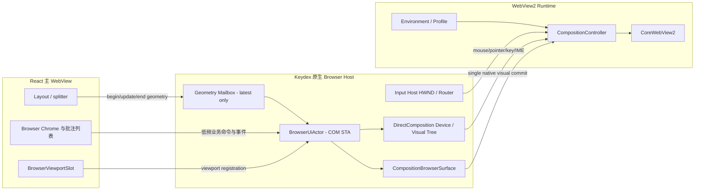
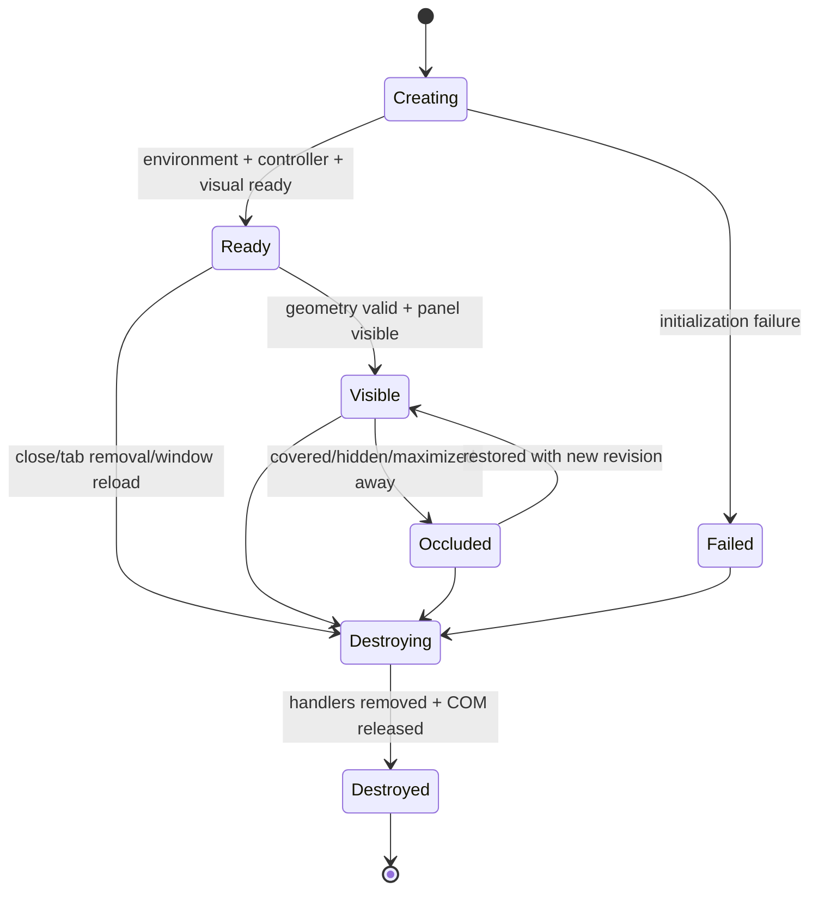

# DES-20260722-002-浏览器合成宿主重构

| 字段 | 值 |
|------|-----|
| 文档编号 | DES-20260722-002-浏览器合成宿主重构 |
| 关联需求 | REQ-20260721-001-侧边栏浏览器 |
| 前置设计 | DES-20260721-001-侧边栏浏览器 |
| 创建日期 | 2026-07-22 |
| 负责人 | Keydex 团队 |
| 状态 | 已确认，进入破坏式重构 |
| 最后更新 | 2026-07-22 |
| 需求类型 | 机制重构：Windows 原生浏览器合成、输入与生命周期 |
| 目标平台 | Windows / Tauri 2 主壳 / WebView2 Composition / DirectComposition |

## 已确认决策

本文覆盖 `DES-20260721-001` 中关于浏览器宿主实现、几何同步和宿主适配器的设计；产品范围、网页批注模型、页面结构化选择、安全边界、Profile 语义和 Keydex 视觉规范继续沿用前置设计。

| 主题 | 结论 |
|------|------|
| 重构方式 | 开发阶段直接破坏式替换，不保留兼容层、灰度开关、旧适配器或运行时回退 |
| 根因判断 | 当前 React 分隔线与独立原生 Wry child WebView 分属两套呈现树，跨 JS/Tauri/Wry/WebView2/Win32 的异步坐标追赶无法形成同一帧提交 |
| 新宿主 | 由 Keydex Rust 原生代码直接创建并拥有 WebView2 `ICoreWebView2CompositionController` |
| 合成方式 | 使用 DirectComposition 将浏览器 Visual 合成到 Keydex 主窗口内；浏览器几何与输入面由同一个原生 UI Actor 管理 |
| Tauri 边界 | Tauri 继续负责主窗口和应用 Shell，不再创建或持有浏览器 child WebView |
| 几何链路 | 拖动期间使用有界、latest-only、fire-and-forget 几何流；业务命令队列不参与逐帧 resize |
| 输入链路 | 原生输入宿主负责鼠标、滚轮、指针、光标、焦点、键盘、IME、拖放和 UI Automation 转发 |
| 旧代码 | 删除 `add_child(WebviewBuilder)`、`Webview<Wry>` 浏览器句柄、旧 `browser_set_bounds` 请求/响应链和伪 `DirectWebView2` 包装层 |
| 验收红线 | 连续拖动时浏览器可见边界与分隔线不得出现可感知追赶；任何时刻偏差超过 2 物理像素即不通过 |
| 宪法 | 仓库当前不存在 `.ktaicoding/CONSTITUTION.md`，以现有工程约束、前置 REQ/DES 和本次用户确认作为实施基线 |

---

## 一、问题定义与目标

### 1.1 当前实现不是“直接 WebView2 宿主”

当前代码虽然把适配器命名为 `DirectWebView2`，但实际创建路径仍位于 `desktop/src-tauri/src/browser/host.rs`，通过 `caller.window().add_child(WebviewBuilder...)` 创建 Wry child WebView；`direct_webview2.rs` 只是从该 Tauri/Wry WebView 中取得 COM 句柄。浏览器画面仍是独立原生 child HWND，而不是 Keydex 自己创建并合成的 CompositionController。

现有拖动链路为：

```text
pointermove
  -> React state / CSS grid commit
  -> ResizeObserver / getBoundingClientRect
  -> BrowserPanelRuntime.setBounds
  -> Tauri command serialization
  -> Rust async command dispatch
  -> Wry Webview::set_bounds
  -> WebView2 controller / Win32 child HWND
  -> Chromium resize + repaint
```

其中 React 主 WebView 和远程网页 child WebView 各自提交画面。即使提高测量频率、使用 `requestAnimationFrame`、合并请求或直接 `SetWindowPos`，也只能缩短平均滞后，不能保证分隔线与网页在同一次 compositor commit 中改变边界。用户看到的“滚动条停在旧位置”“分隔线已到右侧但页面仍在左侧”正是两个呈现树异步推进的结构性结果。

### 1.2 重构目标

1. 浏览器视觉边界在拖动、窗口 resize、最大化、DPI 切换和显示器切换中实时跟随宿主区域。
2. 完整保留普通浏览器能力和现有网页结构化选择、批注能力。
3. 把浏览器的 COM 对象、合成树、输入和生命周期收敛到一个原生所有权模型，消除跨线程句柄借用和命令乱序。
4. React 继续控制产品布局和浏览器 Chrome 样式，但不再承担原生浏览器每帧几何提交。
5. 删除误导性和不可达的兼容结构，让“当前唯一宿主”在代码中与运行时事实一致。

### 1.3 不在本次重构中改变

- 不新增 Agent 自动点击、输入、滚动或页面脚本工具。
- 不改变网页批注数据库的业务语义和已保存数据结构。
- 不改变 Keydex 现有主题、间距、圆角、图标、胶囊、Tooltip 和侧边栏总体设计。
- 不支持 macOS/Linux；非 Windows 构建明确返回 `unsupported_platform`，不提供功能降级浏览器。
- 不把远程网页 DOM 合并进主 WebView DOM，也不使用 iframe 替代完整浏览器。

---

## 二、目标架构

### 2.1 总体架构图



### 2.2 核心原则

- **单一所有者**：所有 WebView2、DirectComposition 和输入 HWND 对象只由 `BrowserUiActor` 所在线程创建、访问和销毁。
- **数据面与控制面分离**：resize 是高频数据面；导航、下载、权限、批注 Bridge 是低频控制面。两者不能共享串行 request/response 队列。
- **最新状态胜出**：几何更新不积压历史帧。Actor 每次唤醒只消费最新 revision，旧 revision 自动失效。
- **同一原生提交点**：浏览器 Visual 的 offset、clip 和 size 在 Actor 内一次提交，避免 child HWND 与 React DOM 两套窗口位置。
- **业务状态不等于原生句柄**：前端只持有 `surface_id + generation`；COM 指针不跨 Actor 暴露。
- **失败显式化**：Windows WebView2 Composition 初始化失败即 surface 创建失败，不切回旧宿主。

### 2.3 目录目标

```text
desktop/src-tauri/src/browser/
├── mod.rs
├── host.rs                    # Tauri 命令入口，仅做合同校验与 Actor 投递
├── ui_actor.rs                # 原生 STA 线程、消息泵、任务调度与资源销毁
├── composition_host.rs        # DComp device/target/root visual 和主窗口绑定
├── composition_surface.rs     # CompositionController/CoreWebView2 surface
├── webview2_environment.rs    # Environment/Profile/Options 创建与共享策略
├── geometry.rs                # viewport registration + latest-only geometry mailbox
├── input_host.rs              # HWND、hit test、焦点、IME、拖放、UIA
├── input_router.rs            # Win32 消息 -> WebView2 input event
├── contract.rs                # 新命令/事件合同
├── bridge.rs                  # 页面结构化选择/批注 bridge
├── navigation.rs
├── permissions.rs
├── downloads.rs
├── capture.rs
├── failures.rs
├── profiles.rs
└── resources.rs
```

以下旧文件/概念不保留：

- `adapter.rs` 与 `BrowserHostAdapterKind`：只有一种宿主，不再需要适配器决策。
- `direct_webview2.rs`：旧实现只是 Wry COM 句柄包装，删除并由 `composition_surface.rs` 取代。
- `bounds.rs` 中面向 Wry `Rect/Position/Size` 的转换和补偿逻辑。
- `SurfaceTable<Webview<Wry>>` 及所有接受 `&Webview<Wry>` 的浏览器能力函数。
- `caller.window().add_child(...)`、`webview.set_bounds(...)`、`webview.hide()/show()` 浏览器路径。

---

## 三、线程、所有权与生命周期

### 3.1 BrowserUiActor

应用启动浏览器子系统时创建唯一 `BrowserUiActorHandle`，其后端为专用 Windows STA 线程。线程执行：

1. `CoInitializeEx(..., COINIT_APARTMENTTHREADED)`。
2. 注册并创建输入/合成宿主窗口类和 HWND。
3. 创建 DirectComposition device 与主窗口 target。
4. 创建 WebView2 Environment；完成异步回调后进入可创建 surface 状态。
5. 运行 Win32 message loop，同时清空控制命令队列并读取 geometry mailbox。
6. 应用退出时按 surface -> controller -> visual -> target -> device -> HWND 的顺序释放资源，然后 `CoUninitialize`。

Actor 对外只暴露可克隆的 sender 和不可伪造的 surface token：

```rust
pub struct BrowserSurfaceToken {
    pub surface_id: String,
    pub generation: u64,
}

pub struct BrowserUiActorHandle {
    control_tx: Sender<BrowserControlCommand>,
    geometry: Arc<GeometryMailbox>,
    wake_hwnd: HWND,
}
```

COM interface 不实现跨线程业务调用。WebView2 事件回调也在 Actor 所属 STA 内先转为无 COM 指针的领域事件，再发送给 Tauri event sink。

### 3.2 Surface 生命周期状态机



- `surface_id` 可复用业务标识，但每次 native create 递增 `generation`。
- 所有命令必须携带 `surface_id + generation`；旧页面刷新后残留的命令直接丢弃并记录 `stale_generation`。
- `destroy` 是幂等控制命令，但完成事件只发一次。
- 主 React WebView reload、窗口 close、侧边栏 tab close 都必须先触发 native destroy-all；主页面重载时由 Rust 窗口生命周期兜底销毁，不依赖旧 JS cleanup 能执行。

### 3.3 Environment 与 Profile

- 普通模式使用 Keydex 独立持久 user-data folder；无痕模式使用本次应用生命周期内的临时 user-data folder。
- Environment 在 Actor 内按 profile class 共享；Controller 每个 browser surface 独立。
- Environment/Profile 创建只在 Actor 启动或首次使用时发生，不进入 resize 路径。
- Profile 清理、Cookie/缓存删除通过 Actor 控制命令执行，完成后返回领域结果。

---

## 四、合成与几何设计

### 4.1 CompositionController

每个 surface 通过 `ICoreWebView2Environment3::CreateCoreWebView2CompositionController` 创建，取得：

- `ICoreWebView2CompositionController`
- `ICoreWebView2Controller`
- `ICoreWebView2`

DirectComposition 为每个 surface 创建容器 Visual，并将 WebView2 visual 设为 `RootVisualTarget`。容器 Visual 负责：

- 目标区域 offset；
- viewport clip；
- 显示/遮挡；
- 与主窗口客户区的像素坐标一致性。

CompositionController 的 `Bounds` 始终使用 surface 本地坐标 `(0, 0, width, height)`；位置由父 Visual offset 表达，裁剪由 clip 表达。这样网页 viewport resize 与面板移动不需要移动独立 child HWND。

### 4.2 Viewport 注册

`BrowserViewportSlot` 是 React 中的透明占位区域，只负责：

- 提供稳定 `slot_id`；
- 在首次挂载、窗口移动、DPI 变化、布局模式切换和 drag begin/end 时发布几何；
- 在 drag 期间把 splitter 的确定性布局值写入共享几何通道；
- 维护浏览器 Chrome 和页面 viewport 之间的静态 inset。

浏览器页不再依赖普通 `ResizeObserver -> Tauri invoke -> await response` 逐帧同步。`ResizeObserver` 只作为非拖动布局变化和丢帧后的最终校正来源。

### 4.3 几何协议

替换 `browser_set_bounds` 为三个单向语义：

```ts
type BrowserGeometryPhase = "begin" | "update" | "end";

interface BrowserGeometryFrame {
  surfaceId: string;
  generation: number;
  revision: number;
  phase: BrowserGeometryPhase;
  windowClientRectCssPx: { x: number; y: number; width: number; height: number };
  deviceScaleFactor: number;
  visible: boolean;
}
```

Rust Actor 入站后统一转换为物理像素：

```text
left   = round(css_x * scale)
top    = round(css_y * scale)
right  = round((css_x + css_width) * scale)
bottom = round((css_y + css_height) * scale)
width  = max(0, right - left)
height = max(0, bottom - top)
```

使用边缘坐标分别取整，避免 `round(x) + round(width)` 在非整数 DPI 下产生累计缝隙。

### 4.4 Latest-only mailbox

`GeometryMailbox` 每个 surface 仅保存一个原子 revision 和最新 frame；更新者覆盖旧 frame，然后通过自定义窗口消息唤醒 Actor。Actor 处理规则：

1. 读取最新 revision。
2. 若小于等于已应用 revision，忽略。
3. 一次设置 visual offset/clip、controller bounds、input HWND region。
4. `Commit` DirectComposition。
5. 再次检查 revision；若期间有新 frame，立即处理最新值，不回放中间帧。

此通道禁止：

- Promise/await；
- 每帧 JSON request/response；
- 无界队列；
- React state 作为唯一几何真相；
- 与下载、导航、批注等业务命令互相阻塞。

### 4.5 拖动事务

- `begin`：Actor 记录 drag session，提升 resize 消费优先级，暂停非必要昂贵工作（如非关键 capture）。
- `update`：只提交最新 geometry，不产生持久化、不发回执、不记录逐帧 info 日志。
- `end`：强制读取一次最终 DOM 几何，提交最终 revision，恢复正常调度，并只在此时持久化 sidebar ratio。
- 拖动期间 React 的分隔线和主内容仍使用现有同步 CSS 布局；浏览器 Visual 使用相同计算源，不等待 React commit 后再反向测量。

### 4.6 窗口与 DPI

原生宿主监听主窗口的 `WM_SIZE`、`WM_MOVE`、`WM_WINDOWPOSCHANGED`、`WM_DPICHANGED`、最小化/恢复和显示器切换。发生这些事件时：

- 主窗口 client origin 和 scale 由原生端重新计算；
- 未变化的 CSS slot rect 可在原生端使用新 origin/scale 重投影；
- React 随后发布的新 revision 作最终校正；
- 最小化或不可见时 surface 进入 occluded，不销毁登录态；恢复时先提交正确 geometry 再显示。

---

## 五、输入、焦点与可访问性

CompositionController 不提供普通 child WebView HWND 自动输入路由，因此本重构必须一次性补齐完整输入面，不能只实现鼠标点击。

### 5.1 输入宿主 HWND

为浏览器 viewport 创建轻量透明输入 HWND，跟随相同物理 rect。该 HWND 不负责绘制网页，只负责：

- 命中测试与鼠标捕获；
- 接收焦点和键盘消息；
- 承载 IME context；
- OLE drag/drop target；
- 暴露 UI Automation provider；
- 把坐标转换到 WebView2 surface local physical pixels。

批注气泡、Keydex Tooltip、菜单等主 UI 浮层出现时，输入路由维护 exclusion region；位于 exclusion region 的事件留在 Keydex UI，不发送给网页。这解决批注气泡本身被 F12 选择器再次选中的问题。

### 5.2 鼠标和指针

需要覆盖：

- move / leave / hover；
- left/right/middle down/up/double-click；
- vertical/horizontal wheel；
- capture lost；
- XButton；
- pen/touch pointer；
- modifier/button state；
- WebView2 requested cursor -> `SetCursor`。

普通鼠标通过 `SendMouseInput`，pointer 设备通过 `SendPointerInput`。坐标均以 CompositionController viewport 左上角为原点。

### 5.3 键盘、焦点与 IME

- 点击 viewport 时设置输入 HWND 焦点，并调用 Controller focus API。
- Tab/Shift+Tab、快捷键和普通按键按现有浏览器快捷键策略分流；应用级保留快捷键先判断，未消费的输入交给 WebView2。
- `WM_IME_*` 使用输入 HWND 的 HIMC，CompositionController 的 caret/input bounds 用于候选窗定位。
- 失焦、切 tab、打开 Keydex 弹层时同步离开网页焦点，避免键盘继续进入隐藏页面。
- 验收必须包含中文拼音输入、候选窗跟随、组合文本确认/取消和剪贴板粘贴。

### 5.4 拖放与文件选择

- 文件选择继续使用 WebView2 原生 file chooser 事件，不从远程页面调用 Tauri shell。
- OLE drag/drop 在输入 HWND 注册；文件和文本 payload 交给 WebView2 composition input path。
- 下载、上传和拖放事件都经过现有安全策略与用户确认，不因宿主重构扩大权限。

### 5.5 Accessibility

输入 HWND 的 `WM_GETOBJECT` 返回 CompositionController 的 AutomationProvider，使屏幕阅读器和 Windows UIA 能进入网页可访问性树。Keydex Chrome 与网页保持两个清晰的可访问性子树。

---

## 六、业务能力迁移

### 6.1 统一原生端口

原有接受 `&Webview<Wry>` 的模块改为只在 Actor 内使用的端口：

```rust
pub struct CompositionBrowserSurface {
    token: BrowserSurfaceToken,
    composition_controller: ICoreWebView2CompositionController,
    controller: ICoreWebView2Controller,
    core: ICoreWebView2,
    visual: IDCompositionVisual,
    input_hwnd: HWND,
    event_tokens: BrowserEventTokens,
    applied_geometry_revision: u64,
}

impl CompositionBrowserSurface {
    fn navigate(&mut self, url: &str) -> Result<()>;
    fn execute_script(&mut self, script: &str) -> Result<()>;
    fn post_web_message(&mut self, payload: &str) -> Result<()>;
    fn set_visible(&mut self, visible: bool) -> Result<()>;
    fn capture_preview(&mut self, request: CaptureRequest) -> Result<()>;
}
```

各模块不再自己从 Tauri/Wry 取 COM 指针。所有调用封装成 Actor 内同步操作或 WebView2 callback continuation。

### 6.2 导航与浏览器 Chrome

迁移并保留：前进、后退、刷新/强制刷新、停止、地址输入、标题、favicon、加载状态、历史、缩放、页面内查找、新窗口策略、外部协议策略。事件回调转换为带 token/generation 的 `BrowserEventEnvelope`，旧 surface 事件不能污染新 tab。

### 6.3 权限、下载和文件选择

- `PermissionRequested`、`DownloadStarting`、下载进度、文件选择事件直接注册在新 CoreWebView2/Profile 上。
- 用户决策仍走 Keydex UI；回调中的 deferral 保存在 Actor 的有界 pending map，并设置超时默认拒绝。
- 关闭 surface 时取消/拒绝所有 pending deferral，禁止泄漏回调持有的 COM 对象。

### 6.4 页面 Bridge 与结构化批注

页面 Bridge 逻辑继续使用 WebView2 document-created script 和 web message，不再通过 Wry handler：

- Bridge 安装与 navigation generation 绑定；每次顶层 document 切换重新握手。
- `bridge.ready`、`page.changed`、element picked、annotation saved 等消息携带 surface token、navigation generation 和 request id。
- F12 级元素选择器仍由 DevTools Protocol/页面 overlay 实现，但模式开关和选择结果由新 surface 端口发送。
- 选择某元素后暂停 inspector，显示 Keydex 原生/主 WebView 批注气泡；保存或取消后，如果顶部按钮仍处于批注态，则恢复 inspector。
- 已保存批注列表、页面标记、重定位和截图证据复用现有数据模型；宿主变化不迁移数据库。

### 6.5 截图与区域证据

使用 CoreWebView2 capture API 获取网页内容，再按 surface-local CSS/physical geometry 裁剪。capture 在 drag session 中降优先级或延迟到 `end`，不得阻塞 geometry mailbox。

### 6.6 崩溃与恢复

- `ProcessFailed` 转为 surface failure event；该 surface 显示错误态并可显式重建。
- 重建生成新 generation，复用业务 tab URL/Profile，不复用旧 Controller/Visual。
- 主 renderer reload 时 Rust 窗口事件主动 destroy-all，解决浏览器画面冻结在新主界面之上的幽灵 surface。

---

## 七、命令与事件合同调整

### 7.1 删除

- `browser_set_bounds` request/response 命令。
- `BrowserHostAdapterKind`、adapter decision/probe 中以兼容切换为目的的字段。
- 任何 `preserves_wire_contract` 或 Tauri-child hard gate 运行时分支。

### 7.2 新增/调整

| 合同 | 类型 | 语义 |
|------|------|------|
| `browser_create_surface` | async control | 返回 `surface_id + generation`，只有 Composition surface ready 后成功 |
| `browser_geometry_frame` | one-way data | begin/update/end；覆盖旧 revision，不返回逐帧响应 |
| `browser_destroy_surface` | async control | 幂等销毁指定 generation |
| `browser_destroy_all_surfaces` | async control | renderer reload/window close 防幽灵 surface |
| `browser_surface_ready` | event | 原生 visual、input 和 core 全部可用 |
| `browser_geometry_committed` | debug-only event | 仅诊断或验收采样，不作为正常布局回路 |
| 其他浏览器命令 | async control | 全部增加 generation 校验 |

生产环境禁止逐帧 geometry 日志；诊断模式可采样 `revision、enqueue_ts、apply_ts、rect`，用于计算端到端延迟但不进入 UI 主线程。

### 7.3 数据库

本重构不修改数据库 DDL。网页批注、目标、证据和历史表继续采用前置设计；仅运行时 surface token、geometry revision、navigation generation 不持久化。

---

## 八、代码实施顺序

### 8.1 阶段 A：原生宿主闭环

1. 删除 adapter 和伪 DirectWebView2 包装。
2. 建立 `BrowserUiActor`、STA message loop、control sender 和 event sink。
3. 创建 WebView2 Environment3、CompositionController。
4. 创建 DirectComposition target/visual，将 RootVisualTarget 绑定到 surface visual。
5. 单 surface 打开 URL，并完成 create/destroy/recreate。

完成标准：不调用 `add_child`，网页能够显示、隐藏、销毁，renderer reload 后无残留画面。

### 8.2 阶段 B：几何与实时拖动

1. 建立 viewport registration 和 physical-pixel conversion。
2. 建立 latest-only geometry mailbox。
3. React splitter 使用同源 geometry frame；移除 `BrowserPanelRuntime.setBounds`。
4. 实现窗口 resize、移动、DPI、最大化和遮挡处理。

完成标准：真实连续拖动 10 秒，网页边界/滚动条与分隔线保持同步，最大偏差不超过 2 物理像素。

### 8.3 阶段 C：完整输入

按鼠标/滚轮 -> 光标/捕获 -> 键盘/焦点 -> IME -> pointer/touch -> drag/drop -> UIA 顺序完成。阶段 C 未完成前不得宣称浏览器功能完整。

### 8.4 阶段 D：业务能力迁移

依次迁移导航、Profile、安全设置、权限、下载、文件选择、查找、缩放、Bridge、DevTools inspector、capture、failure/resources。每个模块迁移后立即删除其 Wry 签名和兼容实现。

### 8.5 阶段 E：清理

- 删除所有 `Webview<Wry>` 浏览器引用。
- 删除 Wry child bounds 相关测试和文档结论。
- 更新 `DES-20260721-001` 的宿主决策引用和 Issues CSV 状态，原 SBW-016/SBW-020 作为错误验收结论失效。
- 更新开发启动、打包依赖和 Windows WebView2 runtime 错误提示。

---

## 九、测试与验收

用户已说明当前迭代不需要过度测试，因此开发中以聚焦编译、模块测试和关键人工验收为主；但以下红线必须在宣布重构完成前真实验证，不能只用 mock 或日志代替画面。

### 9.1 Resize 可见验收

| 场景 | 操作 | 必须结果 |
|------|------|----------|
| 连续向左拖动 | 10 秒内快速/慢速/往返拖动 | 网页右侧滚动条始终贴合当前 viewport 右边界，不停在旧位置 |
| 连续向右拖动 | 分隔线接近窗口右缘 | 网页左边界和宽度实时跟随，不出现页面留在旧左侧 |
| 高频反向 | 每 100~300ms 改变拖动方向 | 不回放旧 geometry，不出现反向追赶 |
| 窗口 resize | 拖动主窗口四边与角 | 与普通浏览器 resize 同步，无冻结白区 |
| 模式切换 | split/maximized/left/right/隐藏/恢复 | 先应用正确 geometry 再显示，无闪烁和幽灵 surface |
| DPI | 100%、125%、150% | 边缘不漂移、不累计 1px 缝隙 |
| 多显示器 | 跨不同 DPI 显示器移动 | scale/origin 更新正确，输入命中和画面一致 |

验收采样指标：

- drag p95 geometry enqueue-to-apply <= 16.7ms；
- mailbox pending frame 每 surface <= 1；
- 可见边界最大偏差 <= 2 physical px；
- drag 期间无同步 Tauri invoke、无逐帧 await、无逐帧持久化；
- 结束后最终 rect 100% 一致。

### 9.2 输入验收

- 链接点击、双击、右键菜单、中键、水平/垂直滚轮。
- 文本选择、拖动选择、页面原生 drag/drop。
- 地址栏与网页之间反复切换焦点。
- 中文拼音 IME 候选窗、组合输入、确认和取消。
- 文件上传、多文件选择、下载确认与进度。
- 屏幕阅读器/UIA 可进入网页树。
- Keydex 批注气泡、Tooltip、菜单优先接收输入，不被页面 inspector 选中。

### 9.3 浏览器与批注回归

- 普通/无痕 Profile、登录态、cookie/cache 清理。
- 前进后退、刷新、停止、查找、缩放、新窗口与外部协议。
- permission/download/process-failed 生命周期。
- F12 级任意元素 hover/选择，保存/取消后按按钮状态恢复 inspector。
- 批注列表立即显示保存结果，reload 后可恢复并重新定位。
- 关闭 tab、关闭侧栏、renderer reload、窗口退出后没有残留浏览器画面或进程资源。

### 9.4 聚焦自动化

- Rust：geometry revision、DPI edge rounding、generation reject、lifecycle release order、mailbox overwrite。
- TypeScript：splitter geometry source、begin/update/end、tab close/reload destroy-all。
- `cargo check --lib` 与浏览器相关 Vitest；不在活跃开发轮次运行全仓库 E2E。

---

## 十、风险与约束

| 风险 | 影响 | 处理 |
|------|------|------|
| CompositionController 输入实现复杂 | 网页能显示但交互残缺 | 输入能力作为独立硬门槛，按 5.2~5.5 完整验收 |
| COM STA 异步回调生命周期错误 | 崩溃、泄漏、死锁 | 单 Actor 所有权、事件 token 集中注销、无跨线程 COM 借用 |
| DirectComposition 与主窗口坐标不一致 | DPI/多屏漂移 | 物理 edge rounding、原生窗口事件重投影、真实多 DPI 验收 |
| React 浮层与 native visual 遮挡 | 菜单/批注气泡不可用 | 明确 overlay exclusion 与 occlusion 协议；必要时隐藏/裁剪 browser visual |
| renderer reload 留下原生 surface | 冻结网页覆盖新 UI | Rust 窗口级 destroy-all 兜底，不依赖 JS unmount |
| 业务迁移期间功能回归 | 权限、下载、批注中断 | 不保留旧宿主，但按能力垂直迁移并做聚焦回归 |
| Windows crate/API 版本差异 | 编译或 COM interface 缺失 | 固定 `webview2-com`/`windows` 版本并先建立最小 composition 编译闭环 |

---

## 十一、外部技术依据

- Microsoft WebView2 API 概览明确区分 windowed controller 与 visual-hosting 的 CompositionController，并要求宿主负责输入转发：<https://learn.microsoft.com/en-us/microsoft-edge/webview2/concepts/overview-features-apis>
- `ICoreWebView2Environment3::CreateCoreWebView2CompositionController` 是创建合成宿主的正式入口：<https://learn.microsoft.com/en-us/microsoft-edge/webview2/reference/win32/icorewebview2environment3>
- Microsoft Win32 Visual Composition 示例展示 DirectComposition visual tree、RootVisualTarget 和输入转发的组合方式：<https://learn.microsoft.com/en-us/microsoft-edge/webview2/samples/webview2samplewincomp>

---

## 十二、设计质量核对

- [x] 解释了当前延迟为何是双呈现树和跨层异步链路问题，而非简单频率不足。
- [x] 明确唯一目标宿主，不保留兼容、双轨、灰度或回退。
- [x] 明确 COM STA、资源所有权、生命周期与 renderer reload 清理。
- [x] 明确 DirectComposition visual、CompositionController 和 RootVisualTarget。
- [x] 明确 high-frequency geometry 与 low-frequency control 分流。
- [x] 明确 latest-only、revision、begin/update/end 和 DPI 换算。
- [x] 完整覆盖鼠标、指针、键盘、焦点、IME、拖放和 UIA。
- [x] 给出导航、权限、下载、Bridge、批注、捕获和失败恢复迁移路径。
- [x] 给出真实可见效果验收红线，不以单元测试代替 UI 结果。
- [x] 说明数据库无变更以及无项目宪法的前提。

## 十三、变更记录

| 日期 | 版本 | 变更 |
|------|------|------|
| 2026-07-22 | v1.0 | 用户确认不考虑兼容兜底，形成 WebView2 Composition + DirectComposition 的破坏式宿主重构设计 |
