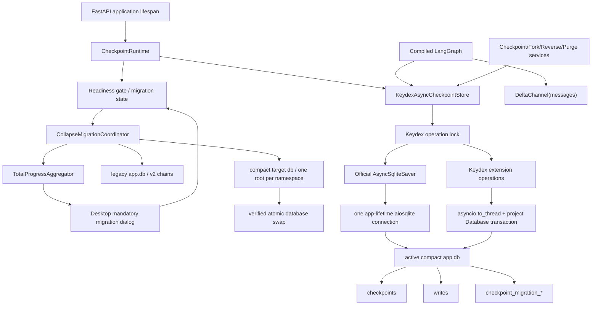
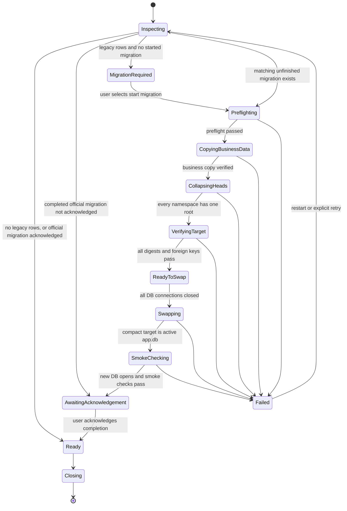

# Keydex Checkpoint AsyncSqliteSaver 增量化与 Collapse 迁移设计

## 1. 文档目的

本文给出 Keydex 从自研同步 `SQLiteCheckpointSaver` 迁移到 LangGraph 官方
`AsyncSqliteSaver` 的完整长期维护方案。方案采用已确认的 B 设计：

- 标准 checkpoint 协议、表结构和序列化行为交还官方
  `langgraph-checkpoint-sqlite==3.1.0`。
- 官方表使用原生无版本后缀名称：`checkpoints`、`writes`。
- 现有 `checkpoints_v2`、`checkpoint_writes_v2` 只作为迁移源和一个版本周期内的空壳兼容表。
- `messages` 从完整累计快照改为 `DeltaChannel` 增量持久化，解决正常长对话中数据库快速膨胀的根因。
- Keydex 特有的 fork、clone、rollback、reverse、purge、手动压缩等能力通过一层组合式异步适配器保留。
- 老数据采用用户明确授权的破坏式 `collapse-to-head` 迁移：每个
  `(thread_id, checkpoint_ns)` 只保留最新可运行状态作为新根，不保留升级前的 checkpoint
  lineage、历史 reverse/fork/time-travel 能力。
- 可见历史消息、附件、trace 内容和 fork 关系仍由现有业务表保存；迁移不得删除或重写这些业务数据。
- 迁移构建新的紧凑数据库文件，完整校验后原子切换，确保历史逻辑占用和物理文件大小都能下降。
- 新版本启动检测到旧 v2 数据时，必须在应用级展示不可关闭、不可跳过的迁移弹窗；用户确认开始后，
  弹窗只展示总进度条和整数百分比，迁移完成前不得关闭，完成后由用户主动关闭并进入应用。
- 所有已有 checkpoint 相关能力必须逐项复测；不以“官方测试通过”替代 Keydex 产品语义验证。

本文是实现合同，不是概念建议。用户授权的破坏边界仅限于升级前 checkpoint lineage：

- 升级前历史消息继续可见；
- 会话能够从迁移根继续对话；
- 升级前消息不能 reverse/rewind，也不能从指定历史消息重新 fork；
- 升级后新消息重新获得完整 reverse/fork 能力；
- 当前可恢复 interrupt/approval/pending 状态不得因 lineage 截断而无声明丢失。

除上述明确授权外，任何数据丢弃、保留期限或功能退化均不允许在执行期自行引入。

## 2. 背景与问题判断

### 2.1 当前实现

当前 `backend/app/agent/checkpoint.py` 中的 `SQLiteCheckpointSaver`：

- 实现了 LangGraph `BaseCheckpointSaver` 的同步接口；
- 所谓异步接口只是直接调用同步 SQLite 逻辑，会阻塞事件循环；
- 每个 checkpoint 都通过 `JsonPlusSerializer.dumps_typed(checkpoint)` 保存完整
  `channel_values`；
- `messages` 使用 `add_messages`，因此每轮 checkpoint 都重复保存全部累计消息；
- 自定义 `checkpoints_v2` 和 `checkpoint_writes_v2` 表；
- 在 saver 内额外实现 thread 删除、回滚、克隆和原地替换 checkpoint state。

随着会话轮次增加，累计消息、工具调用结果、结构化上下文和压缩状态被反复写入后续快照。
其存储复杂度近似为累计历史的前缀和，而不是新增对话内容本身。即便不存在 fork 或 clone，
正常对话也会快速膨胀；fork/clone 只会进一步复制已经膨胀的历史链。

### 2.2 官方 saver 不能单独解决根因

官方 SQLite saver 的 `checkpoints` 表仍会序列化传入的 checkpoint 对象。仅将当前类替换为
`AsyncSqliteSaver`，若 `messages` 继续作为完整累计通道，存储压力仍然存在。

因此 B 设计必须同时完成：

1. 官方 `AsyncSqliteSaver` 接管标准读写和表结构；
2. `messages` 改为 `DeltaChannel`，使后续 checkpoint 只持久化本轮 delta 或周期性快照；
3. Keydex 的克隆、回滚、反向恢复和清理逻辑理解并保护 delta 依赖链。
4. 升级时把旧的累计 checkpoint 链压成每个 namespace 一个独立 full seed，并建立明确的历史操作边界。
5. 通过新文件重建和原子替换回收物理空间，而不是只在原数据库里形成 freelist。

缺少任意一项，都不能视为完成本设计。

### 2.3 现有表与官方表的主要差异

| 维度 | 现有表 | 官方 3.1.0 表 | 迁移影响 |
|---|---|---|---|
| checkpoint 表名 | `checkpoints_v2` | `checkpoints` | 可并存，适合原地迁移 |
| writes 表名 | `checkpoint_writes_v2` | `writes` | 可并存，适合原地迁移 |
| checkpoint 时间 | 独立 `created_at` | 无该列，按 checkpoint id 排序 | 不迁移为排序依据 |
| checkpoint payload | `type` + `checkpoint_blob` | `type` + `checkpoint` | 反序列化后重新序列化 |
| metadata | typed payload 的 base64 JSON 包装文本 | UTF-8 JSON BLOB | 必须转换，不能原样复制 |
| writes payload | `type` + `value_blob` | `type` + `value` | 反序列化后重新序列化 |
| writes `task_path` | 保存 | 官方 SQLite 不保存 | 经调用方审计后有意识丢弃 |
| 标准异步 | 伪异步，阻塞 event loop | 原生 aiosqlite | 服务链路需真正 async |

当前代码没有 saver 之外的 `task_path` 消费者。迁移前仍需用静态搜索和测试门禁再次确认；
确认后才允许不迁移该字段。

## 3. 目标与非目标

### 3.1 必须达到的目标

- 新安装和迁移完成的安装只通过官方无后缀表运行。
- 图运行、暂停/恢复、pending writes、time travel 等标准语义与官方保持一致。
- 正常对话新增数据的增长接近“本轮新增内容 + 周期快照”，不再重复完整消息历史。
- 所有现有会话在迁移后能够显示完整历史并从最新状态继续对话、压缩、从当前状态 fork 和 purge。
- 升级前消息的 reverse/指定历史 fork 被确定性禁用；升级后产生的消息重新支持 reverse/fork。
- 每个旧 thread/namespace 从累计历史链压成一个独立、可 hydrate 的迁移根。
- 迁移可在进程崩溃、断电或磁盘临时错误后幂等续跑。
- checkpoint 和关联业务表的 reverse/purge 原子性不退化。
- 运行期只存在一个应用生命周期级 checkpoint runtime；服务不得自行构造 saver。
- 所有 checkpoint I/O 均为异步接口；同步扩展 SQL 必须移出事件循环。
- serializer 采用显式严格策略，能够 round-trip Keydex 允许的状态类型并拒绝非白名单类型。
- 提供可审计的迁移进度、失败分类、容量指标、原子数据库切换和切换前恢复办法。
- 迁移后物理 `app.db` 明显缩小，而不只是逻辑行数下降。
- 旧数据检测、用户开始、迁移中、失败重试、完成确认形成一个不可绕过的启动阻断闭环；
  面向用户只显示单一总进度百分比，不暴露阶段、表名、行数、namespace、字节数或预计剩余时间。

### 3.2 非目标

- 不在本次引入 PostgreSQL、远程 checkpoint 服务或多设备同步。
- 不改变会话、trace、消息、审批、pending input 和 subagent 的产品语义。
- 不通过固定 TTL 删除用户仍可能 reverse/fork 的历史。
- 不保留升级前所有 checkpoint 节点，也不尝试把每个旧节点重写为可回放 delta。
- 不保证升级前 checkpoint ID、trace input/output anchor、fork source checkpoint 仍可解析。
- 不支持在破坏式切换完成且旧库删除后恢复完整旧 checkpoint lineage。
- 不继续维护一套与官方 saver 并行演进的标准协议实现。
- 不依赖 fork/clone 才能获得容量改善。
- 不在原数据库上执行需要接近旧库大小临时空间的传统全库 `VACUUM`；迁移直接生成最终紧凑目标库。

## 4. 需求和验收总览

| 编号 | 需求 | 验收摘要 |
|---|---|---|
| FR-01 | 官方 saver 接管 | 标准调用全部委托 `AsyncSqliteSaver`，运行期不读写 v2 |
| FR-02 | 真异步 | event loop 线程无同步 SQLite I/O |
| FR-03 | Delta 消息 | 普通追加、更新、删除、全删和工具协议语义不变 |
| FR-04 | 破坏式迁移 | 每个旧 namespace 只生成一个与旧 head 状态等价的新根 |
| FR-05 | 可见历史 | `message_events`、附件、trace 内容、fork 关系数量和摘要不变 |
| FR-06 | 断点续迁 | 目标库构建或切换任意阶段崩溃后可确定性恢复 |
| FR-07 | 继续对话 | 迁移根 hydrate 结果与旧 head 一致，首轮新对话正常 |
| FR-08 | lineage 边界 | 升级前 reverse/历史 fork 拒绝，升级后新消息恢复能力 |
| FR-09 | fork/clone | 当前根及升级后任意 delta 节点均可独立克隆和继续写入 |
| FR-10 | reverse/rollback | 只作用于迁移边界后的 checkpoint，业务副作用同事务 |
| FR-11 | 自动压缩 | `REMOVE_ALL_MESSAGES` + replacement 正确回放 |
| FR-12 | 手动压缩 | 追加 successor，不再篡改历史 checkpoint |
| FR-13 | cancel/restart | 部分输出、pending tool result、重启恢复不丢失 |
| FR-14 | subagent | 子会话当前状态、恢复、迁移后 reverse 删除和 purge 不回归 |
| FR-15 | purge | 官方两表及迁移状态正确清理，邻居数据不受影响 |
| FR-16 | serializer 安全 | Keydex 类型全覆盖，未知危险类型拒绝，full seed/snapshot 压缩可读 |
| FR-17 | 容量 | 旧累计链被移除，物理库缩小；未来增长近线性 |
| FR-18 | 可观测性 | 迁移、容量、耗时、lineage 边界和错误均有稳定指标/日志 |
| FR-19 | 强制迁移弹窗 | 检测到旧数据即阻断应用；只显示总百分比，完成后才允许关闭 |

## 5. 总体架构



### 5.1 组件职责

#### `CheckpointRuntime`

- 由 FastAPI lifespan 创建和关闭；
- 创建唯一的 `aiosqlite.Connection`；
- 应用 SQLite PRAGMA；
- 创建官方 saver 并执行 `setup()`；
- 运行或恢复破坏式 collapse migration，并在原子切换前保持 graph runtime 不可用；
- 创建 `KeydexAsyncCheckpointStore`；
- 维护 `migration_required / migrating / migration_completed_unacknowledged / ready / failed / closing`
  状态和 `asyncio.Event`；
- 仅在 `ready` 后允许图运行和所有 checkpoint 相关 mutation；
- 向 `app.state` 发布唯一实例。

#### `KeydexAsyncCheckpointStore`

采用组合，不继承或复制官方 SQLite saver 的私有 SQL：

- 持有官方 `AsyncSqliteSaver`；
- 实现/转发 LangGraph 标准异步协议；
- 暴露与官方 saver 相同的 `serde` 和 `get_next_version`；
- 转发 `aget_delta_channel_history`，保证 DeltaChannel 能重建状态；
- 提供 Keydex 扩展异步操作；
- 用外层 `asyncio.Lock` 将标准写入与扩展 mutation 串行化；
- 禁止调用方绕过 wrapper 直接获得官方 saver。

#### 官方 `AsyncSqliteSaver`

- 独占标准 `aget_tuple`、`alist`、`aput`、`aput_writes`、`adelete_thread` 实现；
- 创建和维护 `checkpoints`、`writes`；
- 提供 DeltaChannel 历史读取；
- 不承载 Keydex 业务表事务。

#### Keydex 扩展操作

- 使用项目现有 `Database.transaction(immediate=True)`；
- 通过 `asyncio.to_thread` 运行同步 SQLite SQL；
- 在外层 operation lock 中执行，避免与官方写入交叉；
- 允许接收业务 service 已开启的 `sqlite3.Connection`，保留跨表原子性；
- 直接操作官方公开表契约，但不调用官方私有方法。

#### `CollapseMigrationCoordinator`

- 只在 checkpoint runtime 进入 ready 前运行；
- 以旧数据库为只读源，创建独立紧凑目标数据库；
- 复制所有非 checkpoint 业务表并逐表校验；
- 每个 thread/namespace 只生成一个 `parent_checkpoint_id=NULL` 的最新状态根；
- 保存该根自身的 pending writes，不复制更早 writes；
- 写入 session lineage boundary；
- 执行 serializer/graph hydrate、业务表计数、外键和 integrity 校验；
- 在全部连接关闭后原子替换数据库文件；
- 旧库只保留到目标库首启 smoke check 成功，随后删除以释放空间。

#### `TotalProgressAggregator`

- 把预检、业务复制、namespace collapse、目标验证、原子切换和 smoke check 聚合为
  `0..10000` basis points；
- 只向用户状态接口投影 `0..100` 的整数百分比；
- 保证同一次迁移的持久化进度单调不减，只有 completed 状态可以返回 `100`；
- 内部仍保留阶段、计数、字节和错误明细供日志、指标及恢复判断使用，但不得进入用户弹窗。

#### `MandatoryCheckpointMigrationDialog`

- 作为应用级 provider 挂在 Router/Workbench 之上，不能依赖某个会话页面已经挂载；
- 复用现有 `AppDialog` 的焦点陷阱和 browser native surface 遮挡能力；
- required/running/failed 状态设置 `showClose=false`、`closeOnEscape=false`、
  `closeOnOverlayClick=false`，且不传 `onClose`；
- 弹窗出现时阻断工作台交互；迁移完成后才显示“进入 Keydex”并允许关闭；
- 只呈现迁移说明、单一总进度条、整数百分比，以及 required/failed/completed 状态下的必要操作；
  不显示内部阶段和详细统计。

## 6. 依赖与版本合同

### 6.1 固定版本范围

```text
langgraph==1.2.9
langgraph-checkpoint>=4.1,<5
langgraph-checkpoint-sqlite==3.1.0
aiosqlite>=0.20
zstandard>=0.23,<1
```

`langgraph-checkpoint-sqlite==3.1.0` 还会引入其声明的 `sqlite-vec` 依赖。`zstandard`
用于迁移根和后续 `_DeltaSnapshot` 的透明压缩。锁文件必须记录最终解析版本。

### 6.2 升级门禁

- 更新 `pyproject.toml` 和所有 requirements/lock 入口，不能只改本地环境。
- 在同一 issue 中验证 LangChain Core、prebuilt、SDK 解析范围没有冲突。
- 运行所有 agent、context compression、fork/reverse、websocket restart 相关测试。
- 记录 1.2.9 和 3.1.0 的源码/行为基线；后续升级必须先跑本设计的 saver conformance suite。
- 禁止使用 `langgraph.channels._delta` 中的私有 reducer 作为业务 reducer。

## 7. 数据模型

### 7.1 官方业务表

表由 `AsyncSqliteSaver.setup()` 创建，Keydex 不复制一份 DDL 作为主创建路径。3.1.0 的目标契约为：

```sql
CREATE TABLE IF NOT EXISTS checkpoints (
    thread_id TEXT NOT NULL,
    checkpoint_ns TEXT NOT NULL DEFAULT '',
    checkpoint_id TEXT NOT NULL,
    parent_checkpoint_id TEXT,
    type TEXT,
    checkpoint BLOB,
    metadata BLOB,
    PRIMARY KEY (thread_id, checkpoint_ns, checkpoint_id)
);

CREATE TABLE IF NOT EXISTS writes (
    thread_id TEXT NOT NULL,
    checkpoint_ns TEXT NOT NULL DEFAULT '',
    checkpoint_id TEXT NOT NULL,
    task_id TEXT NOT NULL,
    idx INTEGER NOT NULL,
    channel TEXT NOT NULL,
    type TEXT,
    value BLOB,
    PRIMARY KEY (thread_id, checkpoint_ns, checkpoint_id, task_id, idx)
);
```

Keydex 可以为自身查询添加不改变官方列和主键的索引，但不得更改官方表名、列含义或冲突语义。

### 7.2 迁移批次表

```sql
CREATE TABLE IF NOT EXISTS checkpoint_migration_state (
    migration_id TEXT PRIMARY KEY,
    source_schema TEXT NOT NULL,
    target_schema TEXT NOT NULL,
    status TEXT NOT NULL
      CHECK (status IN (
        'pending',
        'preflighting',
        'copying_business_data',
        'collapsing_checkpoints',
        'verifying_target',
        'ready_to_swap',
        'swapping',
        'smoke_checking',
        'completed',
        'failed'
      )),
    source_db_fingerprint TEXT NOT NULL,
    source_db_bytes INTEGER NOT NULL DEFAULT 0,
    target_db_bytes INTEGER NOT NULL DEFAULT 0,
    target_temp_path TEXT,
    backup_path TEXT,
    progress_basis_points INTEGER NOT NULL DEFAULT 0
      CHECK (progress_basis_points BETWEEN 0 AND 10000),
    migrated_namespaces INTEGER NOT NULL DEFAULT 0,
    created_roots INTEGER NOT NULL DEFAULT 0,
    preserved_head_writes INTEGER NOT NULL DEFAULT 0,
    discarded_checkpoints INTEGER NOT NULL DEFAULT 0,
    discarded_writes INTEGER NOT NULL DEFAULT 0,
    source_checkpoint_count INTEGER,
    source_write_count INTEGER,
    business_source_digest TEXT,
    business_target_digest TEXT,
    error_code TEXT,
    error_detail TEXT,
    started_at TEXT,
    completed_at TEXT,
    ui_acknowledged_at TEXT,
    progress_updated_at TEXT,
    updated_at TEXT NOT NULL
);
```

固定 `migration_id` 为实现版本标识，例如
`checkpoint-v2-collapse-to-official-v1`。不得用随机 id 创建多个互不知情的迁移任务。
`source_db_fingerprint` 绑定源库文件身份，防止把上一次未完成迁移的临时目标错误用于另一份数据库。

`progress_basis_points` 是持久化总进度真值；前端只能读取服务端投影后的整数百分比。
`ui_acknowledged_at` 只在迁移已经 completed 且用户点击“进入 Keydex”后写入。若进程在迁移完成后、
用户确认前退出，下次启动仍显示 100% 完成态弹窗，直到用户确认。

迁移还必须持有 `app.db.checkpoint-collapse-v1.lock` 的 OS 级独占文件锁。进程内 operation lock
不能替代跨进程互斥。锁文件是否存在不能单独作为占用依据；必须以 Windows 独占文件句柄为准，
进程退出后由操作系统释放。未取得锁的第二个进程只能读取状态并展示同一弹窗，不得创建第二份目标库。

### 7.3 namespace 迁移明细表

```sql
CREATE TABLE IF NOT EXISTS checkpoint_migration_namespaces (
    migration_id TEXT NOT NULL,
    thread_id TEXT NOT NULL,
    checkpoint_ns TEXT NOT NULL DEFAULT '',
    status TEXT NOT NULL
      CHECK (status IN ('pending', 'running', 'completed', 'failed')),
    source_checkpoint_count INTEGER NOT NULL DEFAULT 0,
    source_write_count INTEGER NOT NULL DEFAULT 0,
    root_checkpoint_id TEXT,
    preserved_head_write_count INTEGER NOT NULL DEFAULT 0,
    discarded_checkpoint_count INTEGER NOT NULL DEFAULT 0,
    discarded_write_count INTEGER NOT NULL DEFAULT 0,
    source_head_digest TEXT,
    target_root_digest TEXT,
    hydrate_digest TEXT,
    error_code TEXT,
    error_detail TEXT,
    started_at TEXT,
    completed_at TEXT,
    updated_at TEXT NOT NULL,
    PRIMARY KEY (migration_id, thread_id, checkpoint_ns)
);

CREATE INDEX IF NOT EXISTS idx_checkpoint_migration_ns_status
ON checkpoint_migration_namespaces(migration_id, status, thread_id, checkpoint_ns);
```

### 7.4 Session lineage 边界

使用现有 `Database._ensure_column()` 幂等增加以下列；DDL 表达其目标形态：

```sql
ALTER TABLE sessions
  ADD COLUMN checkpoint_lineage_epoch INTEGER NOT NULL DEFAULT 0;

ALTER TABLE sessions
  ADD COLUMN checkpoint_history_floor_turn_index INTEGER NOT NULL DEFAULT 0;

ALTER TABLE sessions
  ADD COLUMN checkpoint_root_id TEXT;

ALTER TABLE sessions
  ADD COLUMN checkpoint_collapsed_at TEXT;

ALTER TABLE sessions
  ADD COLUMN checkpoint_migration_id TEXT;

CREATE INDEX IF NOT EXISTS idx_sessions_checkpoint_lineage
ON sessions(checkpoint_lineage_epoch, checkpoint_history_floor_turn_index);
```

SQLite 不支持所有版本上的 `ADD COLUMN IF NOT EXISTS`，实际升级继续走项目现有
`_ensure_column()`。字段含义：

- `checkpoint_lineage_epoch=0`：未发生破坏式截断；
- `checkpoint_lineage_epoch>=1`：旧 lineage 已截断；
- `checkpoint_history_floor_turn_index`：小于该 turn 的消息只可查看，不能 reverse/指定历史 fork；
- `checkpoint_root_id`：当前 active thread 的迁移根；
- `checkpoint_collapsed_at`：用户可见的迁移边界时间；
- `checkpoint_migration_id`：诊断和幂等关联。

对一个 session 而言，floor 是迁移时 `max(message_events.turn_index) + 1`。因此迁移后第一轮
user message 的 input checkpoint 指向迁移根，能够正常 reverse 回迁移根。

### 7.5 迁移表生命周期

- 迁移成功后保留状态表，用于诊断和防止重复执行。
- 旧 v2 链只存在于源数据库；紧凑目标库不复制 v2 表和 v2 行。
- 目标库只含 official root rows、root 自身 pending writes、业务数据和迁移审计状态。
- 原子切换并完成新库 smoke check 后删除旧库，才能真正释放物理空间。
- 旧库删除后无法恢复完整 lineage；文档和 UI 必须明确这一不可逆边界。
- migration state 不参与普通 session purge，但 purge 必须能清理由已删除 thread 遗留的失败明细。

## 8. SQLite 连接和并发模型

### 8.1 应用生命周期连接

官方 saver 使用一个 app-lifetime `aiosqlite.Connection`，初始化时执行：

```sql
PRAGMA foreign_keys = ON;
PRAGMA busy_timeout = 30000;
PRAGMA journal_mode = WAL;
PRAGMA synchronous = NORMAL;
```

连接必须在 event loop 关闭前显式 `await close()`。禁止：

- 每个请求 `AsyncSqliteSaver.from_conn_string()`；
- service 默认构造 saver；
- 在官方 saver 所属 event-loop 线程调用其同步接口；
- 后台任务持有已关闭 runtime。

### 8.2 双连接协调

Keydex 业务仓储继续使用项目 `sqlite3` 连接。官方 saver 与业务扩展 SQL 因此可能由不同连接访问同一数据库。
协调规则：

1. `KeydexAsyncCheckpointStore` 所有标准 mutation 和扩展 mutation 先取得同一个外层 `asyncio.Lock`；
2. 标准 mutation 在锁内委托官方 saver；
3. 扩展 mutation 在锁内通过 `asyncio.to_thread` 进入项目事务；
4. 只读操作可按实现审慎并发，但第一版允许统一加锁，正确性优先；
5. 业务 service 需要 checkpoint + 业务表原子 mutation 时，只能走扩展操作并传入同一个项目连接；
6. 扩展事务内部不能反向调用官方 saver，以免发生双连接嵌套和锁顺序死锁。

固定锁顺序为：

```text
Checkpoint operation lock
  -> official internal lock 或 project Database transaction
  -> SQLite write lock
```

任何路径不得先开启 `Database.transaction` 再等待 operation lock。

### 8.3 关闭语义

- runtime 进入 `closing` 后拒绝新 mutation；
- 等待已取得 operation lock 的操作完成；
- 取消/等待持有 saver 的 graph task；
- 关闭 official saver/aiosqlite connection；
- 最后关闭其余 app 资源。

## 9. 标准协议适配

`KeydexAsyncCheckpointStore` 必须覆盖：

- `aget_tuple`
- `alist`
- `aput`
- `aput_writes`
- `adelete_thread`
- `aget_delta_channel_history`
- `get_next_version`
- `serde`

同步 `get_tuple/list/put/put_writes/delete_thread` 不再作为 Keydex 运行期公共 API。若 LangGraph
基类需要方法存在，应明确抛出带修复指引的 `NotImplementedError`，禁止静默回落到阻塞实现。

标准协议的参数、返回 config、metadata filter、`before`、`limit`、pending writes 和 writes
冲突规则全部以官方实现为准。Keydex 的 conformance tests 要直接对照一个裸官方 saver 和 wrapper，
保证 wrapper 没有改变标准语义。

## 10. DeltaChannel 消息设计

### 10.1 状态声明

`KeydexAgentState.messages` 从：

```python
messages: Annotated[list[AnyMessage], add_messages]
```

改为概念上的：

```python
messages: Annotated[
    list[AnyMessage],
    DeltaChannel(
        keydex_messages_delta_reducer,
        snapshot_frequency=settings.checkpoint_delta_snapshot_frequency,
    ),
]
```

具体 API 以 `langgraph==1.2.9` 的公开导入路径为准。配置项建议：

```text
KEYDEX_CHECKPOINT_DELTA_SNAPSHOT_FREQUENCY=64
```

64 是首个候选默认值，不是无条件常量。实现 issue 必须用存储、恢复延迟和 fork/reverse 基准验证；
若调整，需把测量结果和最终值写入配置说明。

### 10.2 Keydex reducer

官方内部 `_messages_delta_reducer` 不满足 Keydex 语义，因为其不支持或不完整支持：

- `RemoveMessage(id=REMOVE_ALL_MESSAGES)`；
- unknown id 的严格行为；
- 无 id message 的 id 分配；
- message chunk 转换；
- Keydex 已有 `add_messages` 的所有兼容逻辑。

Keydex 使用公开、可测试的批量 reducer：

```python
def keydex_messages_delta_reducer(
    state: Sequence[AnyMessage],
    writes: Sequence[Any],
) -> list[AnyMessage]:
    result = list(state)
    for write in writes:
        result = add_messages(result, write)
    return result
```

实现需符合实际 `DeltaChannel` reducer 签名，但语义固定为“按原写入顺序逐条调用
`add_messages`”。必须证明批处理和实时逐轮处理等价。

### 10.3 需要锁定的消息语义

- 普通 human/AI/tool message 追加；
- 同 id message 更新；
- `RemoveMessage` 删除单条；
- `REMOVE_ALL_MESSAGES` 清空后追加 compression replacement；
- tool call 与 tool result 不产生孤儿；
- streamed chunk 最终转换结果；
- tool-result tombstone 和上下文编辑；
- structured user group replay；
- hidden/visible injection；
- state serde round-trip；
- 进程重启后从 seed + delta 重建；
- 任意非 snapshot checkpoint 的 time travel。

### 10.4 兼容 collapsed root

旧 v2 head checkpoint 中 `messages` 是完整列表。破坏式迁移只把最新 head 写入 official
`checkpoints`，并把它改成 `parent_checkpoint_id=NULL` 的根。这个根中的 plain messages value
被 DeltaChannel 视为全量 seed；更早的旧 checkpoint 不进入目标库。

迁移不从 `message_events` 重新拼模型状态，因为可见事件不包含全部 hidden injection、tool protocol、
structured group、compression state 和 subagent state。只有成功反序列化并通过 compiled graph
hydrate 的旧 head 才能成为迁移根。

从迁移后的第一个新 checkpoint 开始写 delta。该策略同时避免：

- 保留所有历史前缀快照；
- 合成旧 writes 改变 pending-task/time-travel 语义；
- 重放可见消息得到不完整模型上下文。

### 10.5 delta 依赖图

迁移前 lineage 被整体截断，只保留一个 full seed。迁移后产生的增量 checkpoint 不可脱离新祖先链
随意读取；保留迁移后锚点时，必须同时保留从该锚点向上到最近 snapshot/迁移根的祖先和对应
writes。任何迁移后清理算法都必须先计算依赖闭包。

## 11. Keydex 扩展操作

### 11.1 `aclone_checkpoint_to_thread`

第一版采用正确性优先的完整祖先链克隆：

1. 在 operation lock 内开启 `BEGIN IMMEDIATE`；
2. 验证 source target checkpoint 存在；
3. 用 recursive CTE 从目标 checkpoint 向 parent 回溯到根；
4. 先清空 target thread/namespace 的 `writes`，再清空 `checkpoints`；
5. 把祖先链所有 `checkpoints` 原样复制到 target，仅替换 `thread_id`；
6. 复制所有对应 `writes`，包括完成 delta 和 pending writes；
7. 保持 checkpoint id、parent id、type、payload、metadata 不变；
8. read-back 验证 target target-checkpoint 能重建为与 source 相同的 state；
9. 同事务提交。

禁止只复制目标单行，因为它可能是 delta 节点。后续若要优化成“最近 snapshot + 后续链”，必须有等价性证明和独立设计。

source 不存在时不得清空 target。任何异常都由当前事务回滚，不再通过事务外
`delete_thread(target)` 补偿。

### 11.2 `arollback_thread_to_checkpoint`

- `checkpoint_id` 为空：删除该 thread/namespace 的全部 writes 和 checkpoints。
- 非空：
  - 验证目标存在；
  - 计算目标到根的祖先闭包；
  - 删除不在闭包中的 writes；
  - 删除不在闭包中的 checkpoints；
  - 不篡改目标 metadata、payload 或 id；
  - 不再依赖 `created_at` 提升目标为最新；后继被删后，目标 id 自然是剩余 head。

该操作允许接收调用方 transaction connection，供 reverse 与业务表清理同事务执行。

### 11.3 `adelete_thread`

按 `writes -> checkpoints` 顺序删除；允许使用调用方连接。默认 namespace 为全部 namespace，
除非调用方明确限制。官方 `adelete_thread` 可用于纯 checkpoint 删除，涉及业务事务时必须走扩展版本。

### 11.4 checkpoint 存在性与链验证

提供只读异步扩展：

- `acheckpoint_exists(thread_id, namespace, checkpoint_id)`
- `aload_ancestor_ids(...)`
- `avalidate_reconstructable(...)`

服务不再直接写死表名查询。

### 11.5 移除原地替换

删除 `replace_checkpoint_messages` 和 `replace_checkpoint_state` 的运行期使用。
历史 checkpoint 是 trace、fork 和 reverse 的不可变锚点，不能在手动压缩后被静默改写。

## 12. 手动与自动上下文压缩

### 12.1 自动压缩

自动压缩继续在图内产生：

```text
RemoveMessage(REMOVE_ALL_MESSAGES)
  + replacement messages
  + compression boundary/group/epoch state
```

它自然生成新 checkpoint。新 reducer 必须让该批写在即时状态、checkpoint replay 和重启 replay
三种路径结果一致。失败前不得推进 compression epoch 或 boundary。

### 12.2 手动压缩

手动压缩改为图原生的 successor append：

1. 异步读取 expected checkpoint；
2. 生成 replacement；
3. 在写前再次验证 expected id 仍为当前 head；
4. 通过使用同一个 `KeydexAgentState` 的 compiled graph 调用 `aupdate_state` 或
   `abulk_update_state`；
5. 使用明确的 full replacement/overwrite 语义更新 messages 及相关 compression state；
6. 获得新 checkpoint config，并将其作为当前 head；
7. 原 checkpoint 保持字节和语义不变。

不能直接构造 LangGraph 内部 checkpoint dict，也不能直接更新 `checkpoints.checkpoint`。

### 12.3 并发和崩溃语义

- head 已变化：返回稳定 checkpoint conflict，不写 successor。
- generation 失败：不写任何 checkpoint/epoch。
- graph update 失败：事务/官方写入语义决定无可见 successor。
- 写入已成功、响应前进程崩溃：重启后从新 head 恢复，操作可识别为已完成。
- trace output checkpoint 仍指向原历史节点，fork 结果不被后来的手动压缩污染。

## 13. 数据迁移设计

### 13.1 启动状态机



迁移期间：

- health/runtime status 可读取；
- chat、fork、reverse、compression、subagent 启动等 checkpoint 依赖接口返回
  `503 checkpoint_migration_in_progress`，附带可重试标识；
- 不构建或不发布可运行 compiled graph；
- 前端显示应用级强制迁移弹窗，不得表现成会话丢失；
- 迁移失败时保留错误码和恢复指引，不自动创建一份空聊天库绕过失败。

为了避免大库迁移超过 sidecar 启动超时，HTTP 服务可以先进入 maintenance-ready 状态再后台迁移，
但业务 readiness 与进程 liveness 必须分离。

#### 13.1.1 强制弹窗触发与关闭合同

1. 启动检查发现 `checkpoints_v2` 或 `checkpoint_writes_v2` 存在待迁移数据，且没有已完成的
   matching migration 时，runtime 进入 `migration_required`。
2. Desktop 在加载任何可操作工作台前请求迁移状态并立即显示
   `MandatoryCheckpointMigrationDialog`。
3. required 状态展示简洁说明、不可逆边界和唯一主操作“开始迁移”。不得提供关闭、稍后、跳过或取消。
4. 用户点击“开始迁移”后，后端幂等创建或复用固定 migration，取得跨进程迁移锁并开始预检。
5. running 状态只显示一条总进度条和整数百分比；弹窗仍不可关闭。
6. failed 状态保留弹窗，只显示简洁失败说明和“重试迁移”；技术错误码进入日志和支持信息，
   不在主界面展开阶段、表、行、namespace 或字节明细。
7. completed 状态显示 `100%` 和完成说明，此时才显示“进入 Keydex”并允许关闭弹窗。
8. 用户点击完成按钮后，后端在 completed 校验通过的事务中写入 `ui_acknowledged_at`，再解除
   checkpoint readiness 和 UI gate。确认响应返回前必须等待当前迁移任务完成全部运行态收尾；
   同一应用进程中的 HTTP 和 WebSocket chat 必须立即可用，不能依赖退出重启。若内存 gate 与
   已持久化的 completed + acknowledged 状态不一致，checkpoint 入口必须按持久化真值自愈。
   不能仅凭前端本地状态绕过。
9. 用户在 required 状态直接退出应用时数据库不变；在 running 状态退出时，下次启动自动续迁并继续
   显示不可关闭弹窗；在 completed 但未确认时退出，下次启动重新显示可关闭的 100% 完成态。
10. 已 completed 且已确认、或从未存在 legacy 数据的安装，后续启动不再显示该弹窗。

弹窗文案只说明用户必须知道的内容：

```text
需要迁移会话数据

Keydex 将切换到新的会话存储策略，以显著降低长期使用产生的本地存储占用。

迁移会保留历史会话和消息，完成后仍可继续对话。
出于兼容性策略，迁移前已有的历史消息将无法回溯，也无法从这些历史位置创建分支。
迁移完成后新产生的消息（包括在历史会话中继续对话产生的消息）以及新建会话不受影响，
回溯和分支功能可正常使用。

迁移期间 Keydex 将暂时不可使用。
```

迁移中不得显示当前阶段名称、表名、行数、namespace 数量、数据库大小、压缩率或预计剩余时间。

#### 13.1.2 单一总进度算法

服务端以 basis points 保存单一真值，前端只显示 `floor(progress_basis_points / 100)`：

| 内部阶段 | basis points 区间 | 内部计算依据 |
|---|---:|---|
| required | 0 | 等待用户开始 |
| preflight | 0-500 | 已完成预检项 / 预检项总数 |
| business copy | 500-3500 | 已复制工作单元 / 总工作单元 |
| namespace collapse | 3500-8000 | 已完成 namespace / namespace 总数 |
| target verify | 8000-9500 | 已完成验证单元 / 验证单元总数 |
| swap + smoke check | 9500-9900 | 持久化切换检查点 |
| completed | 10000 | 新库 active、smoke check 通过且完成状态持久化 |

规则：

- UI 只获得 `progress_percent`，不获得上表的阶段和分项计数；
- 进度必须单调不减，任何未完成状态最大只能返回 `99`；
- 只有 completed 事务持久化后才能从 `99` 跳到 `100`；
- namespace 以单事务写 root、head writes、digest 和 detail completed；重试 `running/failed`
  namespace 时先在目标事务内删除该 namespace 半成品再重做，completed + digest 一致时跳过；
- 汇总计数和总进度从 durable detail/验证检查点重新聚合，不使用可能重复执行的裸 `+= 1`；
- 重启后先恢复 journal 和 matching tmp，再计算持久化进度；不得因为重算或重试向用户倒退；
- 如果某阶段重做导致内部实际工作暂时落后，界面保持原百分比，直到 durable work 重新超过该值；
- 进度百分比表达“迁移工作完成度”，不承诺线性对应剩余时间。

维护态接口最小合同：

```text
GET  /api/checkpoint-migration
POST /api/checkpoint-migration/start
POST /api/checkpoint-migration/retry
POST /api/checkpoint-migration/acknowledge
```

面向 Desktop 的响应只包含：

```json
{
  "status": "required|running|failed|completed|ready",
  "progress_percent": 0,
  "can_start": true,
  "can_retry": false,
  "can_close": false
}
```

`start`、`retry` 和 `acknowledge` 均为幂等操作：重复 start 返回同一个 migration；running 时 retry
返回当前状态；非 completed 状态 acknowledge 返回冲突；completed 后重复 acknowledge 返回成功。

### 13.2 预检

迁移开始前采集：

- SQLite `integrity_check`、`foreign_key_check`；
- v2 checkpoint/write 总数、thread/namespace 数；
- 所有 session、trace、message event、fork、subagent 与 active thread 的映射；
- 每个 session 的最大可见 `turn_index`；
- 官方表或上次迁移临时库是否已有数据；
- `page_count`、`freelist_count`、`page_size`、数据库/WAL 大小；
- 可用磁盘空间；
- v2 orphan writes、断 parent、重复/非法 payload；
- 目标表与 migration state 是否处于部分迁移状态；
- 仍处于 running/streaming 的 run、pending input、interrupt/approval；
- 源数据库文件 fingerprint 和目标临时路径冲突。

迁移需要的额外空间是“紧凑目标库估算大小 + WAL/安全余量”，不是旧数据库完整大小。实现先对
业务表、每个 namespace 最新 head 和压缩率采样，计算保守上界；空间不足时阻止 cutover，并保持
旧库不变，不能先删除 lineage 再告诉用户无法回收物理空间。

### 13.3 运行态归一化

迁移开始时旧应用进程已停止。对上次异常退出留下的状态：

- 复用现有 startup recovery 规则归一化孤儿 running 状态；
- 当前 head 自身的 writes 全部保留，因为它们是该 head 的 pending/resume 合同；
- 更早 checkpoint 对应 writes 全部丢弃；
- 可恢复 interrupt/approval 必须在目标库 smoke test 中验证 resume；
- 无法分类的 pending 状态阻止该 session 迁移，不能静默 cancel；
- session pending input、approval 和业务队列行原样复制，不因 checkpoint collapse 被清理。

### 13.4 紧凑目标库构建

迁移不在旧 `app.db` 内先写完整目标再 `VACUUM`，而是构建
`app.db.checkpoint-collapse-v1.tmp`：

1. 用当前版本 `Database` 初始化完整最新 schema；
2. 官方 saver 在目标库执行 `setup()`；
3. 旧库以只读方式 attach；
4. 枚举所有 source 用户表，按显式规则分类：
   - `checkpoints_v2`、`checkpoint_writes_v2`：不复制；
   - `checkpoints`、`writes`、migration tables：由迁移器生成；
   - 其余业务表：必须复制；
5. 对每个业务表比较 source/target schema：
   - source-only 列必须有显式映射，否则失败；
   - target-only 列必须有 default 或迁移填充值；
   - 禁止静默跳过未知表；
6. 临时关闭 target foreign-key enforcement，按表复制全部业务行；
7. 写入 session lineage boundary；
8. 重新开启外键并执行 `foreign_key_check`；
9. 重建/验证索引和 trigger；
10. 记录逐表 count、主键集合摘要和内容摘要。

目标库从一开始就是紧凑文件，因此只需要额外容纳最终数据库大小，不需要再复制一份 9GB 旧库。

### 13.5 namespace collapse 算法

迁移单位为 `(thread_id, checkpoint_ns)`：

1. 按现有 v2 `created_at DESC, checkpoint_id DESC` 规则选最新 head；
2. 验证 parent 链没有循环，记录旧 checkpoint/write 数；
3. 使用 legacy serializer 解码 head checkpoint 和 metadata；
4. 使用目标 strict + compressed serializer 重编码完整 head；
5. 向目标 `checkpoints` 插入一行：
   - `checkpoint_id` 保持原 head id；
   - `parent_checkpoint_id=NULL`；
   - checkpoint payload 保持完整 channel state；
   - metadata 保留原有字段并增加兼容的 Keydex migration metadata；
6. 只复制 `checkpoint_id=head_id` 的 writes，保留 `task_id/idx/channel` 和语义；
7. 不复制更早 checkpoint 和 writes；
8. 通过目标 serializer 回读并比较：
   - old head state semantic digest；
   - target root state semantic digest；
   - head pending writes semantic digest；
9. 使用实际 compiled graph + target store 执行只读 `aget_state`；
10. hydrate digest 必须等于 old head digest；
11. 写入 namespace migration 明细和 discarded counts。

没有 checkpoint 的空 session 正常迁移业务数据；存在可见历史但没有可用 head 的 session 不满足“正常继续对话”，
迁移必须失败并保留旧库。

### 13.6 metadata 与压缩序列化

legacy metadata 是 `_metadata_dump(type, bytes)` 得到的 JSON 文本，包含 base64 typed payload。
不能直接写入官方 `metadata`。迁移器必须：

```text
legacy wrapper -> legacy serde.loads_typed -> metadata dict
-> official JSON canonical encoding -> UTF-8 BLOB
```

验证以 dict 的 canonical JSON digest 为准，不以原始字节一致为准。

checkpoint 和 writes 使用 `KeydexCompressedSerializer`：

- 内层为 strict `JsonPlusSerializer`；
- payload 大于阈值且压缩后至少节省配置比例时使用 Zstandard；
- type tag 为 `keydex-zstd-v1:<inner-type>`；
- 小 payload 保留官方原始 type/payload；
- loader 同时支持压缩 tag 和官方原生 tag；
- 解压设置最大输出和帧校验，拒绝异常 payload；
- semantic digest 始终基于反序列化对象。

### 13.7 Session lineage 边界

对每个迁移 session：

- `checkpoint_lineage_epoch += 1`；
- `checkpoint_history_floor_turn_index = max_visible_turn + 1`；
- `checkpoint_root_id = active thread 默认 namespace 的 target root`；
- `checkpoint_collapsed_at` 和 `checkpoint_migration_id` 写入；
- `message_events`、trace 内容、attachments、artifact grants、session_forks 业务行不改；
- 旧 trace 的 input/output checkpoint id 允许作为历史文本存在，但不再保证可解析；
- 旧 fork relation 继续展示，但其 source checkpoint 不可用于重新执行。

API/UI 行为：

- `turn_index < floor`：消息可见，reverse 和指定历史 fork 禁用；
- 当前 head fork：允许，通过 root/当前最新 checkpoint；
- 迁移后第一轮 user message 的 input checkpoint=root，因此可 reverse；
- `turn_index >= floor`：沿用原 reverse/fork 规则；
- pre-boundary 缺 checkpoint 返回 `checkpoint_history_compacted`，不作为数据库损坏。

### 13.8 目标库验证

目标库进入 `ready_to_swap` 前必须全部通过：

- `integrity_check`；
- `foreign_key_check`；
- 所有非 checkpoint 业务表 count、主键集合和内容摘要；
- `message_events` 按 session 的数量、seq、turn、内容摘要；
- attachments、trace、fork、subagent、pending input/approval 摘要；
- 每个 namespace exactly one root；
- 每个 root `parent_checkpoint_id IS NULL`；
- root state/hydrate/pending-write digest；
- session boundary 与 active thread/root 对应；
- 目标文件实际字节数和预检上界；
- 随机和高风险 session 的只读打开/历史渲染 fixture。

任何损坏 checkpoint、metadata、write 或业务表复制差异都使整个目标库失败；旧库保持当前 active，不允许
跳过单个 session 后继续切换。

### 13.9 原子切换与崩溃恢复

切换前关闭旧库和目标库的所有连接并完成 WAL checkpoint/fsync。使用同目录固定文件名：

```text
app.db                                  active source
app.db.checkpoint-collapse-v1.tmp       verified target
app.db.checkpoint-collapse-v1.backup    short-lived pre-swap source
app.db.checkpoint-collapse-v1.swap.json recovery journal
```

切换流程：

1. 写入并 fsync recovery journal；
2. `app.db -> backup`；
3. `tmp -> app.db`；
4. fsync 目录；
5. 打开新 `app.db`，执行 integrity、migration state 和代表性 session smoke check；
6. 成功后标记 migration completed；
7. 删除 short-lived backup 和 journal；
8. 失败则在无连接状态恢复 backup。

Windows rename/replace 失败必须保持 journal 可重试。启动时先解析 journal，按文件 fingerprint 和状态决定
完成切换或恢复旧库，禁止同时选择两份库继续运行。

### 13.10 不可逆性和降级

破坏式迁移完成并删除 backup 后，不存在能够恢复旧完整 checkpoint lineage 的反向迁移。发布必须：

- 阻止旧二进制在检测到 official 数据/migration state 后继续运行；
- 在 UI 和发布说明中明确“升级前消息仍可查看，但不能再回溯/历史 fork”；
- 只有在 backup 尚未删除或用户显式创建完整外部 backup 时才能恢复旧库；
- backup 删除前的回滚是整库文件恢复，不是 official -> v2 合成；
- backup 删除后降级只允许新版本向前修复，不能启动旧二进制；
- 不允许简单删除 official 表再启动旧版。

## 14. 服务层适配

### 14.1 依赖注入

以下组件不得再默认构造 `SQLiteCheckpointSaver`：

- `CheckpointService`
- `SessionForkService`
- `SessionReverseService`
- sessions API helper
- manual context compression service
- E2E server helpers

它们必须接收同一个 app-lifetime `KeydexAsyncCheckpointStore` 或明确的窄接口。

### 14.2 `CheckpointService`

- 全部方法改为 async；
- 使用 `alist`、`aget_tuple` 和 tuple metadata；
- 不直接查询 `checkpoints`，更不查询 v2；
- 对迁移边界后的 latest、latest-completed、explicit checkpoint、trace input/output、message event/turn
  保留原解析规则；
- 查询 pre-boundary message/trace 时先读取 session lineage boundary，返回
  `checkpoint_history_compacted`，不得把预期缺失误报为 `checkpoint_not_found` 或损坏；
- 当前状态 fork 可解析到迁移根；旧指定 message/trace fork 不做近似回退；
- metadata filter 与官方语义对齐；
- 对 missing、failed trace、invalid anchor 返回现有稳定错误。

### 14.3 `SessionForkService`

- `fork_session`、checkpoint 检查、clone 和清理链路 async 化；
- 普通 fork 仍以 completed trace/output checkpoint 为源并复制可见 history；
- `btw` 仍取当前最新 checkpoint，不复制 history，可在 streaming 场景使用；
- 对 migrated session，在第一轮迁移后对话完成前，普通“从当前状态”fork 使用迁移根；指定迁移前
  assistant/message/trace 的 fork 返回 `checkpoint_fork_before_migration_unavailable`；
- 迁移后产生新的 completed output 后，普通 fork 恢复原 source 选择规则；
- 多个 fork 相互独立；
- artifact grant 复制、artifact 文件不复制；
- 跨用户 grant 拒绝；
- clone 失败时 target session/业务数据清理保持原语义；
- archived source 拒绝。

### 14.4 `SessionReverseService`

- reverse 到 user message 时仍使用 trace input checkpoint，即目标轮次执行前的 C(N-1)；
- `turn_index < checkpoint_history_floor_turn_index` 时在任何文件 mutation 或数据库 transaction
  开始前拒绝，返回 `checkpoint_rewind_before_migration_unavailable`；
- 迁移后第一轮 user message 的 input checkpoint 是迁移根，可正常 reverse；
- 删除目标轮和后续 message、trace、approval、pending input、subagent 等业务数据；
- checkpoint rollback 与业务删除继续在一个 `Database.transaction(immediate=True)`；
- 第一轮 reverse 清空 checkpoint chain；
- assistant message 不能作为 conversation rewind source；
- 有前置可见历史但缺 input checkpoint 时拒绝；
- 被 rewind 的 main-agent turn 创建的 subagent session/checkpoint 一并清理；
- file + conversation reverse 的 file-first saga 和失败补偿保持现状。

### 14.5 API

- fork endpoint 改为 async 并 await service；
- legacy reverse helper 改为 async；
- 从 `request.app.state.checkpoint_runtime` 取 store；
- runtime 未 ready 时返回统一可重试 503；
- session payload 暴露 lineage epoch、history floor、collapsed time 和 pre-boundary action capability，
  供前端在渲染时直接禁用旧消息动作；
- API request handler 不调用 saver 同步方法。

### 14.6 Chat/trace/cancel

保留：

- run 前记录 `input_checkpoint_id`；
- completed run 后记录 output/latest checkpoint；
- 失败 trace 不作为默认 fork source；
- cancellation 将已生成的部分输出安全写入当前图状态；
- pending tool call/result 不产生不闭合历史；
- websocket reconnect/restart 从同一 thread 恢复。

迁移根必须完整保留旧 head state，而不是从 `message_events` 重建。首轮迁移后 chat 的 model input
digest 应与旧 head hydrate digest 一致；可见历史渲染继续只依赖业务表，不因旧 checkpoint 消失而变化。

## 15. Purge、保留和 GC

### 15.1 purge

`PurgeService.SESSION_THREAD_RELATIONS` 更新为官方表：

```text
writes.thread_id
checkpoints.thread_id
```

删除顺序遵守 writes 在前、checkpoints 在后，并与 session、message、trace、subagent、approval 等现有业务删除保持单事务。
inventory、dry-run、complete purge、邻居 session 不受影响等语义全部复测。

### 15.2 保留原则

破坏式迁移显式丢弃升级前 lineage；以下保留原则只适用于迁移根和迁移后新 checkpoint。
本次不引入固定时间 TTL。以下 checkpoint 是保留锚点：

- migration root；
- 当前 thread head；
- 迁移后 trace input/output checkpoint；
- 迁移后 fork source 仍被产品引用的 checkpoint；
- pending/interrupted checkpoint；
- 迁移后恢复、reverse、编辑流程仍可选择的 checkpoint；
- subagent 运行/恢复依赖的 checkpoint。

对每个锚点还必须保留至最近 snapshot/full seed 的祖先闭包及对应 writes。

### 15.3 安全 thinning

历史容量由 collapse migration 解决，未来增长由 DeltaChannel 解决。可选安全 thinning 只处理迁移后
lineage，并必须满足：

1. 默认关闭；
2. 先 dry-run 输出候选、保护原因和预计释放量；
3. 只删除不属于任何锚点依赖闭包的 checkpoint；
4. 不删除 pending writes；
5. 删除后逐锚点执行 reconstruction 验证；
6. 任何不确定引用都按保留处理。

在没有产品级历史保留政策前，不得为了追求容量数字删除用户可见 reverse/fork 历史。

## 16. Serializer 与安全

### 16.1 明确配置

创建 saver 时显式构造严格 `JsonPlusSerializer`，配置受允许 module/object 集；同时可设置
`LANGGRAPH_STRICT_MSGPACK=true` 作为进程级防线，但不能只依赖外部环境。

官方 saver 接收的是 `KeydexCompressedSerializer`，其内部组合上述 strict serializer。建议默认：

```text
KEYDEX_CHECKPOINT_COMPRESSION=zstd
KEYDEX_CHECKPOINT_COMPRESSION_LEVEL=3
KEYDEX_CHECKPOINT_COMPRESSION_MIN_BYTES=1024
KEYDEX_CHECKPOINT_COMPRESSION_MIN_SAVING_RATIO=0.10
KEYDEX_CHECKPOINT_MAX_DECOMPRESSED_BYTES=536870912
```

压缩器只有在满足最小 payload 和最小节省比例时才生成
`keydex-zstd-v1:<inner-type>`；否则返回 inner serializer 的官方原始 tag。所有配置进入 saver cache/runtime
identity，不能让同一进程的 reader/writer 使用不同 serializer。

### 16.2 压缩兼容合同

- `dumps_typed` 先 strict 序列化，再选择是否压缩；
- `loads_typed` 识别 `keydex-zstd-v1:`，校验 frame size/输出上限后解压并交回 inner serializer；
- 非 Keydex tag 原样交给 inner serializer，兼容官方原生和迁移前测试 fixture；
- 类型 tag 保留 inner type，不能假定所有 payload 都是 msgpack；
- checkpoint root、周期 `_DeltaSnapshot` 和较大 writes 使用同一合同；
- metadata 继续由官方 saver 以 JSON BLOB 保存，不进入压缩层；
- 压缩失败不得回退写入部分 payload；
- 压缩比只影响存储，不影响 semantic digest 和 checkpoint config。

### 16.3 白名单覆盖

至少覆盖：

- LangChain human/AI/system/tool messages；
- message chunks；
- `RemoveMessage`；
- tool call/tool result；
- Keydex structured user group；
- context compression state；
- tool-result tombstone/editing state；
- attachment/file snapshot references；
- approval/pending protocol state；
- subagent state；
- 标准 JSON、UUID、datetime 等实际 checkpoint 类型。

测试从真实 fixture 中提取状态类型。新增 checkpoint 类型时，必须显式更新白名单和安全测试。

### 16.4 迁移安全

legacy 解码器只对本地既有数据库使用；不接受网络上传的任意 checkpoint blob。日志不得打印 message/tool 内容。
未知类型导致迁移失败，而不是启用宽松 pickle fallback。

旧 head 解码、目标 root 压缩、目标解压和 graph hydrate 四步必须分别有错误分类。任何一步失败都保留旧库为
active source；不得因为单个会话失败而切换到缺失该会话的目标库。

## 17. 可观测性和错误合同

### 17.1 指标

- migration status、completed/total namespaces；
- 持久化 `progress_basis_points`、用户投影 `progress_percent`、start/retry/acknowledge 次数；
- 跨进程 migration lock 获取、冲突和持有时长；
- created root/preserved head write/discarded checkpoint/discarded write rows；
- copied business table rows 和逐表 digest 状态；
- 当前 namespace elapsed；
- source/target DB、WAL、page、freelist 字节和压缩比例；
- atomic swap/recovery journal 状态；
- official checkpoint/write logical payload bytes；
- 单次 `aput`/`aput_writes` 延迟；
- delta reconstruction ancestor depth 和耗时；
- clone/rollback/reverse/purge 耗时；
- operation lock wait；
- migration/serializer/SQLite 错误计数。

### 17.2 稳定错误码

至少包括：

- `checkpoint_runtime_not_ready`
- `checkpoint_migration_in_progress`
- `checkpoint_migration_acknowledgement_required`
- `checkpoint_migration_failed`
- `checkpoint_migration_target_conflict`
- `checkpoint_migration_decode_failed`
- `checkpoint_migration_verify_failed`
- `checkpoint_migration_insufficient_space`
- `checkpoint_migration_business_copy_mismatch`
- `checkpoint_migration_hydrate_failed`
- `checkpoint_migration_swap_failed`
- `checkpoint_migration_recovery_required`
- `checkpoint_history_compacted`
- `checkpoint_rewind_before_migration_unavailable`
- `checkpoint_fork_before_migration_unavailable`
- `checkpoint_not_found`
- `checkpoint_conflict`
- `checkpoint_chain_broken`
- `checkpoint_serializer_rejected`
- `checkpoint_storage_busy`

### 17.3 日志

日志使用 migration id、thread id 的安全 hash、namespace、checkpoint id、计数、耗时和错误码。
不得记录 checkpoint blob、完整 metadata、消息正文、tool result 或凭证。

## 18. 测试与复测设计

### 18.1 测试层级

- reducer/serializer 纯单元测试；
- wrapper 与官方 saver conformance 测试；
- SQLite migration fixture 测试；
- service/API 集成测试；
- graph + chat + websocket 重启测试；
- package 级真实数据库升级 E2E；
- 存储增长、恢复延迟和并发压力基准。

### 18.2 官方协议与异步

| 用例 | 预期 |
|---|---|
| put/get/list/filter/before/limit | wrapper 与裸官方 saver 结果等价 |
| pending writes 冲突语义 | reserved idx 与普通 idx 符合官方 |
| parent config | 链路完整 |
| delete thread | 两表无残留 |
| delta history | wrapper 正确转发 |
| event loop heartbeat | 大量 I/O 时无同步阻塞尖峰 |
| shutdown | 无悬空 aiosqlite worker/closed-loop 回调 |

### 18.3 Delta reducer

| 用例 | 预期 |
|---|---|
| 100/500 轮普通追加 | state 与 `add_messages` 基线一致 |
| 同 id 更新 | 最终消息顺序/内容一致 |
| 单条 RemoveMessage | 删除结果一致 |
| REMOVE_ALL + replacement | 只剩 replacement 序列 |
| tool call/result | 无孤儿 result/call |
| tombstone/edit | 上下文编辑语义一致 |
| hidden/visible injection | reload 后模型上下文一致 |
| 三次自动压缩 | summary 替换、boundary/epoch 正确 |
| snapshot 前后节点 | time travel 都能重建 |
| collapsed full root + new deltas | root state 不重复且向后兼容 |
| restart | state digest 一致 |

### 18.4 迁移矩阵

| Fixture | 验证 |
|---|---|
| 空库 | setup 幂等，直接 ready |
| 只有 v2 | 每个 namespace 仅一个 root，目标无 v2 |
| 已全部 official | 不重复迁移 |
| 检测到 v2、尚未开始 | 强制弹窗出现，0%，数据库不变，无关闭/跳过入口 |
| 重复 start | 复用固定 migration，不创建第二个 tmp 或任务 |
| 双进程同时启动 | 只有一个进程取得 OS 锁，另一个只展示同一迁移状态 |
| namespace 写入中强杀 | 重启清理该 namespace 半成品并幂等重做 |
| 进度重算/重试 | 用户百分比单调不减，未完成不显示 100% |
| completed 未确认后重启 | 重新显示 100% 完成态，确认后后续启动不再显示 |
| 业务表复制 | 所有非 checkpoint 表 count/PK/content digest 一致 |
| target-only 新列 | default 和 lineage boundary 正确 |
| 未识别 source 表/列 | 迁移阻断，不静默跳过 |
| copying/collapsing/verifying 强杀 | 旧 app.db 仍 active，临时库可重试 |
| swap 三个 rename/fsync 点强杀 | journal 驱动完成或恢复，不双开 |
| smoke check 失败 | 恢复 short-lived backup |
| checkpoint blob 损坏 | 整体切换阻断，旧库不变 |
| metadata 损坏 | 整体切换阻断 |
| head write 损坏 | 整体切换阻断 |
| 历史非 head write 损坏 | 记录诊断；若不影响 head/链选择按明确策略处理 |
| orphan write/断 parent | 预检失败或显式归类，不能静默 |
| 多 namespace | 每个 namespace 一个独立 root |
| head pending writes | 只保留 head writes，resume 语义一致 |
| visible history | message/attachment/trace/fork 业务摘要不变 |
| lineage boundary | 旧消息动作禁用，新消息 reverse/fork 正常 |
| fork/subagent/压缩状态 | 各自 head hydrate 后可继续 |
| 空间不足 | 切换前阻断，旧库不变 |
| 近 1GB 合成库 | 额外空间接近 compact target，最终物理文件明显缩小 |

### 18.5 已有功能回归矩阵

| 功能域 | 现有关键行为 | 主要测试落点 |
|---|---|---|
| saver 基础 | clone chain/writes、missing source 不清 target | `backend/tests/agent/test_checkpoint.py` |
| checkpoint 解析 | list、latest、latest completed、explicit、failed trace | `backend/tests/services/test_checkpoint_service.py` |
| checkpoint 边界 | pre-boundary compacted 与真实 missing 分类 | checkpoint service/API tests |
| 普通 fork | current root、post-boundary completed output、multiple fork | `test_session_fork_service.py` |
| btw fork | streaming latest、无 history | `test_session_fork_service.py` |
| 历史 fork | pre-boundary message/trace 明确拒绝、关系仍展示 | fork/API/frontend tests |
| fork 授权/资产 | grant 复制、文件不复制、跨用户拒绝 | fork/web annotation attachment tests |
| reverse | pre-boundary 拒绝、post-boundary input checkpoint、assistant 拒绝 | fork/reverse service tests |
| reverse 原子性 | checkpoint + message/trace/approval/pending 同事务 | fork/reverse tests |
| subagent rewind | 子会话和子 checkpoint 清理 | fork/context lifecycle tests |
| file + conversation reverse | file-first、补偿、冲突、幂等 | `test_session_reverse_service.py`、API tests |
| 手动压缩 | conflict、failure、crash recover | manual compression tests |
| 自动压缩 | REMOVE_ALL、epoch、boundary、structured replay | compression lifecycle/replay tests |
| tool result editing | tombstone、重启、失败不留孤儿 | `test_tool_result_context_editing.py` |
| structured state | reducer、checkpoint round-trip | `test_structured_user_group_state.py` |
| chat | history、模型上下文、input/output anchor | `test_chat_service.py` |
| cancel | 部分输出、pending tool closure | chat/websocket tests |
| restart/reconnect | running recovery、bind existing session | websocket/startup tests |
| hidden/visible injection | checkpoint reload 后上下文一致 | thread task runtime tests |
| purge | inventory、完整删除、邻居保留、fork 集合 | `test_purge_service.py` |
| API | fork、reverse、compression、failed trace | session branch/reverse API tests |
| UI | 旧消息无回溯/历史 fork 动作，迁移边界提示，新消息动作恢复 | desktop component/E2E |
| E2E helper | 不再调用 saver 同步方法/原地 replace | `backend/tests/e2e_keydex_server.py` |

### 18.6 fork/rollback 特殊 Delta 用例

- 从非 snapshot checkpoint fork，source/target state digest 一致；
- 从 migration root fork，source/target state digest 一致；
- fork 后 source/target 独立继续 20 轮；
- 目标无 parent 单行复制的负向测试；
- rollback 到非 snapshot checkpoint 后能重建；
- rollback 后继续写入产生正确新分支；
- reverse 第一个 user turn 后 thread 无 checkpoint；
- clone 写入中并发 graph write 被 operation lock 串行化；
- clone 失败不污染已存在 target；
- purge 一个 fork 不影响 source 和 sibling fork。
- 迁移前消息 reverse/fork 在任何文件或业务 mutation 前拒绝；
- 迁移后第一轮 reverse 精确回到 migration root；
- 旧 fork relation 可展示但 source checkpoint action 不可执行。

### 18.7 容量基准

建立固定、确定性的合成对话：

- 先生成含 100/500 轮累计 full checkpoints 的旧库；
- 记录旧库物理大小、checkpoint logical bytes 和业务表大小；
- 执行 collapse migration，记录 compact target 和 active app.db 物理大小；
- 100、500 轮；
- 每轮固定 human、AI、tool call、tool result payload；
- 含结构化 state 和每 50 轮一次自动压缩；
- 分别运行旧 full snapshot 基线与 B 设计；
- 采集 DB 文件、WAL、page count、freelist、checkpoint/write logical bytes；
- 关闭连接并 checkpoint WAL 后再比较稳定大小。

验收：

- 迁移后每个 namespace 只有一个 root，加总 root/head-write logical bytes 显著低于全部旧链；
- compact 后 active `app.db` 的物理大小接近业务数据 + collapsed roots，而不是旧文件大小；
- 旧库、backup、tmp 和 recovery journal 在 smoke check 成功后均按合同清理；
- B 设计 500 轮不再呈前缀和式增长；
- 100 -> 500 轮增长率接近新增 payload 的线性比例；
- 相同 fixture 下显著小于旧基线；初始发布门禁建议不高于旧基线的 25%，最终阈值以首轮基准记录为准；
- restart 恢复 p95 和非 snapshot time travel p95 记录并设置非退化阈值；
- snapshot frequency 的最终值由容量与恢复延迟共同决定。

不能用执行时间严格毫秒断言做普通 CI；容量使用确定性 logical bytes/page 指标，延迟放到性能门禁。

### 18.8 包级 E2E

用真实 Keydex 启动流程和隔离 app.db：

1. 旧版本 fixture 创建多会话、fork、subagent、压缩和 pending write；
2. 新版本启动，断言不可关闭迁移弹窗在工作台可操作前出现，且只显示总进度条和百分比；
3. required 状态尝试关闭按钮、Escape、overlay click、路由切换，全部不能绕过；
4. 点击“开始迁移”，验证重复点击/重复请求只创建同一个 migration；
5. 分别在 business copy、head collapse、verify、swap、smoke check 中强杀并重启；
6. 每次重启断言同一弹窗恢复，百分比不倒退、不提前显示 100%；
7. 等待 compact target 原子成为 active `app.db`，弹窗显示 100% 和“进入 Keydex”；
8. 关闭弹窗后不重启当前进程，立即通过 HTTP 和 WebSocket 校验 checkpoint runtime 已 ready；
9. 校验历史消息、附件、trace 内容和 fork 关系可见，并让每个 session 从旧 head 等价状态继续第一轮对话；
10. 验证 pre-boundary reverse/历史 fork 被禁用；
11. 验证 post-boundary reverse、current root fork、普通 fork 和 btw fork；
12. 执行 manual/auto compression、cancel/reconnect、subagent resume；
13. purge 一个 session；
14. 完整退出并重启；
15. 校验弹窗不再出现，state、业务数据、lineage boundary、临时文件清理和物理存储指标正确。

## 19. 发布和回滚

### 19.1 分阶段开关

建议开关：

- `KEYDEX_CHECKPOINT_BACKEND=official_async_sqlite`
- `KEYDEX_CHECKPOINT_DELTA_MESSAGES=true`
- `KEYDEX_CHECKPOINT_MIGRATION_MODE=collapse_to_head_v1`
- `KEYDEX_CHECKPOINT_COMPRESSION=zstd`
- `KEYDEX_CHECKPOINT_SAFE_GC_ENABLED=false`

发布包只支持被完整测试的组合。禁止让用户长期运行“official saver + full messages”的过渡组合。

### 19.2 发布步骤

1. 依赖升级和 conformance suite；
2. 新库运行；
3. 旧 fixture collapse migration；
4. 大库目标文件构建、各阶段强杀和原子 swap 恢复；
5. 全功能回归；
6. 容量/恢复性能门禁；
7. package E2E；
8. 小范围升级观察；
9. 正式发布；
10. 首启 smoke check 后确认旧库/临时库/journal 删除和物理空间释放。

### 19.3 回滚条件

任一条件触发停止发布：

- 语义 digest 不一致；
- 任一业务表 count/PK/content digest 不一致；
- lineage boundary 允许升级前 destructive action 穿透；
- target hydrate 与旧 head 不一致；
- migration 无法幂等续跑；
- 强制迁移弹窗可在 completed 前关闭、跳过或被路由绕过；
- 总进度倒退、未完成显示 100%、重复 start 创建第二个任务或双进程同时迁移；
- swap journal 不能确定性完成或恢复；
- delta reducer 与 `add_messages` 不等价；
- fork/reverse/压缩存在不可恢复状态；
- event loop 出现同步 saver 阻塞；
- 新容量曲线仍接近旧 full snapshot；
- serializer 需要退回宽松未知对象加载。

## 20. 风险与应对

| 风险 | 影响 | 应对 |
|---|---|---|
| DeltaChannel 为较新能力 | 升级后行为漂移 | 锁定 1.2.9，建立 reducer/conformance suite |
| 私有 reducer 不支持 REMOVE_ALL | 自动压缩损坏 | 自有公开 reducer，逐写复用 `add_messages` |
| clone 只复制单节点 | fork 无法重建 | 完整祖先链 + writes 克隆 |
| collapse 选错 head | 会话继续时上下文错误 | 沿用旧 latest 排序、state/hydrate 双 digest |
| 从 visible events 重建 state | hidden/tool/compression 状态丢失 | 仅以旧 full head 为迁移根 |
| pre-boundary action 未拦截 | reverse/fork 命中已删除 checkpoint | session floor + API/UI 双门禁 |
| head pending writes 丢失 | interrupt/approval 无法恢复 | 只保留 head writes 并做 resume E2E |
| cleanup 误删 post-boundary seed | 新历史无法恢复 | 依赖闭包算法，safe GC 默认关闭 |
| manual compression 原地改历史 | trace/fork 锚点漂移 | graph-native successor append |
| 双连接并发写 | busy/deadlock/跨表不原子 | 外层锁、固定锁顺序、扩展事务 |
| 两个后端进程同时迁移 | tmp/journal 相互覆盖 | OS 级独占 migration lock，第二进程只读状态 |
| 大库迁移启动超时 | 应用看似打不开 | liveness/readiness 分离、后台续迁进度 |
| 详细进度制造噪音或泄露内部数据 | 用户难以理解、日志信息暴露到 UI | 弹窗只显示总百分比，内部指标与用户响应分离 |
| 重试导致百分比倒退或超过 100% | 用户误判卡死或完成 | basis points 持久化、durable 聚合、单调钳制、completed 才 100% |
| 未知业务表未复制 | 可见产品数据丢失 | source 表全量枚举，未知表/列阻断 |
| 原子 swap 中断 | 两份 DB 状态不明 | 同目录 recovery journal + fingerprint + fsync |
| 空间不足 | 无法生成 compact target | 切换前估算并阻断，旧库保持 active |
| 严格 serializer 漏类型 | 迁移或运行失败 | 真实 fixture 白名单覆盖，未知类型 fail closed |
| 旧版误开迁移后库 | 数据分叉 | schema guard；只允许 swap 前整库恢复 |

## 21. 被否决方案

### 21.1 只换 `AsyncSqliteSaver`

否决原因：完整 `messages` 快照仍会重复写入，不能解决正常对话增长。

### 21.2 继续维护自研 saver，仅做 zstd 压缩

否决原因：压缩只降低常数，仍是重复全量快照；标准协议和升级负担继续由 Keydex 承担。
本设计只把压缩作为官方 saver 的透明 serde 层，并与 collapse + Delta 同时使用。

### 21.3 直接采用官方内部 `_messages_delta_reducer`

否决原因：不满足 `REMOVE_ALL_MESSAGES` 和 Keydex `add_messages` 完整语义，且私有 API 不适合作为长期合同。

### 21.4 clone 只复制目标 checkpoint

否决原因：delta 节点需要祖先 seed/writes，目标 thread 无法重建。

### 21.5 手动压缩继续原地改 blob

否决原因：破坏 checkpoint 不可变性，trace/fork/reverse 锚点会随时间漂移。

### 21.6 在旧库中逐行迁移全部 checkpoint

否决原因：保留所有历史前缀快照不能降低已有用户的主要存储压力，也保留了用户已同意放弃的旧 lineage。

### 21.7 固定 30/90 天 TTL

否决原因：用户只授权一次性丢弃升级前 lineage，没有授权迁移后按时间持续删除新 reverse/fork 历史。

### 21.8 把所有旧 checkpoint 合成为历史 delta

否决原因：旧非 Delta 运行不保证所有输入都以可安全回放的 writes 保存；合成 writes 会触及 pending task、
interrupt、time-travel task cache 和 message ID。collapse-to-head 能以更小风险获得更大的历史减容。

### 21.9 迁移后提供 official -> v2 历史反向迁移

否决原因：目标库有意不保存旧 lineage，反向迁移无法恢复已丢弃节点。回滚只能在短期 backup 删除前做整库恢复。

## 22. 交付物

- 本 DES；
- `.dev/plans/2026-07-24_18-47-57-checkpoint-async-sqlite-migration.md`；
- `.dev/issues/2026-07-24_18-47-57-checkpoint-async-sqlite-migration.csv`；
- 执行期新增的 migration fixtures、conformance suite、storage benchmark 和 package E2E 证据；
- collapse migration、原子 swap、recovery journal 和不可逆边界运维说明；
- 依赖锁定和升级说明；
- 用户可见的历史操作边界说明。
- 用户可见的强制迁移弹窗、单一总进度和完成确认。

## 23. 参考

- `backend/app/agent/checkpoint.py`
- `backend/app/agent/state.py`
- `backend/app/agent/runner.py`
- `backend/app/storage/db.py`
- `backend/app/main.py`
- `backend/app/services/checkpoint_service.py`
- `backend/app/services/session_fork_service.py`
- `backend/app/services/session_reverse_service.py`
- `backend/app/services/manual_context_compression_service.py`
- `backend/app/services/chat_service.py`
- `backend/app/services/purge_service.py`
- `backend/app/api/sessions.py`
- [LangGraph Persistence](https://docs.langchain.com/oss/python/langgraph/persistence)
- [LangGraph Pregel 与 DeltaChannel](https://docs.langchain.com/oss/python/langgraph/pregel)
- [langgraph-checkpoint-sqlite 3.1.0](https://pypi.org/project/langgraph-checkpoint-sqlite/)
- [LangGraph serializer security advisory](https://github.com/langchain-ai/langgraph/security/advisories/GHSA-9rwj-6rc7-p77c)

## 24. 最终验收标准

本设计只有在以下条件同时满足时才可关闭：

1. 新安装只创建并使用官方 `checkpoints`、`writes`；
2. 每个旧 namespace 在目标库只保留一个 `parent=NULL` 的可 hydrate root；
3. 可见消息、附件、trace 内容、fork 关系和其他业务表摘要与旧库一致；
4. pre-boundary reverse/历史 fork 被 API/UI 确定性禁用，post-boundary 能力正常；
5. 迁移后首轮继续对话的 model state 与旧 head 一致；
6. compact active `app.db` 物理大小达到发布门禁，旧库/tmp/journal 正确清理；
7. 正常对话使用 DeltaChannel，未来容量曲线通过固定基准；
8. `REMOVE_ALL_MESSAGES`、工具消息和结构化 replay 语义一致；
9. fork/clone/rollback/reverse 在迁移根和任意迁移后 delta 节点均正确；
10. 手动压缩新增 successor，迁移后历史 checkpoint 不变；
11. trace、cancel、restart、interrupt/approval、subagent、purge 全部回归通过；
12. runtime 无 service 自建 saver、无 event-loop 同步 SQLite；
13. strict + compressed serializer 和真实类型 round-trip 通过；
14. package 级目标库构建、各阶段强杀、swap 恢复、继续对话和重启闭环通过；
15. 不可逆迁移、旧版本 guard 和恢复窗口说明齐备；
16. 检测到旧数据后强制迁移弹窗不可关闭、不可跳过，且在工作台可操作前出现；
17. 弹窗只显示一条总进度条和整数百分比，不显示内部阶段或详细数据；
18. 总百分比跨重试和重启单调不减，completed 前不显示 100%，completed 后才允许关闭；
19. 重复 start/retry/acknowledge 和双进程启动均不能创建重复迁移或并发写目标库；
20. 同一进程 acknowledge 返回后 checkpoint runtime 立即 ready，新旧会话无需重启即可建立 WebSocket 并继续对话；
21. 所有 P0 issue 开发与测试状态均为已完成且有证据。

## 25. 变更记录

| 版本 | 日期 | 变更 |
|---|---|---|
| 1.0 | 2026-07-24 | 初版：官方 saver、DeltaChannel、保留全部旧 checkpoint 的无损迁移 |
| 1.1 | 2026-07-24 | 用户授权破坏式迁移；改为每 namespace collapse-to-head、新库重建、lineage 边界、原子 swap 和物理减容 |
| 1.2 | 2026-07-24 | 检测到旧数据时强制弹窗；只显示总进度百分比；完成后才允许关闭；补充跨进程防重和进度幂等 |
| 1.3 | 2026-07-25 | 补充同进程迁移完成确认后的 runtime 收尾、持久化真值自愈和立即续聊验收 |
| 1.4 | 2026-07-25 | 完善迁移前说明：存储策略切换、空间收益、历史回溯兼容边界和迁移后功能范围 |
