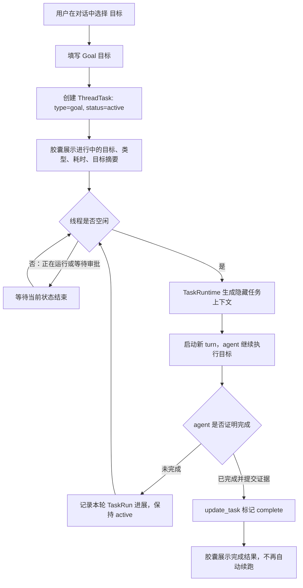

# REQ-20260702-001-长程任务

| 字段 | 值 |
|------|-----|
| 文档编号 | REQ-20260702-001-长程任务 |
| 创建日期 | 2026-07-02 |
| 负责人 | Keydex 研发 |
| 状态 | 草稿 |
| 最后更新 | 2026-07-02 |

---

## 一、用户故事

作为一名 **使用 Keydex 进行本地代码开发的用户**，我希望 **可以在当前对话中创建一个跨越多轮 turn 的长程任务，并用 Goal 作为首个任务类型持续推动 agent 完成目标**，以便 **我提出“一次性完成后再停止”的目标时，系统能持续调度、清晰展示状态，并在完成、暂停、恢复、删除时有明确的业务语义**。

补充用户故事：

- 作为一名 Keydex 用户，我希望在输入区附近直接看到当前长程任务的类型、状态、目标摘要和耗时，以便不用翻历史消息也能判断 agent 当前为什么继续工作。
- 作为一名 Keydex 用户，我希望可以随时展开长程任务面板，编辑目标、暂停/恢复任务、删除任务，以便在目标变化或不再需要时可以直接控制任务生命周期。
- 作为一名 Keydex 用户，我希望 Goal 自动续跑时不要伪装成新的用户消息，也不要让上一条普通用户消息看起来被重新发送，以便消息列表和运行日志能准确表达真实触发原因。
- 作为一名后续功能开发者，我希望长程任务不是 Goal 的一次性特殊实现，而是 turn 之上的通用 ThreadTask 抽象，以便未来 issue 执行、持续测试修复、E2E 验收、长程调研等能力可以作为新的消费方接入。

---

## 二、目标用户

| 用户类型 | 描述 | 核心诉求 |
|----------|------|----------|
| 本地开发用户 | 在 Keydex Desktop 中让 agent 修改代码、运行命令、验证结果的主要用户 | 能把一次性目标交给 agent 持续执行，过程可见，可随时控制 |
| 长程任务使用者 | 明确希望“完成后再停止”“持续推进直到通过”的用户 | 避免 agent 一轮结束后无故停下，避免目标和上一条用户消息混淆 |
| Keydex 前端使用者 | 通过输入框、菜单、胶囊状态条与对话记录理解运行状态的用户 | 在胶囊上看到任务类型、状态、耗时和操作入口 |
| Keydex 运行时开发者 | 维护 chat、tool、message event、runtime scheduler 的研发人员 | 有统一的 ThreadTask 生命周期和调度边界，不为每种长程能力重复造轮子 |
| 后续长程任务消费方开发者 | 未来接入 issue 执行、测试修复、E2E 验收等功能的开发者 | 复用任务表、任务运行记录、状态事件、自动续跑与 UI 展示基础 |

---

## 三、需求背景

### 3.1 业务背景

当前 Keydex 的对话以 turn 为基本执行单位。用户发起一次消息后，agent 完成本轮输出，线程恢复空闲。这个模型适合普通问答和局部开发，但对“帮我一次性完成某个目标，完成之后再停止，中途不要反复问我”这类需求不够稳定：agent 可能在完成前结束当前 turn，系统也缺少一个跨 turn 的目标状态来决定是否继续调度。

本次需求基于对 Codex `/goal` 功能的分析形成，但不直接照搬 Codex 的表现。Codex 的 Goal 本质是线程级目标状态 + 空闲时自动续跑 + agent 调用工具标记完成/阻塞。其问题在于 Goal 续跑没有新的可见用户消息，用户从消息列表或日志看时容易误以为上一条普通用户消息被重新发送。Keydex 需要吸收其“长程任务位于 turn 上层”的机制，同时在业务表达和 UI 上明确区分用户消息、任务状态和自动续跑。

本期只实现 `type=goal` 的长程任务消费入口。其他长程任务类型暂不实现，但底层能力必须为后续消费方预留扩展点。

### 3.2 要解决的问题

- 普通 turn 结束即停止，无法稳定承载“持续推进直到完成”的用户目标。
- Goal 目标如果被实现成普通 user message 或隐式复用上一条 user message，会造成对话记录、运行日志和模型输入语义混乱。
- 当前没有线程级长程任务状态，无法统一表达 active、paused、blocked、complete、system_stopped、cancelled 等生命周期。
- 当前输入区胶囊只展示计划、文件变更、打字速度等 turn 内信息，缺少 turn 之上的长程任务入口。
- 当前没有面向 future consumer 的通用任务抽象，未来 issue 执行、E2E 修复等能力如果各自实现调度，会造成重复状态机和重复 UI。
- 当前 agent 的完成判定缺少任务级证据记录，容易出现“agent 说完成了但任务没有可回溯证据”的情况。

### 3.3 预期收益

- 用户可以在对话中创建 Goal，并让系统在当前线程空闲后继续推进，直到任务完成、暂停、阻塞、系统停止、取消或删除。
- UI 清晰展示当前长程任务的类型、状态、目标摘要和耗时，用户可以通过胶囊展开详情并操作任务。
- 自动续跑不再伪装成用户消息，MessageList 中可以明确看到是长程任务驱动的新 turn。
- 后端形成 ThreadTask / TaskRun 通用模型，为后续更多长程任务消费方提供稳定基础。
- agent 标记完成时必须带完成证据，降低误关单风险，并为后续 verifier 扩展留下接口。

---

## 四、需求详细说明

### 4.1 功能列表

| 序号 | 功能点 | 优先级 | 说明 | Codex 代码参考 |
|------|--------|--------|------|-----------------|
| 1 | 线程级长程任务抽象 | P0 | 新增长程任务实体，挂在 session/thread 之上、turn 之下，支持类型、目标、状态、耗时、运行记录和扩展 metadata | `D:/Pycharm Projects/codex/codex-rs/state/goals_migrations/0001_thread_goals.sql:1`；`D:/Pycharm Projects/codex/codex-rs/state/src/model/thread_goal.rs:63`；`D:/Pycharm Projects/codex/codex-rs/ext/goal/src/api.rs:87` |
| 2 | Goal 任务创建入口 | P0 | 在对话菜单或 slash 菜单中新增“目标”功能，创建 `type=goal` 的长程任务；创建目标不作为普通用户消息发送 | `D:/Pycharm Projects/codex/codex-rs/tui/src/chatwidget/slash_dispatch.rs:745`；`D:/Pycharm Projects/codex/codex-rs/tui/src/chatwidget/slash_dispatch.rs:841`；`D:/Pycharm Projects/codex/codex-rs/tui/src/app/thread_goal_actions.rs:203` |
| 3 | 胶囊任务面板 | P0 | 在现有输入框胶囊区域展示长程任务，支持收起态、展开态、编辑、暂停/恢复、删除；额外展示任务类型 | `D:/Pycharm Projects/codex/codex-rs/tui/src/chatwidget/goal_status.rs:47`；`D:/Pycharm Projects/codex/codex-rs/tui/src/bottom_pane/footer.rs:99`；`D:/Pycharm Projects/codex/codex-rs/tui/src/bottom_pane/footer.rs:541` |
| 4 | 长程任务生命周期 | P0 | 支持 active、paused、blocked、complete、system_stopped、cancelled 等状态；用户控制 pause/resume/delete，agent 只能在满足规则时更新完成或阻塞，系统错误统一进入 system_stopped | `D:/Pycharm Projects/codex/codex-rs/state/goals_migrations/0001_thread_goals.sql:5`；`D:/Pycharm Projects/codex/codex-rs/tui/src/chatwidget/goal_menu.rs:109`；`D:/Pycharm Projects/codex/codex-rs/ext/goal/src/spec.rs:60` |
| 5 | 自动续跑调度 | P0 | 当线程空闲且任务 active 时，由运行时创建新 turn；用户消息、审批等待、当前运行中的 turn 优先于任务续跑；任务创建/编辑/暂停/删除与自动续跑之间必须有状态锁防止竞态 | `D:/Pycharm Projects/codex/codex-rs/ext/goal/src/extension.rs:154`；`D:/Pycharm Projects/codex/codex-rs/ext/goal/src/runtime.rs:359`；`D:/Pycharm Projects/codex/codex-rs/core/src/session/inject.rs:45` |
| 6 | 任务内部上下文注入 | P0 | 自动续跑时向模型注入隐藏任务上下文，包含任务类型、目标、续跑规则和完成审计要求；不渲染为普通用户消息 | `D:/Pycharm Projects/codex/codex-rs/ext/goal/src/steering.rs:45`；`D:/Pycharm Projects/codex/codex-rs/core/src/context/internal_model_context.rs:61`；`D:/Pycharm Projects/codex/codex-rs/ext/goal/templates/goals/continuation.md:1` |
| 7 | agent 任务状态工具 | P0 | 新增 agent 可调用工具读取当前任务、提交 complete/blocked 状态；完成必须携带证据与核验说明；blocked 必须满足连续三轮同一阻塞条件 | `D:/Pycharm Projects/codex/codex-rs/ext/goal/src/spec.rs:9`；`D:/Pycharm Projects/codex/codex-rs/ext/goal/src/spec.rs:60`；`D:/Pycharm Projects/codex/codex-rs/ext/goal/src/tool.rs:221` |
| 8 | 任务状态实时同步与历史回放 | P0 | 任务创建、更新、删除、运行开始/结束通过事件同步到前端；刷新历史后能恢复当前任务面板状态；任务事件与 turn completed、session resume、delete/clear 必须保持可解释顺序 | `D:/Pycharm Projects/codex/codex-rs/app-server-protocol/src/protocol/common.rs:533`；`D:/Pycharm Projects/codex/codex-rs/app-server-protocol/src/protocol/common.rs:1618`；`D:/Pycharm Projects/codex/codex-rs/app-server/src/extensions.rs:117` |
| 9 | 未来消费方扩展基础 | P1 | 存储、服务和运行时以 `type` 区分任务消费方，本期 UI 只开放 goal，后续类型可复用任务基础设施 | `D:/Pycharm Projects/codex/codex-rs/app-server/src/extensions.rs:64`；`D:/Pycharm Projects/codex/codex-rs/app-server/src/extensions.rs:71`；`D:/Pycharm Projects/codex/codex-rs/ext/goal/src/extension.rs:410` |
| 10 | 完成证据与风险约束 | P1 | 记录 agent 完成证据、最近运行信息、测试/验证摘要和系统停止原因；本期不实现独立 verifier，但接口预留 | `D:/Pycharm Projects/codex/codex-rs/ext/goal/templates/goals/continuation.md:30`；`D:/Pycharm Projects/codex/codex-rs/ext/goal/src/spec.rs:75`；`D:/Pycharm Projects/codex/codex-rs/ext/goal/src/tool.rs:285` |
| 11 | 测试与可观测性 | P1 | 覆盖 API、Repository、TaskRuntime、工具、前端胶囊交互和历史回放；日志可区分用户 turn 与 task continuation turn | `D:/Pycharm Projects/codex/sdk/python/src/openai_codex/_goal.py:37`；`D:/Pycharm Projects/codex/sdk/python/src/openai_codex/_goal.py:249`；`D:/Pycharm Projects/codex/sdk/python/tests/test_app_server_goal_operations.py:18` |

### 4.2 业务流程

流程说明：

1. 用户通过对话菜单或 slash 菜单创建 Goal。Goal 文本进入长程任务的 `objective`，不作为普通 `user_message` 写入对话。
2. 系统保存 ThreadTask，并在胶囊上展示任务类型、状态、耗时和目标摘要。
3. TaskRuntime 在任务 active 且线程空闲时自动启动下一轮 turn。
4. 自动 turn 的模型输入包含隐藏任务上下文，提示 agent 继续处理 active task，并要求完成前按目标逐项核验。
5. agent 如果还未完成目标，只做正常进展输出并保持任务 active；系统在 turn 完成后继续判断是否续跑。
6. agent 如果认为完成，必须通过任务状态工具提交 complete，并附带证据、核验项和总结。
7. 用户可随时通过面板编辑目标、暂停、恢复或删除任务。

### 4.3 关键场景说明

#### 4.3.1 创建 Goal

- 用户在输入区菜单选择“目标”，或通过 slash 菜单选择“目标”。
- 用户输入目标描述后提交。
- 系统创建 `type=goal` 的 ThreadTask。
- 如果当前线程已有未结束任务，本期不自动叠加第二个任务；前端需要提示用户编辑/替换/删除现有任务。
- 创建 Goal 不触发普通用户消息渲染，不污染最近一条 user message。

#### 4.3.2 展示与展开任务面板

- 收起态在输入区上方胶囊展示：
  - 类型：目标
  - 状态：进行中 / 已暂停 / 已阻塞 / 已完成 / 已取消
  - 耗时：累计运行时间或从创建后累计的任务时间
  - 目标摘要：单行截断
- 展开态展示：
  - 完整目标
  - 类型
  - 状态
  - 创建时间、最近更新时间、累计耗时、运行轮数
  - 最近一次运行摘要或完成证据
  - 编辑、暂停/恢复、删除、收起操作
- 面板设计借鉴 Codex 的输入区上方 Goal 面板，但保持 Keydex 现有胶囊、菜单、半透明边框和中性视觉风格。

#### 4.3.3 自动续跑

- 任务 active 且线程空闲时，TaskRuntime 启动一轮由长程任务驱动的 chat turn。
- 续跑 turn 的触发原因是 `task_continue`，不是用户新消息。
- 如果用户新消息正在发送或当前 turn 正在运行，任务续跑必须让路。
- 如果当前线程等待审批，任务续跑必须暂停调度，直到审批处理完毕。
- 如果任务被暂停、删除、取消、完成、阻塞或系统停止，不再自动续跑。
- 任务创建、编辑、暂停、删除与自动续跑之间必须串行化，避免用户刚暂停/删除后 runtime 又读到旧 active 状态并启动新 turn。

#### 4.3.4 编辑目标

- 用户可在展开面板中编辑 Goal 的 objective。
- 编辑后任务保持 active，下一轮自动续跑使用新目标。
- 编辑操作需要记录任务更新事件，历史回放时可看到任务目标已更新。
- 编辑 active 目标不重置累计耗时、运行轮数和最近运行记录；它仍是同一个长程任务的目标变更。
- 如果任务已 complete、cancelled 或 system_stopped，本期编辑后按新任务重新创建，不直接复活已结束任务。

#### 4.3.5 暂停与恢复

- 暂停：用户点击暂停后，任务状态变为 paused，TaskRuntime 不再自动续跑。
- 恢复：用户点击恢复后，任务状态变为 active；如果线程空闲，TaskRuntime 可以立即安排下一轮。
- 暂停/恢复是用户控制动作，不允许 agent 自行调用工具暂停或恢复。

#### 4.3.6 删除任务

- 用户点击删除后，需要二次确认。
- 删除后任务不再显示在 active 胶囊，不再自动续跑。
- 删除不回滚已产生的对话、工具调用或文件变更。
- 任务记录采用软删除或可审计删除策略，保留必要历史事件用于回放和排查。

#### 4.3.7 完成与阻塞

- agent 可以通过任务状态工具将任务标记为 complete 或 blocked。
- complete 必须携带：
  - 完成摘要
  - 逐项核验结果
  - 证据列表，例如测试结果、文件变更、命令输出摘要、页面验证结果
- blocked 必须携带：
  - 阻塞原因
  - 已尝试动作
  - 为什么没有可继续推进的路径
- blocked 只有在同一阻塞条件连续出现在至少三轮任务执行中，且 agent 已经没有可继续推进路径时才允许提交；用户恢复 blocked 任务后，阻塞审计重新计数。
- system_stopped 是系统控制状态，用于不可恢复运行错误、连续失败达到阈值或运行环境无法继续；agent 不能主动提交 system_stopped。
- 本期不要求独立 verifier 二次裁决，但工具层必须校验证据字段非空，避免无证据直接关闭任务。

### 4.4 与消息列表的关系

本需求明确区分三类内容：

| 类型 | 业务含义 | 是否等同用户消息 | 展示方式 |
|------|----------|------------------|----------|
| User Message | 用户真实输入并发给 agent 的消息 | 是 | 正常用户气泡 |
| Task Event | 任务创建、编辑、暂停、恢复、完成、删除等状态变化 | 否 | 轻量系统事件或任务面板状态 |
| Task Run | 长程任务驱动的一轮自动执行 | 否 | 可作为任务运行标记，不显示为用户气泡 |

自动续跑不应把 goal objective 渲染成普通用户消息，也不应复用上一条普通用户消息作为可见触发文本。

---

## 五、本期边界

### 5.1 本期范围

本期要交付的功能/场景：

- 新增通用 ThreadTask / TaskRun 数据模型与服务层，支持一个线程上的长程任务生命周期。
- 首个消费方为 `type=goal`，提供用户创建 Goal 的入口。
- 在对话输入区胶囊上展示长程任务，支持展开、编辑、暂停/恢复、删除。
- 自动续跑 active Goal，使用隐藏任务上下文启动新 turn。
- 提供 agent 读取任务与更新 complete/blocked 的工具。
- 将任务状态变化通过 API/WS 同步到前端，并支持历史加载后恢复当前任务状态。
- 避免 Goal 自动续跑表现为上一条用户消息重新发送。
- 覆盖必要后端单测、前端组件测试和关键交互验证。

### 5.2 本期不做

明确排除的功能/场景：

- 不实现除 `goal` 外的其他长程任务类型，例如 issue 执行、E2E 修复、持续测试修复、长程调研。
- 不支持一个线程同时运行多个 active 长程任务；本期限制为一个未结束任务。
- 不实现独立 verifier agent 或外部验收器；完成证据先由工具参数和运行记录约束。
- 不实现跨线程、跨工作区或全局任务队列。
- 不实现定时任务、周期任务、后台无人值守调度。
- 不实现 Codex 的 token_budget、budget_limited 或订阅制预算耗尽语义；本期只记录耗时、运行轮数和可用 token usage 摘要，系统不可继续时统一使用 system_stopped。
- 不回滚或自动清理任务执行过程中产生的代码变更。
- 不把任务目标写入 system/developer 高优先级指令；目标是用户级任务数据。
- 不重构现有 chat 主链路、工具执行体系或消息渲染体系，只在必要边界上扩展。

---

## 六、历史相关需求

| REQ 编号 | 关系 | 说明 |
|----------|------|------|
| 无正式 REQ | 前置调研 | 本需求来自本轮关于 Codex `/goal` 机制、Keydex 实现基础和长程任务抽象的连续讨论 |
| Codex Goal 机制调研 | 参考 | 已确认 Codex 的 Goal 不是另一个裁判 agent，而是线程级目标状态、隐藏续跑上下文、同一 agent 执行与工具更新状态的组合 |

---

## 七、行业情况

### 7.1 业界参考

本需求主要参考 Codex Goal 模式的业务形态：

- Goal 是线程级持久目标，不是普通对话消息。
- Goal active 时，系统在输入区附近展示目标状态。
- 目标可以暂停、恢复、编辑、删除。
- 系统在 turn 空闲后继续推动 agent 工作。
- agent 通过工具显式标记目标完成或阻塞。

需要纠正和优化的地方：

- Keydex 不应让 Goal 续跑在 UI 或日志上看起来像上一条用户消息被重新发送。
- Keydex 需要额外展示任务类型，因为 Goal 只是未来长程任务体系中的一种类型。
- Keydex 的实现应抽象为 ThreadTask，而不是只实现 Goal 的特殊分支。

### 7.2 竞品分析

| 竞品 | 功能特点 | 可借鉴点 |
|------|----------|----------|
| Codex Goal | 输入区上方展示进行中的目标，支持编辑、暂停、删除、展开，后台可自动续跑 | 胶囊上方任务面板、状态+耗时+目标摘要、用户可直接控制任务生命周期 |
| 常规 Chat Agent | 以用户消息触发单轮或多轮工具调用，无独立长期目标状态 | 保留普通 turn 简洁性，避免所有对话都进入长程任务模式 |
| 任务管理型 Agent | 用任务列表或计划清单追踪多步执行 | 完成证据、状态事件和任务运行记录值得借鉴，但本期不做多任务列表 |

---

## 八、验收要求

### 8.1 验收标准

- [ ] 用户可以从对话菜单或 slash 菜单创建“目标”长程任务，后端保存为 `type=goal` 的 ThreadTask。
- [ ] 创建 Goal 不会生成一条普通用户消息；MessageList 中不会显示 Goal 文本为用户气泡。
- [ ] 输入区上方胶囊展示当前长程任务，包含类型、状态、耗时和目标摘要。
- [ ] 用户点击胶囊或展开按钮后，可以查看完整目标、运行信息、最近结果和操作按钮。
- [ ] 用户可以编辑 active Goal 的目标文本，编辑后下一轮续跑使用新目标。
- [ ] 用户可以暂停 Goal；暂停后 TaskRuntime 不再自动续跑。
- [ ] 用户可以恢复 Goal；恢复后如果线程空闲，TaskRuntime 可以继续调度下一轮。
- [ ] 用户可以删除 Goal；删除后面板消失且不再调度，不回滚已产生的对话和文件变更。
- [ ] 当 Goal active 且线程空闲时，系统能通过隐藏任务上下文自动启动下一轮 agent 执行。
- [ ] 自动续跑 turn 在 UI 和日志中有明确的 task continuation 标识，不显示为上一条普通用户消息重新发送。
- [ ] 如果线程正在运行、等待审批或有用户新消息优先处理，任务自动续跑不会抢占。
- [ ] agent 可以读取当前任务状态和目标。
- [ ] agent 标记 complete 时必须提交完成摘要、核验项和证据；缺少证据时工具调用失败。
- [ ] agent 标记 blocked 时必须提交阻塞原因和已尝试动作，且同一阻塞条件已连续出现至少三轮任务执行；不满足时工具调用失败。
- [ ] 不可恢复运行错误、连续失败达到阈值或运行环境无法继续时，任务进入 system_stopped，停止自动续跑并显示系统停止原因。
- [ ] Goal complete、blocked、paused、system_stopped、cancelled、deleted 后不会继续自动续跑。
- [ ] 任务创建、编辑、暂停、删除和自动续跑之间不存在竞态；用户暂停/删除后不会再因旧 active 状态启动新 turn。
- [ ] 任务事件与 turn completed、session resume、delete/clear 的展示顺序稳定可解释。
- [ ] 刷新页面或重新加载历史后，前端能恢复当前 active/paused/blocked/system_stopped 任务面板状态。
- [ ] 后端 API、Repository、TaskRuntime、工具、前端胶囊组件均有针对性测试覆盖。
- [ ] 本期只开放 `goal` 创建入口，但数据模型和服务接口保留 `type` 字段，支持后续消费方扩展。

### 8.2 完成定义（DoD）

- [ ] REQ 与 DES 文档完成并落盘。
- [ ] 数据表、Repository、Service、API、WS 事件、TaskRuntime、agent 工具完成。
- [ ] 前端类型定义、runtime API、状态存储、slash/菜单入口、胶囊任务面板完成。
- [ ] 自动续跑使用隐藏任务上下文，不产生普通用户消息误导。
- [ ] 完成/阻塞工具具备证据字段校验。
- [ ] 单元测试、API 测试、前端组件测试通过。
- [ ] 关键交互完成手动或自动验证：创建、展开、编辑、暂停、恢复、删除、自动续跑、完成停止。
- [ ] 文档和实现保持一致，后续可进入 dev-plan 拆解。

---

## 九、附录

### Codex 代码参考索引

| 参考主题 | Codex 源码位置 | 对 Keydex 的启发 |
|----------|----------------|------------------|
| Slash 创建与控制命令 | `D:/Pycharm Projects/codex/codex-rs/tui/src/chatwidget/slash_dispatch.rs:745`、`:759`、`:787`、`:791`、`:841` | Goal 入口应是命令/菜单动作，不是普通 chat message |
| TUI Goal 动作封装 | `D:/Pycharm Projects/codex/codex-rs/tui/src/app/thread_goal_actions.rs:133`、`:203`、`:236`、`:263` | 前端动作应归一到 set/get/clear/update 状态 |
| App Server Goal API | `D:/Pycharm Projects/codex/codex-rs/app-server/src/request_processors/thread_goal_processor.rs:37`、`:97`、`:161`、`:165`、`:184` | 后端需要独立 task API，并在 set 后触发 runtime effects |
| Goal 状态表 | `D:/Pycharm Projects/codex/codex-rs/state/goals_migrations/0001_thread_goals.sql:1`、`:5`、`:13`、`:15` | Keydex 应建立 ThreadTask 表，记录状态、耗时、预算/用量扩展字段 |
| Goal 状态模型 | `D:/Pycharm Projects/codex/codex-rs/state/src/model/thread_goal.rs:63`、`:66`、`:68` | 任务模型需要 objective、status、usage/time 等状态字段 |
| Runtime 生命周期挂接 | `D:/Pycharm Projects/codex/codex-rs/ext/goal/src/extension.rs:102`、`:154`、`:201`、`:243`、`:299`、`:359`、`:410` | 长程任务应挂在线程/turn/tool 生命周期，而非只在 UI 层 |
| Idle 自动续跑 | `D:/Pycharm Projects/codex/codex-rs/ext/goal/src/runtime.rs:359`、`:392`、`:394` | active task 空闲时生成 continuation item 并启动下一轮 |
| Core idle gate | `D:/Pycharm Projects/codex/codex-rs/core/src/session/inject.rs:45`、`:54`、`:60`、`:69`、`:122`、`:127` | 自动续跑必须检查 pending user turn、Plan mode、busy，再启动 RegularTask |
| 隐藏上下文构造 | `D:/Pycharm Projects/codex/codex-rs/ext/goal/src/steering.rs:45`、`:49`、`:50`、`:56` | Keydex 的 continuation prompt 应是内部上下文，不是可见用户消息 |
| 内部上下文标记 | `D:/Pycharm Projects/codex/codex-rs/core/src/context/internal_model_context.rs:61`、`:79`、`:110` | Codex 用 `<codex_internal_context source="goal">` 表达隐藏上下文来源 |
| 续跑 Prompt | `D:/Pycharm Projects/codex/codex-rs/ext/goal/templates/goals/continuation.md:1`、`:3`、`:30`、`:43`、`:51` | Keydex prompt 必须写清 objective 是用户数据、完成审计和阻塞审计 |
| Goal 工具定义 | `D:/Pycharm Projects/codex/codex-rs/ext/goal/src/spec.rs:9`、`:25`、`:60`、`:75` | Keydex 工具应限制 agent 只能在完成/阻塞时更新状态 |
| Goal 工具执行 | `D:/Pycharm Projects/codex/codex-rs/ext/goal/src/tool.rs:163`、`:180`、`:221`、`:285`、`:454` | Keydex `update_thread_task` 应做状态校验和结果返回 |
| Goal 更新通知 | `D:/Pycharm Projects/codex/codex-rs/app-server-protocol/src/protocol/common.rs:533`、`:1618`；`D:/Pycharm Projects/codex/codex-rs/app-server/src/extensions.rs:117` | Keydex 应补 task_updated/task_deleted WS 与 replay action |
| SDK logical turn 聚合 | `D:/Pycharm Projects/codex/sdk/python/src/openai_codex/_goal.py:37`、`:249`；`D:/Pycharm Projects/codex/sdk/python/tests/test_app_server_goal_operations.py:18` | 多个物理续跑 turn 可在消费侧聚合为一个 logical task operation |

### 变更记录

| 版本 | 日期 | 变更类型 | 变更内容 | 变更原因 |
|------|------|----------|----------|----------|
| v1.2 | 2026-07-02 | 修订 | 将系统停止态收敛为 system_stopped，补充并发锁、blocked 三轮审计、事件顺序和失败停止验收要求 | 对齐 Codex 运行时安全细节，同时适配 Keydex 非订阅制预算模型 |
| v1.1 | 2026-07-02 | 修订 | 为功能列表和附录补充 Codex 精确代码参考 | 便于后续 dev-plan / issues CSV 携带 ref |
| v1.0 | 2026-07-02 | 新增 | 初始版本，定义 Keydex 长程任务与 Goal 首个消费入口 | 支持 turn 之上的长程任务能力 |

---

> 本文档由需求讨论整理生成，遵循 AICoding 范式规范。
