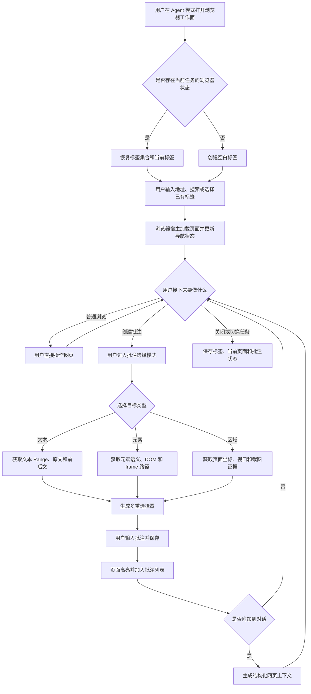
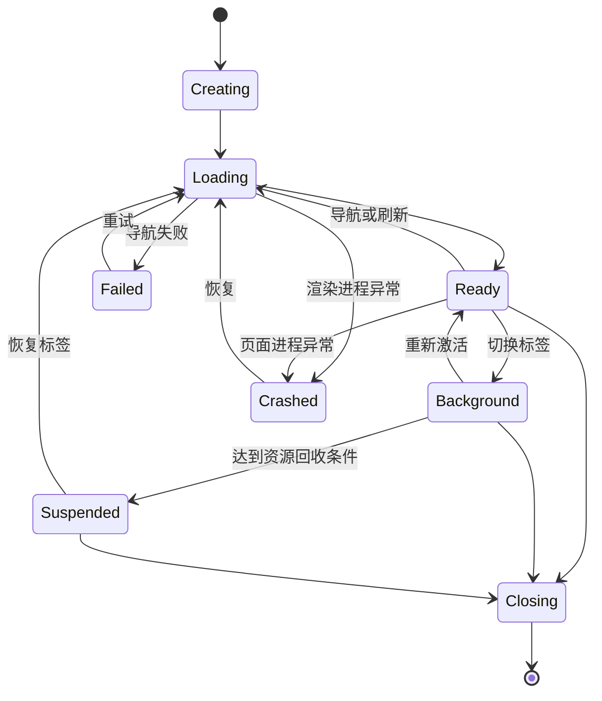

# REQ-20260721-001-侧边栏浏览器

| 字段 | 值 |
|------|-----|
| 文档编号 | REQ-20260721-001-侧边栏浏览器 |
| 创建日期 | 2026-07-21 |
| 负责人 | 待定 |
| 状态 | 草稿 |
| 最后更新 | 2026-07-21 |

---

## 一、用户故事

### 1.1 应用内完整浏览

> 作为一名使用 Keydex Agent 模式完成研发、调研和知识工作的用户，我希望能够在任务侧边栏中打开一个具备多标签、导航、登录态、下载和权限处理能力的完整浏览器，以便在不离开当前任务上下文的情况下浏览和操作网页。

### 1.2 网页结构化引用与批注

> 作为一名需要从网页中提取和沉淀信息的用户，我希望能够选择网页中的文本、元素或页面区域并添加批注，同时将其作为结构化上下文附加到对话，以便准确保存信息来源，并在页面变化后尽可能重新定位原始内容。

> 本期不包含 Agent 对浏览器页面的自动点击、输入、滚动、上传、提交或跨站任务执行。页面结构感知仅用于用户主动发起的结构化选择与批注。

---

## 二、目标用户

| 用户类型 | 描述 | 核心诉求 |
|----------|------|----------|
| 研发与技术用户 | 在 Keydex 中进行编码、排错、阅读文档、查看本地服务和验证页面的开发者 | 不离开当前任务即可浏览网页、登录系统、查看本地页面，并将页面内容结构化引用到对话 |
| 调研与知识工作用户 | 使用 Keydex 搜集资料、比较方案、阅读文档并沉淀结论的产品、设计、研究及管理用户 | 将网页文本、元素和区域结构化引用到对话中，添加可追溯批注，并在多个网页之间保持调研上下文 |

普通网页浏览面向所有 Keydex Agent 模式用户；结构化选择、批注和对话引用是在完整浏览能力之上的进阶能力，不限定为某一种专业角色。

---

## 三、需求背景

### 3.1 业务背景

Keydex 已经具备 Agent 对话、项目文件浏览、文件预览、文件批注引用、Web 搜索与公开网页抓取等能力，并在 Agent 模式中提供了可调整宽度、切换位置和多标签承载的右侧栏。

但当前网页能力与任务工作台是分离的。用户需要切换到外部浏览器完成网页访问、登录、页面操作和结果确认；网页位置、当前任务和对话上下文难以保持连续。现有 HTML iframe 预览适合本地文件展示，但无法承担完整浏览器所需的登录态、弹窗、下载、网站权限、持久 Profile 和异常恢复等能力。

随着 Keydex 从代码助手向综合工作台发展，浏览器将成为连接在线文档、管理系统、本地 Web 应用、调研资料和 SaaS 服务的关键工作面。同时，现有文件批注能力需要扩展到网页，使用户可以把网页证据以结构化、可恢复、可追溯的方式沉淀到当前任务中。

### 3.2 要解决的问题

1. **网页访问与任务上下文割裂**

   用户需要在 Keydex 与外部浏览器之间反复切换，当前任务、网页位置和对话上下文难以保持连续。

2. **现有 Web 工具不等于真实浏览器**

   搜索和网页抓取无法完整处理登录态、单页应用、动态渲染、用户交互、文件上传下载、弹窗及网站权限。

3. **网页内容缺少结构化选择能力**

   用户无法在 Keydex 内选择网页文本、DOM 元素或页面区域，并得到包含来源、语义、位置和页面版本的结构化结果。

4. **网页批注缺少稳定锚点**

   单纯复制文本、截图或保存坐标不能抵抗网页重新加载、DOM 重排和内容更新，无法明确表达正常、内容变化、歧义或孤立状态。

5. **网页证据与对话上下文缺少统一协议**

   用户只能手工复制网页内容，无法像文件批注一样主动附加带来源、引用内容和解析状态的结构化网页批注。

6. **现有侧边栏尚未形成真正可扩展的平台**

   当前侧边栏具备布局和多标签外壳，但面板状态、渲染和初始页动作仍存在具体类型硬编码。浏览器以及后续结构化工作面需要统一的工作面注册和生命周期机制。

### 3.3 预期收益

- 用户可在当前 Keydex 任务内完成网页浏览、登录、调研和页面验证，减少应用切换。
- 浏览器标签与任务保持关联，使网页工作状态可以随任务切换和应用重启恢复。
- 用户可以选择网页文本、元素和区域，并形成带来源、语义和多重锚点的结构化批注。
- 网页证据可以通过批注和页面版本进入对话，提高信息的准确性与可追溯性。
- 现有文件批注与网页批注形成统一的上下文引用体验。
- 推动右侧栏从固定功能集合演进为可扩展的内部工作面平台。

---

## 四、需求详细说明

### 4.1 功能列表

| 序号 | 功能点 | 优先级 | 说明 |
|------|--------|--------|------|
| F1 | 右侧栏工作面平台化 | P0 | 将面板元数据、初始状态、渲染、序列化、恢复和生命周期改造成注册表驱动；现有面板和浏览器均通过统一协议接入 |
| F2 | 侧边栏浏览器工作面 | P0 | 在 Agent 模式右侧栏新增浏览器面板，支持打开、关闭、左右换位、调整宽度、最大化，并与现有任务界面协同显示 |
| F3 | 完整网页导航 | P0 | 支持地址输入、搜索、前进、后退、刷新/停止、页面标题、favicon、加载状态和导航错误提示 |
| F4 | 多标签页管理 | P0 | 支持新建、选择、关闭、恢复浏览器标签，并限制后台标签页资源占用 |
| F5 | 持久登录与浏览器 Profile | P0 | 使用 Keydex 独立 Profile 保存 Cookie、缓存和网站权限；提供独立无痕浏览入口 |
| F6 | 常用浏览器交互 | P0 | 支持登录、动态网页、SPA、弹窗、新窗口、文件上传下载、页面缩放、页内查找及常见网站权限 |
| F7 | 会话与异常恢复 | P0 | 保存任务对应的标签集合和当前页面；浏览器或页面进程异常退出后提供恢复能力 |
| F8 | 文本结构化选择 | P1 | 用户选择网页文本后，记录原文、前后文、文本位置、页面来源、页面版本和 frame 信息 |
| F9 | 元素结构化选择 | P1 | 用户选择按钮、链接、输入框、图片、卡片或表格区域等元素，记录其语义、DOM 路径、frame 路径和页面位置 |
| F10 | 页面区域选择 | P1 | 用户拖拽选择视觉区域，保存页面坐标、视口信息和截图证据；几何信息不作为唯一长期锚点 |
| F11 | 网页批注 | P1 | 基于文本、元素或区域创建、编辑、删除和展示批注，并在页面变化后尝试恢复原始锚点 |
| F12 | 批注导航与状态 | P1 | 支持页面内高亮、批注列表、定位跳转，以及正常、内容变化、歧义、孤立状态 |
| F13 | 网页上下文附加 | P1 | 将用户主动选择的网页批注、页面来源、引用内容和解析状态附加到当前对话 |
| F14 | 权限隔离与数据最小化 | P0 | 远程网页无 Tauri 原生权限；网页 DOM、凭据和表单内容不自动进入后端或模型 |

P0 表示完整浏览器和安全运行所必需的基础能力；P1 表示在完整浏览器之上的结构化选择、批注和对话引用能力。

### 4.2 主流程

### 4.3 浏览器标签状态

### 4.4 批注解析状态

| 状态 | 含义 | 用户可见行为 |
|------|------|--------------|
| 正常 | 当前页面能够唯一定位原始目标，且引用内容未发生可见变化 | 正常高亮并允许定位 |
| 内容变化 | 仍能定位目标，但当前内容与创建批注时的引用快照不同 | 显示变化提示，同时保留原始引用 |
| 歧义 | 存在多个符合条件的候选目标，无法安全选择唯一位置 | 不自动高亮任意目标，提示用户重新绑定 |
| 孤立 | 当前页面无法找到可信候选目标 | 保留批注正文和原始来源，允许用户重新选择目标 |

### 4.5 关键异常分支

1. **页面加载失败**：显示失败类型、目标 URL 和重试入口；保留导航历史，避免不可恢复的空白页面。
2. **证书错误或不安全页面**：默认阻止继续访问并显示风险，浏览器不得静默绕过。
3. **弹窗和新窗口**：默认转化为新的 Keydex 浏览器标签；外部协议交由系统处理前要求用户确认。
4. **下载与上传**：下载展示文件名、来源和目标；上传必须由用户通过系统选择器选取文件。
5. **登录、验证码和多因素认证**：由用户直接在浏览器中完成；密码、验证码和身份令牌不进入批注或对话上下文。
6. **页面动态变化**：导航或显著内容变化后重新解析批注；不得根据旧坐标盲目高亮。
7. **选择目标消失或存在歧义**：停止创建或恢复流程并显示原因，允许用户重新选择。
8. **页面进程崩溃**：保留标签和最后 URL，提供恢复入口，不影响 Keydex 主任务和对话。
9. **不支持的 frame**：明确显示该区域当前不支持批注，不生成错误锚点。
10. **批注上下文未经用户附加**：网页正文、DOM 和表单内容不得自动进入对话。

---

## 五、本期边界

### 5.1 本期范围

#### 5.1.1 右侧栏工作面平台化

- 将面板元数据、初始状态、状态恢复、渲染入口和生命周期从具体布局逻辑中剥离。
- 注册表驱动侧边栏初始页、添加标签菜单、标签标题与图标、面板渲染和状态恢复。
- 将现有 `files / conversation / review` 面板迁移到统一注册机制。
- 浏览器作为新的 `browser` 工作面通过相同机制接入。
- 保留现有侧边栏的左右换位、宽度调整、最大化和动画行为。
- 补充注册表、状态恢复、生命周期和现有面板兼容测试。
- 本期平台化目标是 Keydex 内部可扩展，不建设第三方插件生态。

#### 5.1.2 Windows 侧边栏完整浏览器

- 基于 WebView2 的独立网页渲染视图。
- 地址栏、搜索、前进、后退、刷新和停止。
- 多标签页、标题、favicon 和加载状态。
- 动态网站、SPA 和常见登录流程。
- 持久 Profile 与显式无痕 Profile。
- Cookie、缓存和网站存储。
- 新窗口、弹窗、文件上传下载和常见网站权限。
- 页面缩放、页内查找和异常恢复。
- 后台标签挂起和资源数量限制。
- 与侧边栏宽度、位置和最大化状态联动。

#### 5.1.3 用户驱动的结构化选择与批注

- 用户主动进入和退出批注选择模式。
- 选择网页文本、DOM 元素或页面区域。
- 获取和保存目标语义、文本、DOM、frame、位置和页面来源信息。
- 保存 URL、规范化 URL、页面指纹、引用快照和多种锚点选择器。
- 页面内高亮、批注列表、编辑、删除和定位跳转。
- 页面变化后的多级重新定位。
- 正常、内容变化、歧义和孤立状态。
- 将用户主动选择的批注作为结构化上下文附加到当前对话。
- 尽可能复用现有文件批注的选择器、解析状态和消息注入机制。

#### 5.1.4 安全、稳定性与验证

- 远程网页 WebView 不获得 Tauri 文件、Shell、工作区或其他主应用原生能力。
- 主应用 WebView 与浏览器 WebView 使用不同 capability 边界。
- 网页内容、DOM、Cookie、密码和表单内容不自动进入后端或模型。
- 覆盖页面进程崩溃、导航失败、任务切换和应用重启恢复。
- 覆盖不同系统缩放、多显示器和侧边栏位置。
- 验证多标签页下的资源释放和后台策略。
- 完成侧边栏平台、浏览器宿主、结构化选择、批注和上下文引用的针对性测试。

### 5.2 交付里程碑

1. **M0：右侧栏工作面平台化与 WebView2 宿主验证**
2. **M1：完整侧边栏浏览器**
3. **M2：文本、元素和区域的结构化选择**
4. **M3：批注持久化、重新定位和对话引用**
5. **M4：安全、性能、恢复和产品化验收**

各里程碑必须保持向后兼容；完整浏览器不依赖批注功能完成后才能独立使用。

### 5.3 本期不做

1. 不实现 macOS 和 Linux 浏览器宿主；本期只交付 Windows WebView2 路线。
2. 不直接迁移整个 Keydex 桌面框架；只有架构验证失败时才另行决策原生 BrowserHost 或 Electron 路线。
3. 不建设面向第三方的侧边栏插件 SDK、动态代码加载或插件市场。
4. 不支持 Chrome/Edge 扩展生态和扩展商店。
5. 不复用用户日常 Edge 默认 Profile，不读取其历史、密码和扩展数据。
6. 不实现浏览器账号同步、收藏夹同步或通用密码管理器。
7. 不绕过验证码、多因素认证和证书警告。
8. 不建设远程或云端浏览器集群。
9. 不把完整开发者工具作为正式产品面板。
10. 不以纯视觉坐标作为长期批注锚点。
11. 不把右侧栏平台化扩大成全应用布局重构。
12. 不实现 Agent 页面快照、元素查询、点击、输入、滚动、上传、提交或跨站自动化。
13. 不新增供 Agent 使用的 `BROWSER` capability 或浏览器操作工具。
14. 不建设 Agent 浏览器控制授权、操作租约、操作审批或自动化审计体系。

---

## 六、历史相关需求

| REQ 编号 | 关系 | 说明 |
|----------|------|------|
| N/A | 无明确历史 REQ | 当前未提供与侧边栏浏览器直接关联的正式需求文档编号 |

本需求会在 DES 中关联现有右侧栏、文件批注、HTML 预览、Web 工具和 Tauri 主窗口能力，但这些现有实现不作为历史 REQ 编号。若后续发现已有正式需求，可在评审前补充。

---

## 七、行业情况

### 7.1 业界方案分层

当前社区不存在一套同时解决浏览器 UI、原生网页运行、结构化选择、批注锚定和 Keydex 权限隔离的单一方案。成熟能力主要分布在浏览器宿主和网页批注两个层次，需要由 Keydex 组合并建立统一状态与用户体验。

### 7.2 竞品与方案分析

| 方案 | 定位 | 可借鉴点 | 本期判断 |
|------|------|----------|----------|
| Codex 侧边栏浏览器 | Agent 工作台内的一等浏览器工作面 | 浏览器与当前任务并列显示，具备标签、导航、地址栏和侧边栏布局 | 借鉴产品形态；不根据截图推断其内部实现 |
| Tauri/Wry Child WebView | 在 Tauri 原生窗口中嵌入远程网页 | 复用 Keydex 当前 Tauri/Rust 架构 | 首选验证路线；多 WebView 稳定性和窗口层级必须先验证 |
| WebView2 | Windows 应用内嵌浏览器运行时 | Profile、权限、下载、进程模型、Web 消息和调试接口完整 | Windows-first 浏览器运行时 |
| Electron WebContentsView | Electron 内嵌浏览器视图 | Session、下载、权限和多视图管理成熟 | Tauri/WebView2 验证失败后的架构后备，不在本期直接迁移 |
| CEF | 独立 Chromium 嵌入框架 | 浏览器控制力强 | 分发和维护成本过高，本期不采用 |
| W3C Web Annotation | 网页批注数据标准 | TextQuote、TextPosition、CSS、XPath、Fragment、Range 等 Selector | 作为网页批注数据模型的重要参考 |
| Hypothesis | 成熟网页批注产品和实现 | 多选择器锚定、文本前后文、页面变化后的模糊恢复 | 借鉴多重锚点、恢复策略和孤立状态 |

### 7.3 成熟设计归纳

1. 浏览器没有批注功能时也必须能够独立作为普通浏览器使用。
2. 远程网页必须位于低权限 WebView，不能继承 Keydex 主应用的原生能力。
3. 批注必须同时保存多个锚点，不能只依赖 CSS 路径或屏幕坐标。
4. 文本、元素和区域选择都必须由用户主动触发，不对网页持续执行无边界扫描。
5. 页面重新加载和内容变化后必须明确区分正常、内容变化、歧义和孤立状态。
6. 网页内容只有在用户主动附加批注时才进入对话上下文。
7. 浏览器必须通过统一右侧栏工作面协议接入，而不是继续在布局组件中增加特例。

### 7.4 参考资料

- Tauri WebviewBuilder：https://docs.rs/tauri/latest/tauri/webview/struct.WebviewBuilder.html
- Wry WebViewBuilder：https://docs.rs/wry/latest/wry/struct.WebViewBuilder.html
- WebView2 API 概览：https://learn.microsoft.com/en-us/microsoft-edge/webview2/concepts/overview-features-apis
- Electron WebContentsView：https://www.electronjs.org/docs/latest/api/web-contents-view
- Chromium Embedded Framework：https://github.com/chromiumembedded/cef
- W3C Web Annotation Data Model：https://www.w3.org/TR/annotation-model/
- Hypothesis Fuzzy Anchoring：https://web.hypothes.is/blog/fuzzy-anchoring/

---

## 八、验收要求

### 8.1 侧边栏工作面平台

- [ ] `files / conversation / review / browser` 均通过统一工作面注册协议接入。
- [ ] 注册定义覆盖类型、标题、图标、初始状态、渲染、序列化、恢复和生命周期。
- [ ] 新增内部工作面时不需要在 `Layout.tsx` 增加针对该面板类型的渲染分支。
- [ ] 侧边栏初始页和添加标签菜单由注册表生成。
- [ ] 各面板使用统一标签状态模型，并按 Keydex 任务保存和恢复。
- [ ] 文件、对话和审查面板迁移后功能与现状一致。
- [ ] 左右换位、宽度调整、最大化、关闭和现有动画行为保持一致。
- [ ] Workbench、Project 等当前未启用全局右侧栏的模式不会意外出现入口或面板。
- [ ] 工作面自身错误不会导致整个主布局白屏。

### 8.2 侧边栏浏览器

- [ ] 用户可以从侧边栏初始页或添加标签菜单创建浏览器工作面。
- [ ] 浏览器可以与文件、对话和审查面板共同存在。
- [ ] 浏览器网页视图在宽度调整、左右换位、最大化、窗口缩放和多显示器切换后位置正确。
- [ ] 支持 URL/搜索输入、前进、后退、刷新、停止、重定向后的真实地址、标题、favicon 和加载状态。
- [ ] 导航失败时显示错误信息和重试入口，不出现不可恢复空白页。
- [ ] 支持新建、选择、关闭和恢复多标签页；新窗口默认转化为新标签。
- [ ] 至少同时打开 10 个标签时，标签切换和当前页面操作仍可正常完成。
- [ ] Keydex 使用独立普通 Profile，并提供数据隔离的无痕 Profile。
- [ ] 普通 Profile 的有效登录态可在 Keydex 重启后恢复；最后一个无痕会话关闭后清理无痕站点数据。
- [ ] 支持静态网站、JavaScript SPA、常见登录和 OAuth 跳转。
- [ ] 支持系统文件选择器上传、下载任务、常见网站权限、页内查找和页面缩放。
- [ ] 浏览器标签集合与 Keydex 任务关联，任务切换和应用重启后恢复对应 URL 与选中状态。
- [ ] 单个网页崩溃或加载失败不会导致 Keydex 主界面、当前任务和其他标签崩溃。
- [ ] 关闭浏览器标签后释放对应 WebView、事件监听和页面桥状态。

### 8.3 文本、元素和区域选择

- [ ] 用户可以进入和退出批注选择模式；退出后网页恢复正常交互。
- [ ] 文本选择保存精确文本、前后文、文本位置、URL、标题和 frame 信息。
- [ ] 跨多个文本节点的选区可以生成完整批注。
- [ ] 相同文本可以通过前后文和位置辅助区分。
- [ ] 元素选择模式展示候选轮廓，并支持按钮、链接、图片、输入框、卡片和表格区域等元素。
- [ ] 元素选择保存标签、角色、可访问名称、文本摘要、DOM 路径、frame 路径和页面位置。
- [ ] 选择模式不会触发原元素的点击、提交或导航。
- [ ] 区域选择保存页面坐标、视口尺寸、滚动位置和截图证据。
- [ ] 无有效面积的区域不生成批注；页面变化后不依据旧坐标盲目恢复。
- [ ] 同源 iframe 和可覆盖的 frame 可以生成带 frame 路径的选择结果；无法处理时明确提示不支持。
- [ ] Shadow DOM 目标记录 host 路径并尝试在重新加载后恢复。

### 8.4 批注持久化、恢复与导航

- [ ] 批注保存后立即出现在当前网页批注列表中，并在页面内显示高亮。
- [ ] 批注记录页面来源、页面指纹、选择器集合、引用内容、用户评论和时间信息。
- [ ] 重新打开同一页面时能够加载相关批注，不同来源页面的相同文本不会串联。
- [ ] 编辑和删除批注后，页面高亮和批注列表同步更新。
- [ ] 页面重新加载后依次使用 DOM/Range、文本引用与上下文、语义和位置等方式恢复。
- [ ] 原文发生变化但仍可定位时显示“内容已变化”。
- [ ] 存在多个候选时显示“歧义”，不自动选择任意候选。
- [ ] 无法定位时显示“孤立”，并保留原始引用与批注正文。
- [ ] 用户可以重新选择目标并更新锚点，且不丢失原批注正文和变更信息。
- [ ] 从批注列表点击批注可以切换到对应标签并滚动到目标；目标不可定位时显示原因。
- [ ] 高亮层不阻断网页正常滚动、输入和点击。

### 8.5 对话引用

- [ ] 用户可以主动把一条或多条网页批注附加到当前对话。
- [ ] 未经用户主动附加，网页正文和页面结构不会自动进入对话上下文。
- [ ] 附加内容包含页面标题、URL、引用内容、批注正文、目标类型和解析状态。
- [ ] 元素批注只附加必要语义，不附加无关完整 DOM。
- [ ] 区域批注包含截图证据和页面来源。
- [ ] 页面内容变化时保留发送时引用快照，并区分当前解析状态。
- [ ] 删除原批注不会篡改已经发送的历史消息。
- [ ] 对话历史重新加载后，网页批注上下文仍可正确展示。

### 8.6 安全与范围约束

- [ ] 远程网页 WebView 不具备 Tauri Shell、文件系统、工作区或主应用 IPC 权限。
- [ ] 远程页面调用 Keydex/Tauri 命令时失败且不产生副作用。
- [ ] 主应用 capability 明确限定到主 WebView，而不是包含浏览器的整个窗口。
- [ ] 页面选择桥只接受固定 schema，不允许执行任意原生命令。
- [ ] 浏览器不自动发送 DOM、Cookie、密码或表单内容到后端或模型。
- [ ] 密码输入框、身份令牌、Cookie 和授权头不进入批注数据。
- [ ] 后端不注册浏览器点击、输入、滚动、上传或提交工具。
- [ ] 不新增供 Agent 使用的 `BROWSER` capability。
- [ ] 页面元素引用仅用于用户批注解析，不作为 Agent 操作句柄。
- [ ] 产品界面不出现允许 Agent 控制浏览器的入口。

### 8.7 性能与资源释放

- [ ] 地址栏、标签栏和浏览器页面保持可交互，侧边栏拖拽时 WebView 不出现长期错位或覆盖。
- [ ] 非批注选择状态下不运行高频全页面元素探测。
- [ ] 页面滚动和输入不因批注桥持续扫描完整 DOM 而明显卡顿。
- [ ] 批注高亮采用增量更新，不在每次页面变化后无条件重建全部页面结构。
- [ ] 连续创建并关闭 20 个标签后，不存在持续增长的已关闭 WebView 实例。
- [ ] 后台标签遵循明确的挂起或回收策略。
- [ ] 切换任务后，不活跃任务的所有浏览器视图不会继续保持前台运行状态。
- [ ] 应用退出时浏览器状态在限定流程内完成持久化，不无限阻塞退出。

### 8.8 完成定义（DoD）

- [ ] REQ 与 DES 完成并保持编号关联。
- [ ] DES 明确给出侧边栏工作面注册协议、BrowserHost 边界、WebView2 生命周期和批注数据模型。
- [ ] Tauri 多 WebView、React/WebView 覆盖层、DPI、多显示器和权限隔离完成架构验证。
- [ ] 现有 `files / conversation / review` 面板迁移完成，无已知功能回退。
- [ ] 侧边栏浏览器基础能力完成。
- [ ] 文本、元素和区域批注完成。
- [ ] 批注保存、重新定位、状态展示和对话引用完成。
- [ ] 本需求要求的单元测试、组件测试、Rust 测试和桌面 E2E 测试通过。
- [ ] 使用静态页面、SPA、登录页面、iframe 页面、Shadow DOM 页面和动态内容页面完成验收。
- [ ] WebView 权限隔离和批注数据最小化完成专项验证。
- [ ] 不包含 Agent 浏览器操作自动化入口或工具。
- [ ] 浏览器崩溃与恢复链路完成验证。
- [ ] Windows NSIS 安装包完成真实安装和启动验证。
- [ ] 用户可见说明文档和变更记录完成。
- [ ] 产品验收通过，未遗留阻断级问题。

---

## 九、附录

### 9.1 术语

| 术语 | 说明 |
|------|------|
| 工作面 | 可注册到 Keydex 右侧栏、具有独立状态和生命周期的内部面板类型 |
| BrowserHost | 在桌面原生层管理 WebView2 创建、尺寸、Profile、导航、事件和销毁的浏览器宿主 |
| 结构化选择 | 用户主动选择网页文本、DOM 元素或页面区域，并生成带来源、语义和锚点的结构化结果 |
| Selector | 用于描述和重新定位批注目标的文本、DOM、语义、frame 或几何选择器 |
| 页面指纹 | 用于辅助判断页面版本或内容变化的页面特征，不作为唯一页面身份 |
| 孤立批注 | 当前页面无法可信定位原始目标，但仍保留原始来源、引用快照和批注正文的批注 |

### 9.2 变更记录

| 版本 | 日期 | 变更类型 | 变更内容 | 变更原因 |
|------|------|----------|----------|----------|
| v1.0 | 2026-07-21 | 新增 | 生成侧边栏浏览器与结构化网页批注需求初稿 | 建立完整浏览器工作面和网页批注能力 |
| v1.1 | 2026-07-21 | 范围修订 | 删除 Agent 浏览器自动化、页面操作工具和 Agent 控制授权；将页面结构感知限定为用户批注所需 | 用户明确本期只实现侧边栏浏览器、批注和结构化注释 |
| v1.2 | 2026-07-21 | 范围补充 | 将右侧栏工作面平台化提升为 P0 前置能力 | 避免继续在布局组件中硬编码浏览器特例 |

---

> 本文档由 `/req` 流程生成，遵循 AICoding 范式规范。
