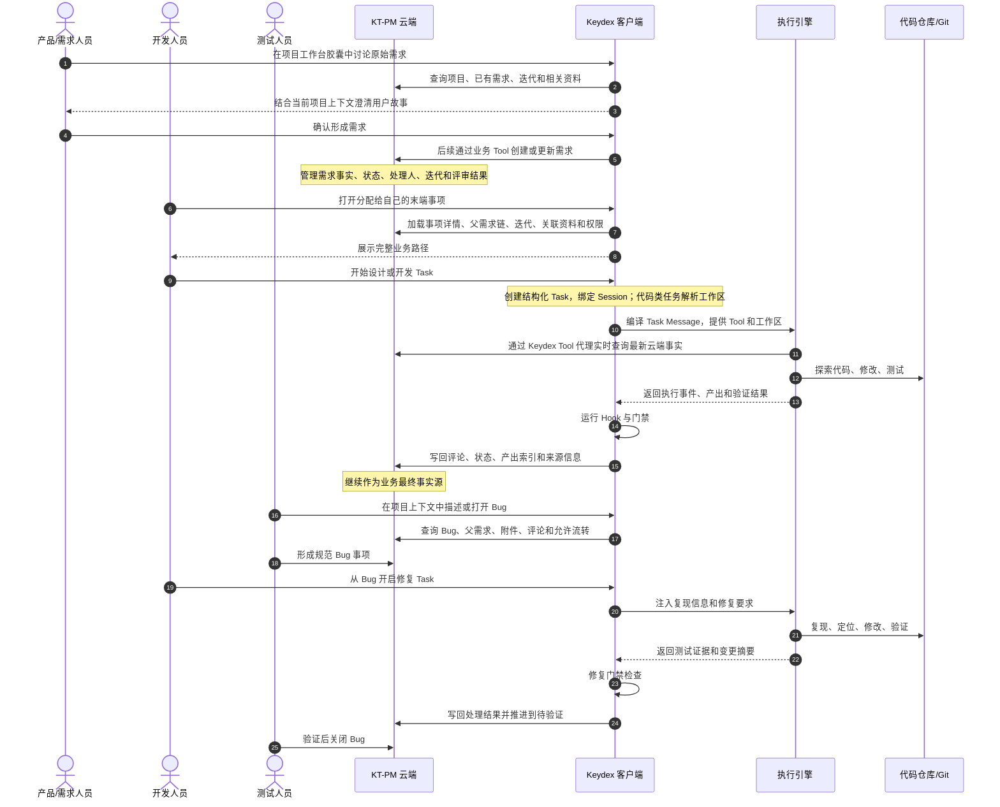
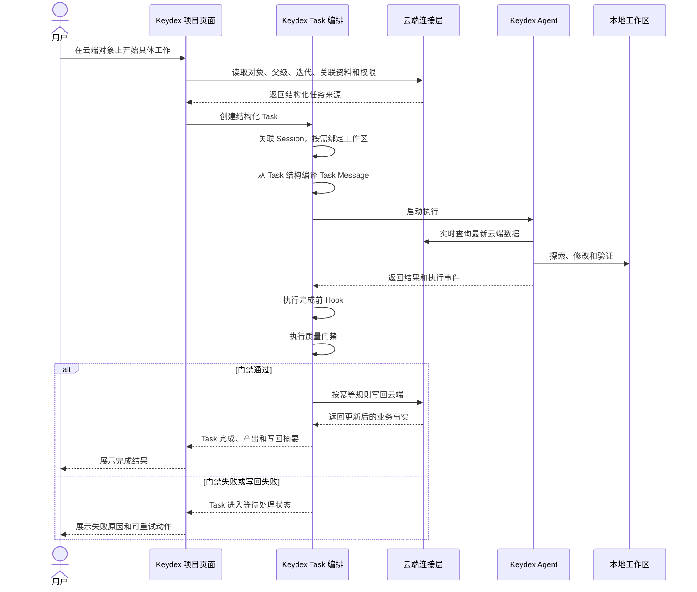

# DES-20260712-001-Keydex项目模式任务闭环与云端接入

| 项目 | 内容 |
|---|---|
| 文档状态 | 讨论稿 v0.9 |
| 初始编写日期 | 2026-07-12 |
| 最后讨论日期 | 2026-07-13 |
| 恢复日期 | 2026-07-24 |
| 需求来源 | 组内关于 KT-PM Web、Keydex 项目模式、Task、Hook、执行引擎和资源包的连续讨论 |
| 历史关联说明 | `docs/PRODUCT-20260710-001-Keydex项目模式产品方向说明.md` |
| 历史关联说明 | `docs/ARCH-20260702-001-Web项管与Keydex一体化架构说明.md` |
| 既有云端设计 | `.ktaicoding/des/DES-20260623-001-平台治理与IM登录基础.md` |
| 既有云端设计 | `.ktaicoding/des/DES-20260630-001-项目与事项协作底座.md` |
| 本文重点 | 基于云端项目管理能力，设计 Keydex 从数据承接到任务执行闭环的分阶段方案 |

> 恢复说明：本文曾以未跟踪文件存在，后被误删。当前版本依据 2026-07-12 至 2026-07-13 的连续讨论、已冻结决策和 v0.1-v0.9 变更记录重新整理。恢复动作不引入新的产品裁决。

---

## 开篇总览：整体分为四个阶段

这套体系不会一次性把云端接入、Task、多个执行引擎和完整资源包全部做完，而是按依赖关系拆成四个阶段。前一阶段形成稳定底座后，再进入下一阶段。

```text
阶段一：接入云端
身份、权限、项目平铺、个人事项树、单页详情、页面 Agent
                          │
                          ▼
阶段二：跑通 Task 闭环
结构化 Task、Session、工作区、Task Message、Hook、门禁、写回
                          │
                          ▼
阶段三：扩展执行引擎
Keydex 引擎标准化、统一 Adapter、Claude Code / Codex / Cursor CLI
                          │
                          ▼
阶段四：建设完整资源包
.ktaicoding、.keydex、团队规范、经验、Skill、测试资产和模块加载
```

| 阶段 | 主要解决什么问题 | 完成后用户能做什么 | 本阶段暂不解决 |
|---|---|---|---|
| 阶段一：真实接入云端数据 | 让 Keydex 使用真实身份、权限和个人事项数据，不再依赖静态 Demo；先建立最小、稳定的个人工作入口 | 企微扫码登录；在左侧看到有权限的项目及其唯一工作台；在右侧按迭代和父子事项树查看“我的末端事项”；进入单页详情；在工作台顶部按迭代和事项类型筛选；底部胶囊 Agent 感知当前页面 | 不实现长程 Task；不在 Keydex 复制迭代、需求、Bug、文档等独立管理页面；不接外部 CLI；不设计完整资源包 |
| 阶段二：建立 Keydex Task 闭环 | 把一次正式 AI 工作从普通聊天中独立出来，形成可启动、暂停、恢复、检查和写回的长程任务 | 从云端对象无表单启动结构化 Task；自动关联 Session 和必要的本地工作区；运行时编译 Task Message；通过 Hook 和门禁完成检查及云端写回 | 先只使用 Keydex Agent；不同时适配多个外部引擎；资源只使用云端任务相关内容 |
| 阶段三：执行引擎扩展 | 让 Task 不依赖某一种 Agent，实现同一套任务可以交给不同专业执行引擎 | 继续使用 Keydex Agent，也可以选择 Claude Code、Codex 或 Cursor CLI；不同引擎获得等价的 Task、工作区和 Tool 能力；执行事件统一回到 Keydex | 不在各引擎中分别复制权限、Hook 和门禁；不让外部 CLI 直接持有云端凭证 |
| 阶段四：完整资源包规范 | 在主链路稳定后，解决团队规范、项目经验、Skill、测试资产和模块知识如何长期积累、加载、更新及通过 Git 协作 | Task 除云端业务内容外，还能按项目、仓库和模块自动加载完整开发资产；任务结束后按规范沉淀和维护资产 | 不改变前三阶段已经稳定的 Task、Session、执行引擎和云端写回边界 |

四个阶段的阶段性价值分别是：

1. **阶段一解决“登录后能直接看到我该处理什么”**：Keydex 成为真实云端项目的个人工作入口，并保留页面 Agent 的上下文感知能力。
2. **阶段二解决“工作能完整跑完”**：从页面对象启动正式 Task，形成第一条最小可用闭环。这是整个体系最关键的里程碑。
3. **阶段三解决“由谁执行都可以”**：把 Keydex 的任务管理能力与具体 Agent 引擎解耦。
4. **阶段四解决“组织经验可以长期复用”**：在运行闭环之上建立公司级 AI 工作资产体系。

因此，近期实施重点是阶段一和阶段二。阶段三、阶段四在设计上保留接口，但不应提前把复杂度带入第一条可用链路。

---

## 一、本文要解决什么问题

KT-PM 云端已经形成项目治理和项目协作的基础能力。Keydex 也已经具备 Agent、工作台、Session 和第一类长程任务 Goal 等基础能力。

现在需要解决的不是“再做一个项目管理页面”，而是把两套能力连成一条真正可工作的链路：

1. Keydex 使用云端身份登录，并按用户权限读取项目数据。
2. Keydex 按项目展示一个个人工作台，以“迭代 → 父需求 → 子需求 → 我的末端事项”的树形结构承接云端数据。
3. 页面底部的胶囊 Agent 感知当前用户、项目、页面、对象和选中内容。
4. 用户从一个具体云端对象直接开始正式工作，不再手工拼提示词、找文档、建会话。
5. Keydex 用独立的 Task 管理长程工作，并用 Session 承载对话和执行过程。
6. Keydex 在关键节点强制执行检查、云端更新和资料产出，不能只依赖 Agent“记得做”。
7. 第一期执行闭环只使用 Keydex 自己的执行引擎，后续再接 Claude Code、Codex、Cursor CLI 等外部执行引擎。
8. 完整资源包规范最后单独设计；前几期只注入云端任务相关内容，并为 `.ktaicoding`、`.keydex` 留出位置。

本文既不是 Keydex 项目模式的纯产品说明，也不是某一个接口的开发设计。它描述的是一条分阶段落地的完整链路。

---

## 二、先说结论

### 2.1 云端已经具备的基础比早期设想更完整

当前云端已经有可复用的项目事实模型：

- 用户、企微身份、项目、成员、角色、权限；
- 项目列表、项目归档和项目上下文；
- 迭代及其开始、关闭、重开、归档；
- 需求、任务、Bug 三类事项；
- 项目可配置的事项状态和状态流转路径；
- 事项正文、附件、标签、父子关系、关联事项、关联文档；
- 文档目录、Markdown 文档、上传文档、版本、标签、评论；
- 活动日志、操作来源、审计日志和通知；
- Web Cookie 登录和面向自动化调用的 API Key 权限矩阵。

因此，Keydex 不需要重新定义一套“项目、需求、任务、Bug、文档”数据，也不应在本地复制云端项目管理系统。

### 2.2 Keydex 的价值不在于复制页面，而在于连接“人、云端事实、本地工作和 Agent”

仅把云端列表搬进桌面端，价值有限。Keydex 真正需要补上的能力是：

- 识别当前用户正在看哪个项目、哪个对象和哪段内容；
- 把云端业务对象转换为可执行的正式 AI 工作；
- 自动组合任务相关上下文，而不是让用户手动搬运资料；
- 管理 Task、Session、工作区和执行引擎之间的关系；
- 在执行前后强制运行 Hook、门禁和写回；
- 让外部 CLI 在执行时获得同样的任务上下文和云端工具；
- 后续加载和维护跟随 Git 协作的完整项目资源包。

Keydex 最终可以成为公司的个人 AI 工作终端，但落地时必须先从项目协作和 AI Coding 的最小链路开始。

### 2.3 业务字段和 Tool Schema 不等于“Agent 行为协议”

需求、任务或 Bug 的状态、处理人、迭代、优先级、评论等，本质上仍然是云端业务对象的字段。

无论是人手动修改，还是 Agent 调用 Tool 修改，最终都应该进入同一套业务接口和校验逻辑。Agent 调用时需要定义的是业务 Tool Schema，例如：

```text
issue.update
输入：项目、事项 ID、允许修改的字段、幂等信息、来源信息
输出：更新后的事项、版本、活动记录
```

不需要为了“Agent 来填写”再发明一套云端任务状态协议。

真正需要统一协议的是第三阶段的**执行事件**，用于让 Keydex 理解不同执行引擎发生了什么，例如：

```text
run.started
run.output
run.tool_call
run.waiting_user
run.completed
run.failed
```

业务 Tool Schema 解决“改什么业务数据”，执行事件解决“执行引擎现在发生了什么”。两者不能混在一起。

### 2.4 当前不能假定 MCP 和 CLI 已经可用

云端已经存在 API Key、来源标记和权限矩阵，但不能把尚未完成或尚未稳定的 MCP Server、CLI 当作一期前置条件。

一期正确的做法是：

> Keydex 先通过自己的云端连接层调用现有业务 API，并在 Keydex 内部提供稳定的业务 Tool；未来云端 MCP 完成后，再替换连接方式，而不是让 Task 和 Agent 直接依赖某一种传输协议。

---

## 三、云端当前能力和数据关系

### 3.1 可复用的云端能力

| 领域 | 云端已有能力 | 对 Keydex 的意义 |
|---|---|---|
| 登录与身份 | 企微扫码回调、当前用户、退出、Session | Keydex 可复用身份和权限，不建立第二套账号 |
| 项目治理 | 项目列表、详情、成员和权限 | 左侧按权限展示项目 |
| 人员与权限 | 用户、成员、角色、权限点 | Keydex 页面和 Agent Tool 不得越权 |
| 通知与审计 | 收件箱、未读数、审计和来源标记 | 后续自动写回可进入统一审计链路 |
| 事项 | 列表、详情、正文、附件、迭代归属、流转、动态、关联 | 需求开发、Bug 修复等 Task 可直接以事项为来源 |
| 迭代 | 列表、详情、统计、活动 | 工作台可按迭代组织“我的事项树” |
| 状态流转 | 项目级状态、状态类别和允许路径 | Keydex 不写死各团队的状态名称 |
| 文档 | 文件夹、详情、Markdown、上传版本、标签、关联事项 | 可作为任务上下文和后续产出 |
| 评论 | 事项评论、文档评论、回复、提及 | 可用于澄清、评审和处理意见 |
| 文件 | 上传、解析、授权访问 | 可复用附件和测试证据 |

### 3.2 核心数据关系

```text
用户
 ├─ 绑定企微身份
 ├─ 加入多个项目
 └─ 在每个项目拥有角色和权限
              │
              ▼
项目 ─────────┬───────────┬────────────┐
              │           │            │
              ▼           ▼            ▼
            迭代         事项          文档目录
              │           │            │
              │           ├─ 类型：需求 / 任务 / Bug
              │           ├─ 状态与允许流转路径
              │           ├─ 处理人、优先级、日期、工时
              │           ├─ 父子事项、关联事项、标签
              │           ├─ 正文、附件、评论
              │           └─ 关联文档
              │                        │
              └──── 包含事项           ▼
                                      文档
                                      ├─ Markdown 或上传文件
                                      ├─ 草稿与发布版本
                                      ├─ 标签和评论
                                      └─ 关联事项或迭代

以上对象的变更进入活动日志；关键写操作同时进入审计日志。
```

### 3.3 Keydex 不能把云端已有页面全部搬进来

Web 端负责完整的项目管理：

- 管理项目和成员；
- 规划迭代；
- 批量管理需求、任务和 Bug；
- 管理文档目录和发布；
- 配置状态和权限；
- 提供管理视角和跨成员协作。

Keydex 项目模式只负责个人工作入口：

- 我在哪些项目中；
- 哪些末端事项真正分配给我；
- 这些事项从哪条需求路径拆出来；
- 当前对象的关键信息是什么；
- 我能否围绕当前对象与 Agent 沟通；
- 后续能否从对象无感启动正式 Task。

因此一期没有必要复刻概览、迭代列表、需求列表、任务列表、Bug 列表和文档库等完整管理页面。

### 3.4 第一阶段新增的数据要求：我的事项必须带完整祖先链

第一阶段工作台不是把“处理人是我”的事项做一次普通列表筛选。它需要展示以下完整关系：

```text
迭代
└─ 父需求                    处理人可能不是我
   └─ 子需求                 处理人可能不是我
      ├─ 任务                处理人是我
      └─ Bug                 处理人是我
```

因此，查询结果必须同时包含：

1. 处理人为当前用户、且位于事项树末端的事项；
2. 这些末端事项所属的迭代；
3. 从末端事项一路向上直到根事项的完整祖先链；
4. 每个节点用于工作台展示的类型、状态、优先级、处理人、截止日期等字段。

现有普通事项列表虽然有 `parentId`，但如果先按处理人分页筛选，就会丢失处理人不是当前用户的父需求；如果只拿当前页数据在 Keydex 本地拼树，也无法保证祖先完整。

阶段一需要明确采用以下两种方式之一：

- 云端提供“我的末端事项 + 自动补齐祖先”的专用查询；
- Keydex 先查询我的末端事项，再按父 ID 批量补查祖先，直到形成闭包。

优先建议第一种。它能在云端统一处理权限、分页、去重和树完整性。第二种可作为接口尚未补齐时的过渡方案，但不能逐节点串行请求。

### 3.5 当前能力缺口

以下内容不能在一期中假设已经稳定：

- 面向 Keydex 的“我的末端事项 + 祖先链”专用查询；
- 面向外部 Agent 的正式 MCP 工具集；
- 可直接复用的云端 CLI；
- Keydex 与企微登录窗口之间的 Cookie 交接实机结果；
- 跨项目、跨设备共享 Keydex Task；
- 完整资源包内容、加载规则和冲突处理规范。

这些缺口不妨碍 Keydex 开始第一阶段，但必须在阶段边界中明确，不能把占位能力当成已实现能力。

---

## 四、整体边界

### 4.1 四个主体分别负责什么

| 主体 | 负责 | 暂不负责 |
|---|---|---|
| KT-PM 云端 | 用户、权限、项目、迭代、事项、文档、状态、评论、活动和审计等项目事实 | 不运行本地 Agent，不管理本地代码修改过程 |
| Keydex | 个人工作台、页面上下文、Task、Session、工作区、Hook、门禁、云端连接和执行引擎编排 | 不复制云端主数据，不替代 Git 冲突管理 |
| 执行引擎 | 理解任务、探索环境、调用工具、生成内容、修改代码和运行测试 | 不直接决定云端权限，不绕过 Keydex 门禁，不持有长期云端凭证 |
| 代码仓库与 Git | 代码和跟仓库走的正式资料；后期承载完整资源包 | 不保存云端实时事项状态、用户权限和本地 Task 运行状态 |

一句话概括：

> 云端管“事实”，Keydex 管“人现在要做什么以及怎么做完”，执行引擎负责“实际工作”，Git 管“代码和正式仓库资产如何协作”。

### 4.2 必须区分两种“任务”

- **云端任务事项**：项目管理中的一种事项类型，与需求和 Bug 并列；
- **Keydex Task**：一次需要被持续管理、可恢复、可检查、可闭环的 AI 工作。

一个 Keydex Task 可以来源于云端需求、云端任务、云端 Bug、云端文档，也可以来源于用户在项目对话中形成的新工作。

```text
云端 Bug #438
      │
      └─ Keydex Task：修复 Bug #438
              ├─ Session 1：分析与复现
              ├─ Session 2：编码与测试
              └─ Session 3：补充说明与云端写回
```

### 4.3 总体架构

```text
┌──────────────────────────── KT-PM 云端 ────────────────────────────┐
│ 用户与企微身份 │ 项目与成员权限 │ 迭代/事项/文档 │ 状态流转 │ 审计 │
└───────────────┬───────────────────────────────────────────────────┘
                │ 登录、读取、后续写回
                ▼
┌──────────────────────────── Keydex ────────────────────────────────┐
│ 项目模式页面                                                       │
│  登录门 → 项目平铺 → 项目工作台 → 我的事项树 → 单页详情            │
│                                    └──────────→ Agent 胶囊          │
│                                                                    │
│ 动态页面上下文                                                     │
│  当前用户 │ 当前项目 │ 当前页面 │ 当前对象 │ 当前选中内容           │
│                         │ 每轮发送时生成胶囊上下文消息              │
│                         └──────────────► 页面胶囊 Agent             │
│                                                                    │
│ 云端连接层                                                         │
│  身份凭证 │ 权限上下文 │ 数据缓存 │ 业务 Tool │ 错误与重试          │
│                                                                    │
│ Task 编排层（阶段二）                                              │
│  结构化 Task │ Session │ 工作区 │ Hook │ 门禁 │ 写回记录            │
│       │                                                            │
│       └─ Task Message 编译器：每次运行时从 Task 结构生成特殊消息    │
│                                                                    │
│ 执行引擎层                                                         │
│  Keydex Agent（先接）│ Claude Code │ Codex │ Cursor CLI（后续）     │
└───────────────┬──────────────────────────────┬────────────────────┘
                │                              │
                ▼                              ▼
        本地工作区与代码仓库             Keydex 本地数据与运行目录
        代码、Git、后期资源包             Task、Session、缓存、日志
```

### 4.4 Keydex 以“人的当前状态”为枢纽

Keydex 作为个人终端，连接的不是三个彼此孤立的系统，而是同一个人当前正在进行的工作：

```text
云端项目事实
项目 / 迭代 / 事项 / 文档 / 权限
             │
             ▼
      人的当前工作状态
当前项目 / 当前页面 / 当前对象 / 当前选择 / 当前动作
             │
       ┌─────┴─────┐
       ▼           ▼
页面胶囊 Agent   正式 Keydex Task
动态随页面变化    启动后独立运行
       │           │
       └─────┬─────┘
             ▼
本地工作空间 / 代码仓库 / 执行引擎
```

项目不必在用户登录后立即绑定本地工作区。只有真正启动代码、文件或测试类 Task 时，才需要解析或确认工作区绑定。

### 4.5 两种 Agent、两条上下文链路

项目模式中存在两种 Agent 形态：

#### 页面胶囊 Agent

- 始终位于项目模式底部；
- 感知当前页面和当前对象；
- 用户每次发送消息时，重新编译当时的页面上下文；
- 页面切换后，下一轮自然使用新的上下文；
- 适合解释、查询、讨论和形成下一步动作。

#### 长程 Task Agent

- 由一个正式 Keydex Task 驱动；
- 启动时记录结构化任务来源和初始事实；
- 启动后不再跟随用户页面切换；
- 运行期间通过 Tool 实时查询云端、本地文件、Git 和测试结果；
- 受 Hook、门禁和写回规则约束。

这两类 Agent 不能共用一份持续变化的上下文，否则用户浏览别的页面可能污染正在运行的长程任务。

---

## 五、从需求到维护的完整主链路

### 5.1 三个层次如何贯穿一个需求

下面用一个需求从形成、设计、开发到 Bug 修复的过程说明三方职责。



在这条主链路中：

- 云端管理的是需求、迭代、状态、处理人、评论、文档和审计；
- Keydex 管理的是当前人的工作入口、Task、Session、上下文、Hook、门禁和执行引擎；
- 执行引擎完成探索、生成、编码和测试；
- Git 管理代码和后续正式资源包的并发协作。

### 5.2 单次 Task 的最小闭环



强制动作由 Keydex 编排层执行。Agent 可以生成内容和提出写回建议，但不能通过一句“已经完成”绕过门禁。

---

## 六、阶段一：真实接入云端数据

### 6.1 阶段目标和已冻结范围

让 Keydex 项目模式从静态 Demo 变成真实、可登录、按权限展示的云端个人工作台。

第一阶段首先回答：

> 用户进入 Keydex 项目模式后，能否立刻看见自己在哪些项目中、当前需要处理哪些具体事项，以及这些事项来自哪条完整需求路径。

2026-07-13 小组讨论后，本阶段产品范围冻结为：

1. 在 Keydex 中完成云端企微扫码登录；
2. 左侧平铺展示自己有权限的项目，每个项目下面只有一个“工作台”；
3. 点击某个项目的工作台后，在右侧查看“迭代 → 父需求 → 子需求 → 我的末端事项”树；
4. 每个层级都可以在主内容区进入独立详情页；
5. 在工作台顶部按迭代或事项类型筛选；筛选末端事项时仍保留完整父级路径；
6. 底部保留 Keydex 既有 Agent 胶囊，并感知当前项目、工作台、详情对象和用户选择；
7. 我的末端事项显示“开启长程任务”快速按钮，但第一阶段只弹出范围提示，不实际创建 Task。

第一阶段明确不做：

- 项目下拉切换器；
- 概览、迭代、需求、任务、Bug、文档、长程任务等独立菜单和独立列表页；
- 真正的长程 Task 创建、Session 接驳、Hook、门禁和执行引擎运行；
- 在 Keydex 中重新实现云端项目管理操作台；
- 外部 CLI；
- 完整资源包。

### 6.2 优先复用现有企微扫码和 Web Session

推荐复用现有链路：

```text
Keydex 项目模式展示企微二维码
        │
        ▼
用户扫码，Keydex 获得企微临时 code
        │
        ▼
Keydex 本地后端或主进程调用现有企微回调
        │
        ▼
云端校验企微身份并建立现有 Redis Session
        │
        ▼
Keydex 本地后端或主进程保存 sid
        │
        ▼
后续请求携带 Cookie: sid={sid}
        │
        ▼
调用当前用户接口获取用户、项目和权限
```

这里的 `sid` 是 Session ID，不应直接当作 API Key Bearer Token 使用。

Keydex 是桌面应用，页面来源与云端 Web 不同，不应假定 Renderer 的跨域请求能像同域 Web 页面一样自动携带 Cookie。建议：

- 由 Keydex 本地后端或 Tauri 主进程持有 Session；
- Renderer 不接触 `sid`；
- Renderer 只调用 Keydex 本地连接层；
- 本地连接层代理云端请求并统一处理登录失效。

只有出现以下情况时，才把“一次性授权码交换”作为降级方案：

- 企微扫码能力因可信域名限制无法在 Keydex 页面承载；
- 必须在系统浏览器或独立云端窗口登录；
- 登录窗口中的 Cookie 无法安全交给 Keydex 本地连接层。

一次性授权码交换只是跨窗口交接现有 Session 的补充方式，不是新建第二套用户体系。

### 6.3 云端连接层

Keydex 需要统一的云端连接层，不能让页面、Agent、Task 和外部 CLI 各自发送云端请求。

连接层负责：

- 企微扫码、Session 保存、有效性检查和退出；
- 自动携带当前项目上下文；
- 根据当前用户权限控制页面动作和 Agent Tool；
- 统一处理超时、重试、凭证失效和权限错误；
- 为后续写操作补充来源、Task、Session、执行引擎和幂等信息；
- 将云端对象转换成 Keydex 内部稳定的数据结构；
- 为页面和 Agent 共用短期缓存；
- 切换项目工作台时隔离缓存和请求。

```text
项目页面 ─┐
胶囊 Agent ├─► Keydex 云端连接层 ─► KT-PM API
Task 编排 ┤       │
外部引擎 ─┘       ├─ 身份与权限
                  ├─ 项目上下文
                  ├─ Tool Schema
                  ├─ 缓存与重试
                  └─ 来源与审计信息
```

### 6.4 第一期云端读取能力和 Agent Tool 边界

一期不等待 MCP Server。页面和胶囊 Agent 通过同一个云端连接层读取数据。

本次会议冻结的是页面最小范围，因此一期验收只要求读取与详情查询稳定；新建、编辑、状态流转等写操作保留接口位置，但不作为本次页面一期的必交能力。

| Tool 分组 | 一期必需动作 | 主要复用的云端能力 |
|---|---|---|
| `project` | 列出项目、查看项目、查看成员与权限 | 项目、成员、角色接口 |
| `iteration` | 列表、详情、统计、查看活动 | 迭代接口 |
| `issue` | 查询我的末端事项及祖先链、查看详情、父子关系、关联和动态 | 事项和状态流接口 |
| `document` | 按事项查询关联文档、查看摘要或详情 | 文档接口 |
| `comment` | 查看事项和文档评论 | 评论接口 |
| `file` | 查看附件元数据和授权访问地址 | 文件接口 |

Tool 是 Agent 可调用的业务动作，不是 Agent 行为协议。传输层未来可以从直接 API 调用替换为 MCP，但 Task 和页面不应因此改变业务语义。

### 6.5 页面动态上下文

第一阶段所说的“任务相关资源”只包含云端已经存在的信息，不引入完整资源包：

```text
当前用户和项目权限
+ 当前页面
+ 当前打开对象
+ 所属迭代
+ 父子事项和关联事项
+ 关联文档摘要
+ 最近活动和未解决评论
+ 当前状态和允许动作
+ 页面当前选择内容
= 胶囊 Agent 的结构化页面上下文
```

上下文不是在每次页面变化时立即发送给模型。正确机制是：

1. Keydex 在客户端持续维护结构化页面状态；
2. 用户发送消息时读取发送瞬间的页面状态；
3. 编译成本轮胶囊 Agent 的特殊上下文消息；
4. 已发送的历史消息不因后续页面切换而改变；
5. 需要最新全文、评论、状态或附件时，Agent 继续调用实时 Tool 查询。

第二阶段从当前对象启动长程任务时，Keydex 会把来源对象和启动事实写入结构化 Task；第一阶段按钮只展示占位提示。

### 6.6 项目模式左侧侧边栏

三个模式继续共享同一套 Keydex 外壳语言：

```text
系统固定区域
├─ 折叠侧边栏
├─ 新对话
└─ 搜索

项目区域
├─ 项目 A
│  └─ 工作台
├─ 项目 B
│  └─ 工作台
└─ 项目 C
   └─ 工作台

系统固定区域
├─ 主题
└─ 设置
```

规则：

- 项目不通过顶部或侧栏下拉框切换；
- 用户在左侧直接看到有权访问的普通项目；
- 每个项目下面只有一个工作台；
- 不出现概览、迭代、需求、任务、Bug、文档和长程任务菜单；
- 平台项目、归档项目和无权访问项目是否展示，服从云端权限和项目类型规则；
- 当前打开的项目工作台保持高亮；
- 进入详情页后，左侧仍高亮所属项目的工作台。

### 6.7 右侧个人工作台

工作台以“我的末端事项”为入口，但不是一张扁平任务表：

```text
Sprint08 · 项目模式 MVP
└─ #412 需求：Keydex 项目模式接入云端身份与项目数据
   └─ #417 子需求：项目页面上下文提供给 Agent
      ├─ #425 任务：接入事项列表与筛选 API          [开启长程任务]
      └─ #438 Bug：项目切换后筛选条件未重置         [开启长程任务]
```

展示规则：

- 只有末端处理人为当前用户的事项进入“我的”结果集；
- 父需求、子需求即使处理人不是当前用户，也作为上下文路径展示；
- 迭代和事项节点可以展开、收起；
- 每个层级均可点击并在主内容区进入详情；
- 详情返回后恢复原项目、筛选条件和展开状态；
- 只有“我的末端事项”显示“开启长程任务”；
- 一期点击按钮后提示“这不是一期的实际实现功能范围”，不创建 Task、Session 或 Run。

工作台行建议展示：

| 区域 | 字段 |
|---|---|
| 层级标题 | 编号、标题、父子缩进、是否为我的末端事项 |
| 类型 | 需求、任务、Bug |
| 状态 | 云端当前状态名称和状态类别 |
| 优先级 | 紧急、高、中、低 |
| 处理人 | 当前节点处理人 |
| 截止日期 | 节点计划截止日期 |
| 操作 | 查看详情；我的末端事项额外显示长程任务占位按钮 |

详情页可展示云端已有字段：

- 类型、状态、优先级；
- 所属项目和迭代；
- 创建人、处理人；
- 开始日期、截止日期；
- 预估工时、实际工时、难度；
- 版本号、标签；
- 正文、附件；
- 父子事项、关联事项、关联文档；
- 创建时间、更新时间；
- 最近活动和评论。

### 6.8 工作台顶部筛选

因为一期没有独立迭代页和事项分类页，工作台顶部必须集成：

- 迭代筛选；
- 事项类型筛选：全部、需求、任务、Bug；
- 当前结果数量；
- 重置动作。

页面顺序为：

```text
页面标题
  ↓
筛选区
  ↓
个人事项摘要
  ↓
事项树
  ↓
常驻 Agent 胶囊
```

筛选作用于“我的末端事项”，不能直接裁剪整棵树。例如用户筛选“任务”后，命中任务所属的父需求和子需求仍然保留，否则用户会失去业务背景。

### 6.9 单页详情，不使用侧边抽屉

项目模式内部统一采用主内容区单页跳转：

- 工作台进入迭代、需求、任务或 Bug 详情时，主区域完整切换；
- 详情页提供明确返回动作；
- 返回后恢复工作台状态；
- 左侧项目工作台和底部 Agent 胶囊继续存在；
- 页面 Agent 感知详情对象；
- 不在列表上叠加侧边抽屉或管理后台式详情层。

### 6.10 阶段一验收

- Keydex 可以完成企微扫码登录、恢复有效 Session、会话失效重登和退出；
- 左侧只展示用户有权访问的项目，每个项目下只有一个工作台；
- 不存在项目下拉和其他业务菜单；
- 工作台能查询当前用户的末端事项，并补齐所属迭代和完整祖先事项链；
- 树节点可以展开、收起，任何层级均能进入主内容区详情页并正常返回；
- 工作台顶部可以按迭代和事项类型筛选，筛选后父级路径仍完整；
- 只有当前用户负责的末端事项显示“开启长程任务”；
- 点击“开启长程任务”只出现一期范围提示，不创建 Task；
- 页面上下文能进入底部胶囊 Agent 对话；
- Agent 至少可以查询当前工作台和当前详情对象；
- 凭证失效、无项目权限、树数据不完整和对象不存在时给出明确错误，不静默降级。

---

## 七、阶段二：建立 Keydex Task 闭环

### 7.1 Task 的定位

Session 是一次对话或执行记录，Task 是用户真正要完成的一项工作。

一个 Task 可以经历多次对话、暂停、恢复、失败重试和后台处理，因此 Task 必须位于 Session 之上：

```text
Task：修复 Bug #438
 ├─ Session 1：分析与复现
 ├─ Session 2：编码与测试
 └─ Session 3：补说明与云端写回
```

Task 初期保存在 Keydex 本地。云端继续保存业务事项和最终事实，不立即新增云端 Task 表。只有未来明确出现跨设备接力或团队查看执行进度的刚需时，再评估云端 ExecutionRun。

### 7.2 Task 的最小结构

| 信息 | 说明 |
|---|---|
| Task ID | Keydex 本地唯一编号 |
| 名称 | 从来源对象和动作自动生成 |
| Task 类型 | 需求澄清、需求设计、开发、Bug 修复、文档维护等 |
| 来源对象 | 云端项目、对象类型、对象 ID、启动时版本或更新时间 |
| 当前状态 | 待开始、运行中、等待用户、等待门禁、已完成、失败、已取消 |
| Session 列表 | 本 Task 创建或接管的 Session |
| 工作区绑定 | 可选；代码或本地文件任务才要求 |
| 执行引擎 | Keydex、Claude Code、Codex、Cursor CLI |
| 结构化初始上下文 | 用户、项目、对象、父级、迭代、关联资料索引、启动动作 |
| Hook 计划 | 启动前、运行中、完成前、完成后需要执行的动作 |
| 门禁结果 | 每项检查、证据、失败原因和人工确认 |
| 云端写回记录 | 幂等 ID、目标对象、写回动作、结果和重试状态 |
| 产出索引 | 代码变更、文档、测试证据和后续资源包变更 |

Task 不保存一个不可解释的大 Prompt 字符串作为事实源。

### 7.3 Task Message 由结构化 Task 在运行时编译

启动 Task 时记录的是结构化事实，不是一次性的 Prompt 快照。

```text
结构化 Task
├─ 任务类型
├─ 任务目标
├─ 来源对象
├─ 当前阶段
├─ 云端上下文索引
├─ 工作区
├─ Hook 和门禁
└─ 当前 Run 状态
        │
        ▼
Task Message 编译器
        │
        ▼
本次 AgentLoop 使用的特殊 Task Message
```

每次开始或继续执行时，AgentLoop 按固定规则重新编译 Task Message。这样可以：

- 保持 Task 数据可查询、可迁移、可审计；
- 避免 Prompt 文本成为隐式状态；
- 让不同执行引擎读取同一份任务事实；
- 允许规则升级；
- 让 Hook、门禁和写回直接读取结构化字段，而不是反向解析 Prompt。

Task Message 用于告诉执行引擎：

- 这是一个什么类型的正式任务；
- 目标是什么；
- 来源对象是什么；
- 工作区在哪里；
- 可以使用哪些 Tool；
- 当前处于哪个阶段；
- 需要满足哪些完成条件；
- 最新事实应通过哪些 Tool 实时查询。

### 7.4 启动时上下文和运行时实时查询

Task 启动时记录：

- 当前用户；
- 当前云端项目；
- 来源对象及其版本；
- 所属迭代；
- 父子事项关系；
- 关联文档和附件索引；
- 用户选择的启动动作；
- 当时页面选中内容；
- 需要的工作区映射。

启动后：

- Task 不再跟随页面切换；
- 云端对象可能继续变化；
- Agent 需要最新状态、正文、评论或附件时调用实时 Tool；
- 本地代码、Git 和测试结果始终实时读取；
- Hook 和门禁读取 Task 当前结构及实时证据。

初始上下文说明“从哪里开始”，不充当后续所有信息的永久缓存。

### 7.5 无感启动，不让用户填写复杂面板

正式 Task 的启动入口来自具体对象和具体动作。用户不需要选择 Prompt、Skill、Hook、资源文件和后置动作。

例如：

```text
待澄清需求  → 开始梳理用户故事
用户故事    → 开始需求设计
评审通过    → 开始技术设计
设计通过    → 生成执行计划
计划完成    → 开始开发
开发完成    → 开始验证和交付
Bug         → 开始修复
评审意见    → 处理评审意见
```

Keydex 根据：

- 来源对象类型；
- 当前云端状态；
- 用户在项目中的角色；
- 团队为该项目配置的工作方式；
- 当前动作；

自动选择任务类型、需要加载的云端内容、完成前检查和后续写回。

### 7.6 兼容不同团队的工作流程

不同团队不应该通过修改 Keydex 代码来适配自己的流程。

可以把复杂概念先解释为两类配置：

#### 项目的工作方式

描述该团队处理一类工作的步骤：

```text
需求开发
原始需求
  → 用户故事
  → 评审
  → 需求与技术设计
  → 再次评审
  → 执行计划
  → 开发
  → 验证
  → 完成
```

另一个团队可以是：

```text
需求
  → 简要设计
  → 开发
  → 验证
```

#### 每一步的任务说明

描述某一步启动时需要什么、结束时必须产出什么：

```text
“开始开发”
需要加载：
- 来源需求
- 技术设计
- 执行计划
- 当前评论

完成前检查：
- 代码已修改
- 测试已运行
- 结果可说明

完成后动作：
- 写回处理摘要
- 更新事项状态
- 记录产出索引
```

技术实现中可以把这两类配置称为 Workflow Profile 和 Task Blueprint，但产品和组内沟通应优先使用“项目的工作方式”和“每一步的任务说明”。

### 7.7 Task 与 Session 的关系

规则建议：

- 一个 Task 可以拥有一个或多个 Session；
- 一个 Session 在同一时刻只归属于一个 Task；
- Task 创建的 Session 在 Agent 模式和工作台模式中可以被看到；
- 跨模式展示的是同一个 Session，不复制数据；
- 项目模式按 Task 和来源对象组织；
- Agent 模式按项目与对话组织；
- 工作台模式按本地工作区组织；
- 无工作区的纯云端 Task 不强行进入某个本地工作台；
- 有工作区的 Task 在对应工作台中显示其 Session；
- 从任一入口打开都回到同一个执行和对话状态。

### 7.8 Task 与本地工作区的关系

项目和工作区不是强制一对一：

- 一个云端项目可能关联多个仓库；
- 一个仓库可能在本地有多个工作树；
- 产品澄清、需求整理等 Task 不需要代码工作区；
- 开发、修复、测试类 Task 通常需要工作区；
- 用户可能尚未克隆代码；
- 一个 Task 启动后应绑定具体工作区，避免执行中漂移。

建议关系：

```text
云端项目
 ├─ 可选的仓库映射
 └─ Keydex Task
      ├─ 纯云端工作：workspace = null
      └─ 本地工作：workspace = 某个具体本地路径
```

工作区解析优先级：

1. 来源对象明确绑定仓库和模块；
2. 当前 Keydex 已打开工作区与项目匹配；
3. 用户之前保存过项目到工作区的映射；
4. 必要时只让用户确认一次；
5. 无法确认时明确阻止代码类 Task 启动，不静默使用其他目录。

### 7.9 Hook 体系

Hook 是 Keydex 程序在关键节点强制触发的动作，不是写在 Prompt 中期待 Agent 自觉执行的一句话。

建议节点：

| 节点 | 典型动作 |
|---|---|
| Task 创建前 | 校验身份、项目权限、来源对象和工作区 |
| Task 创建后 | 保存 Task、创建 Session、记录来源 |
| Run 启动前 | 编译 Task Message、检查 Tool 和工作区可用性 |
| 运行中 | 记录标准执行事件、处理等待用户和可恢复点 |
| 完成前 | 要求 Agent 生成结构化结果，执行测试和产出检查 |
| 门禁通过后 | 执行云端状态更新、评论、文档维护或产出登记 |
| 完成后 | 保存摘要、索引 Session、通知页面刷新 |
| 失败或取消 | 记录失败原因、保留可恢复状态、执行必要清理 |

Hook 本身由 Keydex 调度。Agent 可以提供 Hook 所需内容，但不能决定是否跳过 Hook。

### 7.10 门禁设计

门禁是“Task 是否可以进入下一状态”的程序化判断。

门禁分为：

- **结构门禁**：必需字段和产出是否存在；
- **执行门禁**：命令、测试、构建或检查是否运行；
- **证据门禁**：是否有可追溯结果；
- **业务门禁**：云端对象当前状态是否允许推进；
- **人工门禁**：评审、测试确认、高风险写回是否需要人确认。

例子：

```text
Bug 修复完成门禁
├─ 已记录复现结论
├─ 已记录根因
├─ 存在代码变更或明确无需修改
├─ 相关测试通过
├─ 有验证结果
├─ 云端 Bug 版本未发生冲突
└─ 允许推进到“待验证”
```

门禁失败时，Task 进入“等待处理”或“受阻”，而不是伪装成完成。

### 7.11 云端写回

写回由 Keydex 编排层执行，Agent 不直接构造任意网络请求。

每次写回应包含：

- 当前真人用户身份；
- 项目上下文；
- 来源类型；
- Task ID；
- Session ID；
- Run ID；
- 执行引擎；
- 幂等 ID；
- 目标对象及预期版本；
- 结构化变更内容。

写回原则：

- 普通、可回滚、幂等动作可自动执行；
- 状态关闭、发布、删除等高风险动作需要人工门禁；
- 写回前读取最新对象或校验版本；
- 失败后可重试但不能重复产生评论或状态流转；
- 写回结果保存到 Task；
- 云端继续是最终事实源。

---

## 八、阶段三：执行引擎

### 8.1 为什么不能让 Task 直接依赖 Keydex Agent

Keydex 自研 Agent 更容易与本地产品和 Task 编排深度结合，但在专用编码能力、工具栈、Token 使用效率和长程稳定性上，Claude Code、Codex、Cursor CLI 等引擎可能更有优势。

因此：

- Keydex 应拥有 Task 和编排权；
- 执行引擎只是完成某一次 Run 的可替换执行者；
- Task、Hook、门禁、云端权限和写回不能散落到各引擎中。

### 8.2 一期执行闭环只接 Keydex 引擎

阶段二先只使用 Keydex Agent，验证：

- Task 结构是否合理；
- Task Message 能否稳定编译；
- Session 关系是否清晰；
- 页面与跨模式展示是否正确；
- Hook 和门禁能否真正强制执行；
- 云端写回是否可靠。

只有这套契约稳定后，才扩展外部 CLI。否则会同时调试任务模型和多个引擎差异，成本过高。

### 8.3 统一执行引擎 Adapter

Keydex 对执行引擎暴露统一输入：

```text
ExecutionRequest
├─ Task 结构
├─ 编译后的 Task Message
├─ 工作区
├─ 可用 Tool 清单
├─ 环境与权限
├─ 继续执行所需状态
└─ 取消和超时控制
```

执行引擎返回统一事件：

```text
run.started
run.output
run.reasoning_summary
run.tool_call
run.tool_result
run.waiting_user
run.checkpoint
run.completed
run.failed
run.cancelled
```

Adapter 负责吸收差异：

- 启动命令不同；
- system message 或 task message 注入方式不同；
- MCP、Tool 或本地命令协议不同；
- Session 继续方式不同；
- 流式事件格式不同；
- 取消、超时和进程回收方式不同；
- Token 和成本信息不同。

### 8.4 外部引擎如何获得 Keydex 专属上下文

不能要求 Claude Code、Codex 或 Cursor CLI 原生理解 Keydex。

Keydex 在启动外部引擎时进行适配：

1. 从结构化 Task 编译目标引擎可接受的任务输入；
2. 将工作区设置为目标引擎运行目录；
3. 通过引擎支持的 system/task message、初始用户消息或临时运行上下文注入任务；
4. 向引擎暴露 Keydex 本地 Tool 代理或 MCP；
5. 由 Keydex 外层进程监听输出和执行事件；
6. 外部引擎结束后，Keydex 继续执行 Hook、门禁和云端写回。

```text
结构化 Task
      │
      ▼
Keydex Task Message 编译器
      │
      ├─► Keydex Agent 内部特殊消息
      ├─► Claude Code 启动输入 + Tool 配置
      ├─► Codex 启动输入 + MCP/本地 Tool
      └─► Cursor CLI 启动输入 + 可用能力
```

如果某个外部引擎不支持某项必需能力，应明确阻止该 Task 使用该引擎，不能隐藏降级。

### 8.5 云端凭证不交给外部 CLI

外部 CLI 需要读取或更新云端时：

```text
外部 CLI
   │ 调用本地 Tool
   ▼
Keydex 本地 Tool 代理
   │ 校验 Task、用户、项目、权限和动作
   ▼
Keydex 云端连接层
   │ 携带受保护的 Session
   ▼
KT-PM 云端
```

外部 CLI 不直接持有 `sid`、API Key 或其他长期凭证。

---

## 九、阶段四：完整资源包

### 9.1 资源包暂时不作为前置条件

完整资源包涉及：

- 团队开发规范；
- 项目宪法；
- 模块经验；
- 业务知识；
- Skill；
- 测试资产；
- 常见缺陷和排错经验；
- 代码模式和约束；
- 任务完成后的资产更新；
- 多人并发修改和 Git 冲突。

如果在第一条 Task 闭环前同时设计这些内容，复杂度会失控。因此前三阶段只保留位置，不把完整资源包设为前置条件。

### 9.2 现阶段的“初级任务资源”

阶段一和阶段二可使用的资源只来自云端任务本身：

- 来源事项；
- 父需求链；
- 所属迭代；
- 正文；
- 附件；
- 评论；
- 关联事项；
- 关联文档；
- 状态和允许流转；
- 用户与权限。

这是一份任务上下文，不等同于完整组织资源包。

### 9.3 `.ktaicoding` 和 `.keydex` 暂时只占位

当前只冻结职责方向：

```text
仓库
├─ .ktaicoding/
│  └─ 后续承载跟项目和团队协作的正式 AI Coding 资产
│
└─ .keydex/
   └─ 后续承载 Keydex 运行约定、索引或本地加载说明
```

具体目录、继承规则、模块识别、版本、冲突处理和自动沉淀另立设计。

### 9.4 资源包的系统边界

当前结论：

- 正式资产正文优先跟 Git 仓库走；
- Git 负责多人并发、评审、版本和冲突；
- Keydex 负责识别项目、仓库和模块并加载注入；
- 云端暂时不托管资源包正文；
- 云端继续管理需求、任务、状态、权限、评论和审计；
- 未来如需资源索引、质量度量或项目到仓库映射，可由云端保存索引和关系，但不因此替代 Git。

---

## 十、典型业务闭环

### 10.1 产品人员形成需求

```text
产品人员进入项目工作台
  → 使用底部 Agent 胶囊描述想法
  → Agent 自动获得当前项目、已有需求和权限
  → 通过对话补齐背景、目标用户、痛点和边界
  → 用户确认
  → 后续通过云端 Tool 创建规范需求
  → 云端保存需求事实和状态
```

第一阶段只要求查询和讨论能力稳定；创建需求的写 Tool 可在后续小步接入。

### 10.2 开发一个需求

```text
云端
  管理：父需求、子需求、末端任务、迭代、状态、处理人、文档和评论
      │
      ▼
Keydex 工作台
  展示：完整需求路径和分配给我的末端事项
  用户动作：开始设计 / 开始开发
      │
      ▼
Keydex Task
  自动加载：来源事项、父需求、迭代、正文、评论、关联资料
  自动绑定：Session；代码类任务绑定工作区
  自动约束：Hook、门禁、写回计划
      │
      ▼
执行引擎
  探索代码、生成设计、修改代码、运行测试
      │
      ▼
Keydex 门禁
  检查产出、测试、证据和云端版本
      │
      ▼
云端
  写回处理摘要、产出索引和状态变化
```

### 10.3 解决一个 Bug

```text
测试或开发在云端形成 Bug
  → 包含复现步骤、期望、实际、附件、关联需求和迭代
  → Bug 分配给开发
  → 开发在 Keydex 工作台看到 Bug 及父级路径
  → 开启 Bug 修复 Task
  → 自动加载 Bug、附件、评论、关联需求、所属迭代和允许流转
  → 绑定代码工作区并启动 Agent
  → Agent 复现、定位、修改、测试
  → 完成门禁检查复现证据、测试结果和变更摘要
  → Keydex 写入处理评论和活动，按项目状态流推进 Bug
  → 如需测试确认，Task 进入等待人工门禁而不是直接关闭
  → 测试确认后完成最终写回
```

### 10.4 文档和知识沉淀

后续 Task 完成后，可以由 Keydex 启动独立的后台 Session 或复用 Task 后置阶段：

```text
主 Task 完成
  → Hook 判断需要维护哪些资料
  → 启动文档维护 Session
  → 加载当前变更、原文档和产出
  → Agent 更新文档或形成候选资产
  → 门禁检查格式、关联和冲突
  → 云端文档通过云端版本机制写回
  → 仓库资产通过 Git 变更提交评审
```

这类能力属于阶段二之后的扩展，第一阶段不实现。

---

## 十一、分阶段交付计划

| 阶段 | 主要交付 | 明确不做 | 前置条件 |
|---|---|---|---|
| 阶段一：云端接入 | 企微扫码与现有 Session 接入、项目平铺工作台、我的事项树、祖先链查询、单页详情、顶部筛选、页面 Agent 上下文 | 真正创建长程 Task、独立项目管理页面、外部 CLI、完整资源包 | 云端 API 和测试环境可访问 |
| 阶段二：Task 闭环 | Task 数据、Session 关系、工作区绑定、任务类型、Task Message、Hook、门禁、跨模式展示和写回 | 多执行引擎、完整资源包 | 阶段一登录、权限、个人事项树和详情读取链路稳定 |
| 阶段三：执行引擎 | Keydex 引擎标准化、统一 Adapter、外部 CLI 试点、本地 Tool 代理 | 资源包内容治理 | 阶段二 Task 契约稳定 |
| 阶段四：资源包 | `.ktaicoding` / `.keydex` 分工、Git 资源包、分层加载、模块映射、资产维护 | 云端托管资源正文，除非另立项目 | 前三阶段闭环已经可用 |

建议每个阶段选择一条真实业务链路作为验收：

- 阶段一：企微扫码进入 Keydex，在某项目工作台中沿父需求路径打开一个分配给自己的 Bug 详情，并验证筛选和页面 Agent 上下文；
- 阶段二：完整执行一次 Bug 修复 Task；
- 阶段三：同一个 Bug 修复 Task 分别用 Keydex 和一个外部 CLI 执行；
- 阶段四：执行引擎自动加载模块规范和历史经验，并形成可评审的 Git 变更。

---

## 十二、云端需要补充的最小能力

Keydex 第一阶段对云端的新增要求应尽量小：

1. 保持现有企微扫码、登录回调、当前用户和退出能力对 Keydex 可用；
2. 明确现有 Session 在 Keydex 本地后端代理请求中的使用和失效规则；
3. 稳定项目、事项、迭代、文档和评论读取 API；
4. 增加适合个人工作台的查询：返回当前用户负责的末端事项，并自动补齐所属迭代和完整祖先链；
5. 只有跨窗口 Cookie 交接确实无法完成时，才增加一次性 Session 交换接口；
6. 完成现有 MCP/CLI 之前，不把它们列为 Keydex 的硬依赖。

阶段二开始前再补充：

1. 写接口的版本冲突结果；
2. 幂等 ID 支持或明确的防重复规则；
3. 来源类型、Task ID、Session ID 和执行引擎元数据；
4. 允许流转和权限失败的稳定错误结构；
5. 评论、状态更新、文档更新和附件访问的 Tool 契约。

暂不建议云端新增：

- Keydex Task 表；
- Session 全量记录；
- Agent 思考过程；
- 本地资源包正文；
- 本地工作区绝对路径；
- 外部 CLI 原始日志。

---

## 十三、安全、权限和审计

### 13.1 身份和凭证

- Keydex 使用真人身份，权限不得超过该用户在项目中的权限；
- `sid` 只允许由 Keydex 本地后端或 Tauri 主进程持有；
- `sid` 不得暴露给 Renderer、Agent、外部 CLI、仓库文件或普通日志；
- Session 到期后明确要求重新登录；
- 不使用高权限 API Key 对用户操作做静默兜底；
- 外部 CLI 不保存云端长期凭证。

### 13.2 项目隔离

- 用户从左侧打开另一个项目工作台后，所有请求必须携带新的项目上下文；
- 页面缓存、Agent 动态上下文、详情对象和筛选结果不得串项目；
- Task 启动后保存自己的项目，不跟随页面切换；
- 工作区映射必须同时校验项目和仓库；
- Tool 调用同时校验真人权限和 Task 项目。

### 13.3 自动写回

- 写操作必须带来源；
- 高风险操作必须通过人工门禁；
- 写回使用幂等 ID；
- 写回前校验对象版本；
- 冲突时停止并展示差异；
- Agent 不能直接绕过 Keydex 连接层；
- 敏感字段不得进入 Agent 上下文、Session 文本或运行时上下文文件。

### 13.4 审计边界

云端审计关注：

- 谁；
- 在哪个项目；
- 通过什么来源；
- 对哪个业务对象；
- 做了什么变更；
- 结果是什么。

Keydex 本地运行记录关注：

- 哪个 Task；
- 哪个 Session 和 Run；
- 使用哪个执行引擎；
- Hook 和门禁结果；
- 写回动作与结果；
- 产出索引。

不保存模型完整思考过程作为项目审计材料。

---

## 十四、测试与验证重点

### 14.1 阶段一

- 企微扫码成功、拒绝、超时；
- Session 恢复、到期重登和退出销毁；
- 桌面页面来源下的企微扫码、Cookie 与本地代理实机验证；
- 同一用户多项目权限隔离；
- 左侧只展示可访问项目，且每个项目只有一个工作台；
- 我的末端事项查询能补齐非本人处理的父需求；
- 祖先链无缺失、无重复、无越权；
- 按迭代和事项类型筛选后，匹配的末端事项及其父级路径保持完整；
- 工作台、迭代节点和事项节点进入单页详情后可以返回原筛选和展开状态；
- 页面与 Agent 读取同一对象时数据一致；
- 打开另一个项目工作台后不串数据；
- “开启长程任务”只出现一期范围提示，不创建 Task 或 Session；
- 空数据、无权限、对象已删除和树不完整时给出明确状态。

### 14.2 阶段二

- Task 创建、暂停、恢复、失败、取消和完成；
- 一个 Task 多 Session；
- Session 跨模式只展示一次且位置正确；
- 纯云端 Task 不要求工作区；
- 编码 Task 必须有确定工作区；
- Task Message 每次从结构化数据重新编译；
- 页面切换不污染运行中 Task；
- Hook 失败后可重试且不重复写回；
- 门禁未通过时 Task 不能完成；
- 云端状态流变化后 Keydex 不依赖旧状态名；
- 写回冲突、超时和部分成功可恢复。

### 14.3 阶段三

- 同一个 Task 在不同引擎中获得等价的任务目标和 Tool；
- 外部 CLI 无法读取云端长期凭证；
- 标准执行事件映射正确；
- 取消后进程和子进程被回收；
- 引擎不支持必需能力时明确失败；
- 外部引擎退出后 Hook 和门禁仍由 Keydex 执行；
- 不发生隐藏降级。

### 14.4 阶段四

- 项目、仓库和模块识别正确；
- 分层资源加载顺序稳定；
- 同一资产并发修改通过 Git 发现冲突；
- 资源变更可评审、可回滚；
- Task 完成后只产生约定范围内的候选资产；
- 不把云端实时状态误写进仓库资源包；
- 不把本地绝对路径和敏感凭证提交到 Git。

---

## 十五、主要风险和待定事项

| 风险或待定项 | 当前建议 |
|---|---|
| 企微扫码能否直接运行在桌面页面 | 优先实机验证；不可行时使用独立登录窗口和一次性 Session 交接 |
| `sid` 如何供 Keydex 调用 | 由 Keydex 本地后端或主进程持有并以 Cookie 调用；不作为 Bearer API Key |
| 普通事项分页查询丢失父需求 | 提供“我的末端事项 + 祖先链”专用查询；过渡期按父 ID 批量补查，禁止逐节点串行请求 |
| Keydex Task 是否上云 | 初期不上云；出现跨设备接力或管理可见性刚需后再评估 |
| 云端状态和 Keydex Task 阶段如何对应 | 项目级映射，不写死状态名称，不要求一一对应 |
| 自动写回是否会误操作 | 普通幂等写回自动执行，高风险操作进入人工门禁 |
| 文档并发冲突 | 写回前读取最新版本；发布使用云端版本检查 |
| 外部 CLI 能力差异 | 由 Adapter 吸收；不支持则明确失败，不隐藏降级 |
| MCP 尚未实现 | Keydex Tool 先走现有业务 API；未来替换传输层 |
| Task Message 与结构化数据漂移 | 只以结构化 Task 为事实源；消息每次运行时编译 |
| Session 跨模式重复展示 | 使用同一 Session ID 和归属关系，不复制 Session |
| 工作区错误绑定 | 代码类 Task 启动前强校验，不能静默猜目录 |
| Hook 只写在 Prompt 中被绕过 | Hook 由 Keydex 程序调度，不依赖 Agent 自觉 |
| 资源包范围不断扩大 | 第四阶段单独立项，前三阶段禁止把资源包设为前置条件 |

---

## 十六、当前建议冻结的决策

1. 云端继续作为项目事实源，Keydex 不复制项目管理主数据。
2. Keydex 项目模式是个人工作台和工作启动器，不是 Coding 或 KT-PM Web 的桌面复刻。
3. Keydex Task 是长程工作的主对象，Session 是 Task 的执行与对话记录。
4. Task 是否需要本地工作区由工作内容决定，不由“是否来自项目模式”决定。
5. 从云端对象上的具体动作无感创建 Task，用户不填写复杂启动表单。
6. Hook 和门禁由 Keydex 程序控制，Agent 只参与内容生成和判断，不拥有绕过权。
7. 前期只注入云端任务上下文，不同时设计完整资源包。
8. Task 闭环先只接 Keydex 执行引擎，Task 契约稳定后再接外部 CLI。
9. 外部 CLI 通过 Keydex 本地 Tool 代理访问云端，不直接持有云端长期凭证。
10. 云端 MCP/CLI 未稳定前不能作为一期硬依赖。
11. Keydex 登录默认复用企微扫码和现有 Session；一次性授权交换仅作为跨窗口 Cookie 无法交接时的降级方案。
12. 页面胶囊 Agent 每轮使用发送瞬间的动态页面上下文；已经启动的长程 Task 不再跟随页面变化。
13. Task 只保存结构化事实和运行状态，不保存 Prompt。
14. Task Message 由 AgentLoop 在运行时按固定规则重新编译。
15. Hook、门禁和写回只读取结构化 Task，不解析 Prompt 文本。
16. 项目模式详情统一在主内容区按单页形式跳转，不使用侧边抽屉。
17. 第一阶段左侧中部只平铺用户可访问的项目，每个项目下只有一个工作台。
18. 第一阶段不提供项目下拉和其他业务菜单。
19. 第一阶段工作台以当前用户负责的末端事项为入口，必须补齐所属迭代和完整父事项链。
20. 工作台筛选只筛末端事项，命中的父需求和子需求路径继续展示。
21. 工作台筛选区放在页面内容顶部。
22. 第一阶段每个层级都可进入主内容区详情。
23. 只有我的末端事项显示“开启长程任务”。
24. 第一阶段“开启长程任务”只显示范围提示，不创建 Task、Session 或执行 Run；真实闭环从第二阶段开始。
25. 正式资源包正文优先跟随 Git；Keydex 负责加载，云端暂时不管理正文。

---

## 十七、后续详细设计拆分建议

本文冻结整体链路后，建议拆出以下详细设计：

1. Keydex 企微登录、Session 代理与云端连接层；
2. Keydex 第一阶段个人工作台与“我的事项祖先链”查询；
3. Keydex Task、Session、Task Message、Hook 与门禁；
4. Keydex 执行引擎 Adapter 与本地 Tool 代理；
5. `.ktaicoding` / `.keydex` 完整资源包规范。

每份详细设计再进入接口、数据结构、状态机、错误处理、测试用例和开发 Issue 拆分。这样既保留整体方向，也避免一次实现跨越过多边界。

---

## 十八、变更记录

| 版本 | 日期 | 说明 |
|---|---|---|
| v0.1 | 2026-07-12 | 基于云端当前能力和 Keydex 现状，形成四阶段总体设计讨论稿 |
| v0.2 | 2026-07-12 | 登录主方案改为复用现有企微扫码和 Session；一次性授权交换降为跨窗口 Cookie 无法交接时的备选方案 |
| v0.3 | 2026-07-12 | 总体架构继续使用 ASCII 图，完整主链路改为 Mermaid 时序图 |
| v0.4 | 2026-07-12 | 新增贯穿需求形成、设计、拆分、开发、Bug 修复和持续维护的云端-Keydex-执行引擎三层协作总图 |
| v0.5 | 2026-07-12 | 明确页面胶囊 Agent 与长程任务 Agent 的两条上下文链；Task 改为统一结构化存储，Task Message 由 AgentLoop 每次运行时编译，不保存 Prompt 快照 |
| v0.6 | 2026-07-13 | 冻结项目模式页面交互：业务详情在主内容区单页跳转，禁止使用侧边抽屉 |
| v0.7 | 2026-07-13 | 在文档开头增加四阶段总览，明确每阶段目标、用户价值、交付边界和先后依赖 |
| v0.8 | 2026-07-13 | 根据第一阶段小组会结论收敛产品范围：侧栏改为项目平铺且每项目仅一个工作台；右侧改为“我的末端事项 + 完整祖先链”树；长程任务入口一期仅占位 |
| v0.9 | 2026-07-13 | 将工作台迭代/事项类型筛选区从事项树底部调整到页面内容顶部，筛选规则不变 |
