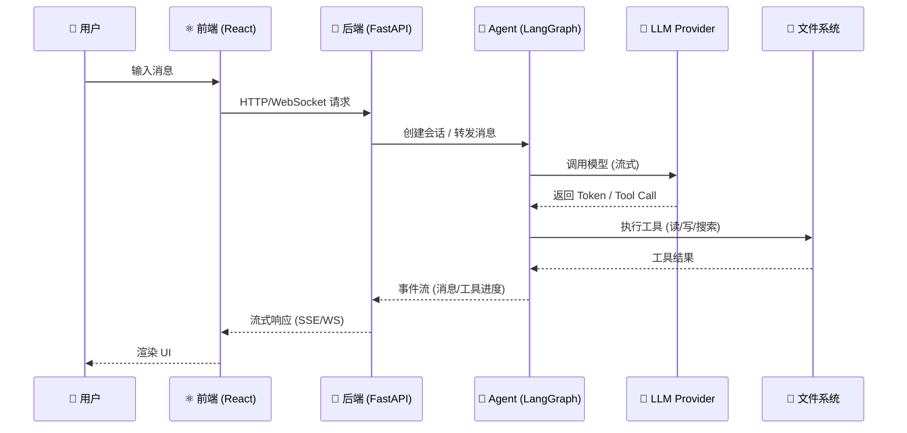

# 🏗️ Keydex 项目结构总览> 📝 **提示**：上面所有 Mermaid 图均可在支持 Mermaid 的 Markdown 预览/渲染器中图形化展示（如 VS Code、GitHub、Obsidian 等）。

> ⏱️ 最后更新：2025-07-16

> 版本：0.1.0 | 后端：Python 3.11~3.13 | 前端：React + Tauri

---

## 一、全景架构图

```mermaid
graph TB
  %% ==================== 根目录 ====================
  subgraph Root[项目根目录]
    ROOT_PKG[package.json]
    ROOT_PY[pyproject.toml]
    ROOT_MD[README.md]
    ROOT_GIT[.gitignore]
  end

  %% ==================== 后端 ====================
  subgraph Backend["🐍 Python 后端 (FastAPI + LangGraph)"]
    direction TB
    BE_ENTRY[backend/app/main.py<br/><small>FastAPI 应用入口</small>]

    BE_CORE["core/<br/><small>基础设施层</small>"]
    BE_CORE_FILES["config.py / env.py / logger.py<br/>ids.py / time.py / file_path.py<br/>middleware.py / exception_handler.py<br/>request_context.py"]

    BE_API["api/<br/><small>路由层</small>"]
    BE_API_FILES["health.py / sessions.py / settings.py<br/>models.py / model_providers.py<br/>usage.py / workspace.py / workspaces.py<br/>websocket.py / dependencies.py"]

    BE_AGENT["agent/<br/><small>Agent 编排核心</small>"]
    BE_AGENT_FILES["__init__.py / factory.py / runner.py<br/>checkpoint.py / middleware.py<br/>event_processor.py / tool_call_progress.py<br/>langchain_tools.py / system_prompt.py"]

    BE_MODEL["model/<br/><small>LLM 抽象层</small>"]
    BE_MODEL_FILES["base.py / provider_client.py<br/>e2e_transport.py"]

    BE_TOOLS["tools/<br/><small>工具系统</small>"]
    BE_TOOLS_FILES["__init__.py / base.py / factory.py<br/>registry.py / filesystem.py / search.py<br/>shell.py / patch.py / plan.py / orchestrator.py"]

    BE_STORAGE["storage/<br/><small>持久化层</small>"]
    BE_STORAGE_FILES["db.py / blobs.py / repositories.py"]

    BE_SERVICES["services/<br/><small>业务服务层</small>"]
    BE_SERVICES_FILES["chat_service.py / session_service.py<br/>chat_stream_manager.py<br/>workspace_service.py<br/>message_event_service.py / usage_service.py"]

    BE_EVENTS["events/<br/><small>事件驱动架构</small>"]
    BE_EVENTS_FILES["__init__.py / domain.py / event_types.py<br/>dispatcher.py / actions.py<br/>chat_projection.py / persistence_projection.py<br/>completed_aggregator.py"]

    BE_RUNTIME["runtime/<br/><small>运行时</small>"]
    BE_RUNTIME_FILES["bootstrap.py"]

    BE_SECURITY["security/<br/><small>安全策略</small>"]
    BE_SECURITY_FILES["workspace.py"]

    BE_PROTOCOL["protocol/<br/><small>协议定义</small>"]
    BE_PROTOCOL_EMPTY["⚙️ 空目录"]

    BE_TESTS["tests/<br/><small>测试套件</small>"]
    BE_TESTS_FILES["agent/ api/ e2e/ events/ model/<br/>protocol/ security/ services/<br/>storage/ tools/<br/>各独立测试文件"]

    BE_PKG["packaging/<br/><small>打包配置</small>"]
  end

  %% 后端连线
  BE_ENTRY --> BE_CORE
  BE_ENTRY --> BE_API
  BE_ENTRY --> BE_AGENT
  BE_ENTRY --> BE_MODEL
  BE_ENTRY --> BE_TOOLS
  BE_ENTRY --> BE_STORAGE
  BE_ENTRY --> BE_SERVICES
  BE_ENTRY --> BE_EVENTS
  BE_ENTRY --> BE_RUNTIME
  BE_ENTRY --> BE_SECURITY
  BE_ENTRY --> BE_PROTOCOL

  BE_CORE --> BE_CORE_FILES
  BE_API --> BE_API_FILES
  BE_AGENT --> BE_AGENT_FILES
  BE_MODEL --> BE_MODEL_FILES
  BE_TOOLS --> BE_TOOLS_FILES
  BE_STORAGE --> BE_STORAGE_FILES
  BE_SERVICES --> BE_SERVICES_FILES
  BE_EVENTS --> BE_EVENTS_FILES
  BE_RUNTIME --> BE_RUNTIME_FILES
  BE_SECURITY --> BE_SECURITY_FILES
  BE_PROTOCOL --> BE_PROTOCOL_EMPTY

  BE_PKG -.-> BE_ENTRY
  BE_TESTS -.-> BE_ENTRY

  %% ==================== 前端 ====================
  subgraph Frontend["⚛️ 桌面客户端 (Tauri + React + TypeScript)"]
    direction TB
    FE_ROOT[desktop/]

    FE_SRC[src/]

    FE_ENTRY[App.tsx / main.tsx / styles.css]

    FE_API["api/<br/><small>后端 API 客户端</small>"]
    FE_API_FILES["client.ts / events.ts / runtime.ts"]

    FE_FEATURES["features/<br/><small>功能模块</small>"]
    FE_FEATURES_DIRS["approvals/ chat/ composer/<br/>items/ settings/ thread-list/"]

    FE_RENDERER["renderer/<br/><small>UI 渲染层</small>"]
    FE_RENDERER_DIRS["components/ devtools/ events/<br/>hooks/ lib/ pages/<br/>preferences/ providers/<br/>stores/ styles/ utils/"]

    FE_RUNTIME["runtime/<br/><small>运行时逻辑</small>"]
    FE_RUNTIME_FILES["index.ts / agentConnection.ts / bridge.ts<br/>conversation.ts / desktopPicker.ts / errors.ts<br/>httpClient.ts / models.ts / settings.ts<br/>usage.ts / workspace.ts / workspaces.ts / wsClient.ts"]

    FE_STORES["stores/<br/><small>状态管理</small>"]
    FE_TYPES["types/<br/><small>类型定义</small>"]
    FE_TYPES_FILES["protocol.ts"]
    FE_UTILS["utils/<br/><small>工具函数</small>"]
    FE_UTILS_FILES["formatting.ts / i18n.ts"]

    FE_TAURI["src-tauri/<br/><small>Tauri Rust 壳层</small>"]
    FE_TAURI_FILES["src/lib.rs / src/main.rs<br/>Cargo.toml / build.rs / tauri.conf.json"]

    FE_CONF["配置项"]
    FE_CONF_FILES["index.html / vite.config.ts<br/>uno.config.ts / tsconfig.json<br/>package.json / playwright.config.ts"]
  end

  %% 前端连线
  FE_ROOT --> FE_SRC
  FE_SRC --> FE_ENTRY
  FE_SRC --> FE_API
  FE_SRC --> FE_FEATURES
  FE_SRC --> FE_RENDERER
  FE_SRC --> FE_RUNTIME
  FE_SRC --> FE_STORES
  FE_SRC --> FE_TYPES
  FE_SRC --> FE_UTILS
  FE_API --> FE_API_FILES
  FE_FEATURES --> FE_FEATURES_DIRS
  FE_RENDERER --> FE_RENDERER_DIRS
  FE_RUNTIME --> FE_RUNTIME_FILES
  FE_TYPES --> FE_TYPES_FILES
  FE_UTILS --> FE_UTILS_FILES
  FE_ROOT --> FE_TAURI
  FE_ROOT --> FE_CONF
  FE_TAURI --> FE_TAURI_FILES
  FE_CONF --> FE_CONF_FILES

  %% ==================== 周边 ====================
  subgraph Peripheral["🔧 辅助资源"]
    direction TB
    SCRIPTS["scripts/"]
    SCRIPTS_FILES["dev-start.ps1<br/>package-windows.ps1"]

    DOCS_LIB["docs/"]
    OWN_DOCS["own-docs/"]
    OWN_DOCS_FILES["PROJECT-STATUS.md<br/>architecture plan / dev plan<br/>development/"]

    ARTIFACTS["artifacts/"]
    ARTIFACTS_DIRS["windows/"]
  end

  SCRIPTS --> SCRIPTS_FILES
  OWN_DOCS --> OWN_DOCS_FILES
  ARTIFACTS --> ARTIFACTS_DIRS

  %% ==================== 跨域关系 ====================
  Root --> Backend
  Root --> Frontend
  Root --> Peripheral

  BE_API -.->|HTTP / WebSocket| FE_RUNTIME
```



---

## 二、技术栈速览

| 层级 | 核心选型 | 说明 |
|------|----------|------|
| 🐍 **后端语言** | Python 3.11 ~ 3.13 | 异步原生，类型注解完备 |
| 🌐 **后端框架** | FastAPI + Uvicorn | 高性能异步 Web 框架 |
| 🤖 **Agent 框架** | LangChain + LangGraph | 图状态编排，Checkpoint 持久化 |
| 📦 **数据模型** | Pydantic v2 | 序列化、校验、配置管理 |
| ⚛️ **前端框架** | React + TypeScript | 类型安全，组件化 |
| 🖥️ **桌面壳层** | Tauri (Rust) | 轻量原生桌面窗口 |
| 🎨 **UI 方案** | UnoCSS | 按需原子化 CSS |
| ⚡ **构建工具** | Vite | 极速 HMR 开发体验 |
| 🧪 **后端测试** | pytest | Fixture + asyncio 支持 |
| 🧪 **前端/E2E** | Playwright | 跨浏览器自动化测试 |
| 📐 **代码规范** | Ruff | 极速 Python 静态检查 |
| 📦 **包管理** | pnpm (前端) + pip (后端) | |

---

## 三、后端模块详解

| 模块 | 职责 | 关键文件 |
|------|------|----------|
| `core/` | **基础设施** — 配置、环境变量、日志、异常处理、ID 生成、路径解析、请求上下文 | `config.py`, `logger.py`, `exception_handler.py`, `middleware.py`, `ids.py`, `file_path.py`, `env.py`, `time.py`, `request_context.py` |
| `api/` | **API 路由层** — REST 端点 + WebSocket，供前端调用 | `health.py`, `sessions.py`, `settings.py`, `models.py`, `model_providers.py`, `usage.py`, `workspace.py`, `workspaces.py`, `websocket.py`, `dependencies.py` |
| `agent/` | **Agent 编排核心** — Agent 工厂、运行器、LangGraph 检查点、事件处理、工具调用进度追踪 | `factory.py`, `runner.py`, `checkpoint.py`, `event_processor.py`, `tool_call_progress.py`, `middleware.py`, `langchain_tools.py`, `system_prompt.py` |
| `model/` | **LLM 抽象层** — 多 Provider 客户端适配（OpenAI 兼容），端到端加密传输 | `base.py`, `provider_client.py`, `e2e_transport.py` |
| `tools/` | **工具系统** — 文件系统读写、搜索、Shell 执行、Patch 应用、Plan 管理、工具注册与编排 | `filesystem.py`, `search.py`, `shell.py`, `patch.py`, `plan.py`, `orchestrator.py`, `registry.py`, `base.py`, `factory.py` |
| `storage/` | **持久化层** — SQLite 数据库、Blob 存储、Repository 数据访问模式 | `db.py`, `blobs.py`, `repositories.py`（~60KB 核心逻辑） |
| `services/` | **业务服务层** — 聊天会话管理、流式响应、事件消息、工作区管理、用量统计 | `chat_service.py`, `session_service.py`, `chat_stream_manager.py`, `workspace_service.py`, `message_event_service.py`, `usage_service.py` |
| `events/` | **事件驱动架构** — 领域事件定义、事件调度与分发、投影读模型、聚合器 | `domain.py`, `event_types.py`, `dispatcher.py`, `actions.py`, `chat_projection.py`, `persistence_projection.py`, `completed_aggregator.py` |
| `runtime/` | **运行时引导** — 服务初始化、依赖注入、启动生命周期 | `bootstrap.py` |
| `security/` | **安全策略** — 工作区沙箱隔离、路径验证 | `workspace.py` |
| `protocol/` | **协议定义** — 预留目录 | ⚙️ 空 |

---

## 四、前端模块详解

| 模块 | 职责 | 关键内容 |
|------|------|----------|
| `api/` | **后端 API 客户端封装** | `client.ts` / `events.ts` / `runtime.ts` |
| `features/` | **业务功能模块** | `approvals/` 审批, `chat/` 聊天, `composer/` 编辑器, `items/` 项目列表, `settings/` 设置, `thread-list/` 会话列表 |
| `renderer/` | **UI 渲染层** — 组件、Hook、页面、Context Provider、Store、样式、工具 | `components/`, `hooks/`, `pages/`, `providers/`, `stores/`, `styles/`, `utils/`, `devtools/`, `events/`, `lib/`, `preferences/` |
| `runtime/` | **运行时逻辑** — Agent 连接、WebSocket、HTTP 客户端、Bridge 通信、Workspace 管理 | 13 个核心模块 |
| `stores/` | **状态管理** | 预留目录 |
| `types/` | **TypeScript 类型定义** | `protocol.ts`（~15KB 类型定义） |
| `utils/` | **工具函数** | `formatting.ts` / `i18n.ts` |
| `src-tauri/` | **Tauri Rust 壳层** — 原生窗口、系统菜单、文件对话框 | `lib.rs` / `main.rs` / `Cargo.toml` / `tauri.conf.json` |

---

## 五、数据流简图



---

## 六、目录树快照

```
keydex/
├── backend/                        # Python 后端
│   ├── app/
│   │   ├── main.py                 # FastAPI 入口
│   │   ├── core/                   # 基础设施 (11 文件)
│   │   ├── api/                    # API 路由 (12 文件)
│   │   ├── agent/                  # Agent 编排 (10 文件)
│   │   ├── model/                  # LLM 抽象 (3 文件)
│   │   ├── tools/                  # 工具系统 (11 文件)
│   │   ├── storage/                # 持久化 (3 文件)
│   │   ├── services/               # 业务服务 (6 文件)
│   │   ├── events/                 # 事件驱动 (8 文件)
│   │   ├── runtime/                # 运行时 (1 文件)
│   │   ├── security/               # 安全 (1 文件)
│   │   └── protocol/               # 协议 (空)
│   └── tests/                      # 测试套件
├── desktop/                        # 桌面客户端
│   ├── src/
│   │   ├── api/                    # API 客户端 (3 文件)
│   │   ├── features/               # 6 功能模块
│   │   ├── renderer/               # 11 子模块
│   │   ├── runtime/                # 13 核心文件
│   │   ├── stores/                 # 状态管理
│   │   ├── types/                  # 协议类型
│   │   └── utils/                  # 工具函数
│   └── src-tauri/                  # Tauri 壳层 (Rust)
├── scripts/                        # 开发脚本
├── own-docs/                       # 项目文档
├── docs/                           # 通用文档
└── artifacts/                      # 构建产物
```

---

> 📝 **提示**：上面所有 Mermaid 图均可在支持 Mermaid 的 Markdown 预览/渲染器中图形化展示（如 VS Code、GitHub、Obsidian 等）。
