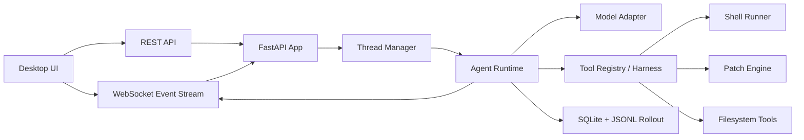

# Python Codex Clone Development Plan

> 目标：用 Python 后端和可打包为 Windows exe 的桌面前端，复刻 Codex 的核心 chat + harness 体验。保留 Codex 的线程/回合/事件/工具执行/patch/终端流式体验，裁剪复杂的自动化、云端、插件市场、多层配置、Guardian、企业管控等能力，形成团队内部本地使用的可执行开发方案。

## 1. 结论

推荐做成一个 **本地桌面应用 + Python 本地 agent server**：

- 前端：`Tauri 2 + Vue 3 + TypeScript + Vite + Pinia + TanStack Query for Vue/VueUse + Xterm.js + Monaco Editor + Naive UI`
- 后端：`Python 3.11 + FastAPI + WebSocket/SSE + Pydantic + SQLModel/SQLite + httpx + anyio`
- 打包：Tauri 打包 Windows exe，安装包内携带 Python runtime 或独立 PyInstaller 后端二进制
- 模型接口：OpenAI-compatible Chat Completions/Responses 适配层，用户可配置 `base_url`、`api_key`，模型列表从 `GET /models` 自动解析
- 核心运行时：复刻 Codex 的 `Thread -> Turn -> Item`、`Submission(Op) -> Event`、tool registry、shell/apply_patch/read_file/write_file/list_dir/search 等 harness 能力
- 第一阶段不做：MCP、插件市场、skills 自动加载、复杂 sandbox、Guardian 自动审批、云任务、realtime audio、多 agent、远程环境、复杂配置分层

这不是把 Codex Rust 源码逐行翻译成 Python，而是按当前 Codex 架构抽出最小完整闭环：



## 2. Codex 源码中的关键参考点

当前 Codex 的核心设计可以压缩成四个层次：

1. 前端入口
   - CLI 总入口在 `codex-rs/cli/src/main.rs`
   - TUI 在 `codex-rs/tui/src/lib.rs`
   - TUI 的 app-server facade 在 `codex-rs/tui/src/app_server_session.rs`
   - app-server 在 `codex-rs/app-server/src/lib.rs` 和 `codex-rs/app-server/src/message_processor.rs`

2. 外部 API 层
   - app-server v2 使用 JSON-RPC
   - 主要对象是 `Thread`、`Turn`、`ThreadItem`
   - 请求包括 `thread/start`、`turn/start`、`turn/interrupt`、`thread/read`、`thread/list`
   - 类型定义在 `codex-rs/app-server-protocol/src/protocol/v2/thread_data.rs`、`turn.rs`、`item.rs`

3. 内部运行协议
   - core 使用 `Submission { id, op }` 进入队列
   - `Op::UserInput`、`Op::Interrupt`、`Op::ExecApproval`、`Op::PatchApproval` 等定义在 `codex-rs/protocol/src/protocol.rs`
   - core 产出 `EventMsg::TurnStarted`、`AgentMessage`、`AgentReasoning`、`ExecCommandBegin/Delta/End`、`PatchApplyBegin/End`、`TokenCount` 等事件

4. agent core
   - `ThreadManager` 创建/恢复线程：`codex-rs/core/src/thread_manager.rs`
   - `Codex::spawn` 创建 session 并启动 submission loop：`codex-rs/core/src/session/mod.rs`
   - `submission_loop` 处理 `Op`：`codex-rs/core/src/session/handlers.rs`
   - 工具注册与执行：`codex-rs/core/src/tools/registry.rs`
   - 审批 + 沙箱 + 重试编排：`codex-rs/core/src/tools/orchestrator.rs`
   - shell 工具 schema：`codex-rs/core/src/tools/handlers/shell_spec.rs`

Python 版要复刻的是这些“产品结构和运行语义”，不是复刻 Rust 的全部工程复杂度。

## 3. 产品范围

### 3.1 必须复刻

核心体验：

- Chat 界面：用户输入、模型流式输出、reasoning 折叠/展开、Markdown 渲染、代码块复制
- 会话线程：创建、列表、重命名、删除、恢复历史
- 回合状态：pending/running/completed/failed/cancelled
- 工具面板：每次工具调用独立卡片，显示参数、状态、耗时、输出、错误
- 终端命令：shell 命令流式 stdout/stderr、exit code、运行时间、工作目录
- 文件变更：apply_patch 或文件写入展示 diff，支持人工确认后应用
- 模型配置：base_url、api_key、model，模型列表从接口自动拉取
- 权限模式：只实现简单三档
  - `read_only`: 只允许读文件和模型回复
  - `workspace_write`: 允许改 workspace 内文件，命令默认需确认
  - `full_access`: 命令和文件改动默认允许
- 中断：用户可 stop 当前 turn，终止模型流和正在执行的子进程
- 日志与历史：SQLite 存 metadata，JSONL 存完整 rollout/event

### 3.2 第一版裁剪

不做：

- MCP 客户端/服务端
- 插件市场、skills marketplace、自动安装
- 多 agent/subagent 协作
- Guardian 自动审批
- 复杂 sandbox：Windows restricted token、Linux bwrap、macOS seatbelt
- 远程环境/exec-server
- 企业 config requirements、cloud config、profile 分层
- OAuth/ChatGPT 登录
- Realtime audio/WebRTC
- 记忆系统、自动 compaction 的高级策略

保留扩展点，但不实现复杂能力。

## 4. 推荐技术栈

### 4.1 前端

推荐：`Tauri 2 + Vue 3 + TypeScript`

理由：

- 能打包成 Windows exe，体积比 Electron 小
- Vue 3 适合快速搭建工作台型桌面应用，模板语法和组合式 API 对复杂状态面板更直观
- Tauri 可以启动/托管本地 Python 后端进程
- TypeScript 适合维护一套严格的事件类型
- Xterm.js 可以高保真展示终端输出
- Monaco Editor 可以展示 diff、代码块、patch 预览

前端库：

- UI 基础：Naive UI，必要时配合 Tailwind CSS 做局部布局
- 状态：Pinia
- 数据请求：TanStack Query for Vue 或 VueUse
- WebSocket：原生 WebSocket 封装
- Markdown：markdown-it 或 md-editor-v3，代码高亮使用 Shiki
- 终端：xterm.js
- Diff：Monaco diff editor 或 Vue diff 组件
- 图标：lucide-vue-next
- 虚拟列表：vue-virtual-scroller 或 @tanstack/vue-virtual

### 4.2 后端

推荐：`FastAPI + Pydantic + anyio`

后端库：

- API：FastAPI
- WebSocket：FastAPI WebSocket
- 数据模型：Pydantic v2
- 数据库：SQLModel 或 SQLAlchemy 2 + SQLite
- 异步 HTTP：httpx
- 子进程：asyncio subprocess / anyio
- 文件监听：watchfiles
- JSON patch/diff：unidiff、python-patch、difflib，自研 apply_patch parser
- token 估算：tiktoken，可选
- 配置：tomlkit 或 pydantic-settings
- 日志：structlog + rich
- 打包：PyInstaller 或 Nuitka

### 4.3 打包方案

推荐路线：

1. Python 后端用 PyInstaller 打成 `agent-server.exe`
2. Tauri 前端把 `agent-server.exe` 作为 sidecar
3. Tauri 启动时：
   - 找一个本地空闲端口
   - 启动 sidecar：`agent-server.exe --host 127.0.0.1 --port <port> --data-dir <app-data>`
   - 前端连接 `http://127.0.0.1:<port>`
4. Tauri 打包产物为 `PythonCodex.exe` 或 MSI installer

开发期可以直接：

```bash
cd apps/server
uvicorn pycodex_server.main:app --reload --port 8765

cd apps/desktop
pnpm dev
```

## 5. 目标项目结构

建议新项目结构：

```text
python-codex/
  apps/
    desktop/
      src/
        main.ts
        App.vue
        router/
        stores/
        views/
        components/
        features/
          chat/
          thread-list/
          composer/
          tool-calls/
          diff-viewer/
          settings/
        lib/
        styles/
      src-tauri/
      package.json
      vite.config.ts
    server/
      pyproject.toml
      pycodex_server/
        main.py
        api/
          http.py
          websocket.py
          schemas.py
        config/
          settings.py
          model_registry.py
        runtime/
          agent_runtime.py
          thread_manager.py
          turn_runner.py
          context_builder.py
          event_bus.py
          cancellation.py
        model/
          base.py
          openai_compatible.py
          stream_parser.py
        tools/
          base.py
          registry.py
          orchestrator.py
          shell.py
          filesystem.py
          patch.py
          search.py
        storage/
          db.py
          models.py
          rollout.py
          repositories.py
        security/
          permissions.py
          approvals.py
          workspace.py
        tests/
  packages/
    protocol/
      ts/
      python/
  docs/
    DEVELOPMENT_PLAN.md
    API.md
    EVENT_PROTOCOL.md
```

如果是放在当前 Codex 仓库做方案文档，不建议把实现代码直接混进 `codex-rs`。应新建独立 repo 或当前 repo 下的 `python-codex/` 实验目录。

## 6. 核心领域模型

Python 版保留 Codex 的 `Thread -> Turn -> Item` 模型。

### 6.1 Thread

```python
class Thread(BaseModel):
    id: str
    title: str | None
    preview: str
    cwd: Path
    model_provider: str
    model: str
    created_at: int
    updated_at: int
    status: Literal["idle", "running", "waiting_approval", "failed"]
    turns: list[Turn] = []
```

### 6.2 Turn

```python
class Turn(BaseModel):
    id: str
    thread_id: str
    status: Literal["queued", "in_progress", "completed", "failed", "cancelled"]
    items: list[ThreadItem]
    started_at: int | None
    completed_at: int | None
    duration_ms: int | None
    error: TurnError | None
```

### 6.3 ThreadItem

最小 item 类型：

- `user_message`
- `assistant_message`
- `reasoning`
- `command_execution`
- `file_change`
- `tool_call`
- `approval_request`
- `error`
- `token_usage`

前端只渲染 item，不直接理解后端内部状态。

## 7. API 设计

不需要完全复刻 Codex app-server 的 JSON-RPC。团队内部产品推荐 REST + WebSocket，更简单。

### 7.1 HTTP API

```text
GET    /api/health
GET    /api/settings
PUT    /api/settings

GET    /api/models
POST   /api/models/refresh

POST   /api/threads
GET    /api/threads
GET    /api/threads/{thread_id}
PATCH  /api/threads/{thread_id}
DELETE /api/threads/{thread_id}

POST   /api/threads/{thread_id}/turns
POST   /api/threads/{thread_id}/turns/{turn_id}/interrupt

POST   /api/approvals/{approval_id}/respond

GET    /api/files/read?path=
GET    /api/files/tree?path=
```

### 7.2 WebSocket

```text
WS /api/ws
```

事件统一结构：

```json
{
  "type": "item.delta",
  "threadId": "thr_x",
  "turnId": "turn_x",
  "itemId": "item_x",
  "seq": 42,
  "payload": {}
}
```

核心事件：

```text
thread.created
thread.updated
turn.started
turn.completed
turn.failed
turn.cancelled
item.started
item.delta
item.completed
approval.requested
approval.resolved
token.updated
runtime.error
```

## 8. 模型适配层

目标是支持任意 OpenAI-compatible endpoint：

- OpenAI
- Azure OpenAI 兼容层
- vLLM
- Ollama OpenAI-compatible endpoint
- LM Studio
- LiteLLM proxy
- 内部模型网关

### 8.1 用户配置

```toml
[model]
base_url = "https://api.openai.com/v1"
api_key = "..."
model = "gpt-4.1"
api_kind = "openai_compatible" # first version only
```

### 8.2 自动模型列表

调用：

```http
GET {base_url}/models
Authorization: Bearer {api_key}
```

兼容响应：

```json
{
  "data": [
    {"id": "gpt-4.1"},
    {"id": "qwen3-coder"}
  ]
}
```

解析策略：

- 优先读取 `data[*].id`
- 如果返回数组，读取 `[*].id` 或字符串
- 如果失败，允许用户手动输入模型名
- 缓存最近成功模型列表

### 8.3 流式协议

第一版建议用 Chat Completions streaming：

```http
POST /chat/completions
{
  "model": "...",
  "messages": [...],
  "tools": [...],
  "tool_choice": "auto",
  "stream": true
}
```

必须兼容：

- content delta
- reasoning_content delta，若模型网关返回
- tool_calls delta
- finish_reason = tool_calls
- finish_reason = stop

如果 endpoint 支持 Responses API，可后续增加 `responses` adapter，不影响上层 runtime。

## 9. Agent Runtime 设计

核心类：

```python
class AgentRuntime:
    async def start_turn(self, thread_id: str, input: list[UserInput], overrides: TurnOverrides) -> Turn:
        ...

    async def interrupt_turn(self, thread_id: str, turn_id: str) -> None:
        ...
```

执行循环：

```text
1. 创建 Turn
2. 写入 UserMessage item
3. 构建 model messages + tool schemas
4. 调用模型 stream
5. 前端实时接收 assistant/reasoning delta
6. 如果模型请求 tool_calls：
   6.1 创建 tool item
   6.2 ToolOrchestrator 判断是否需要审批
   6.3 执行工具
   6.4 写入 tool result
   6.5 再次调用模型
7. 如果模型停止：
   7.1 turn completed
   7.2 持久化 rollout
```

伪代码：

```python
async def run_turn(ctx: TurnContext):
    messages = context_builder.build(ctx.thread)
    while True:
        stream = model.stream(messages, tool_schemas=tool_registry.schemas())
        assistant_msg, tool_calls = await consume_model_stream(stream, ctx)

        if assistant_msg:
            messages.append({"role": "assistant", "content": assistant_msg})

        if not tool_calls:
            await complete_turn(ctx)
            return

        messages.append({"role": "assistant", "tool_calls": tool_calls})
        for call in tool_calls:
            result = await tool_orchestrator.run(ctx, call)
            messages.append({
                "role": "tool",
                "tool_call_id": call.id,
                "content": result.model_content,
            })
```

## 10. Context Builder

Python 版的上下文构建要简单，但保留 Codex 的关键思想：有边界、有上限、可解释。

每次 turn 构建：

1. system prompt
2. developer prompt
3. environment context
4. current settings
5. bounded conversation history
6. current user message

最小 system prompt：

```text
You are an internal coding agent running locally.
You can inspect files, run shell commands, and edit files using tools.
When changing files, prefer small safe edits and explain verification.
Never modify files outside the configured workspace unless explicitly allowed.
```

environment context：

```xml
<environment_context>
cwd: D:\project
os: windows
shell: powershell
permission_mode: workspace_write
current_date: 2026-06-15
</environment_context>
```

历史截断策略：

- 最大 messages token 预算：默认 80k，可配置
- 总是保留 system/developer/environment/current user
- 最近 N 个 turn 优先
- 老 turn 压缩为 summary，第一版可先只做硬截断

## 11. Tool Harness

第一版工具清单：

| Tool | 作用 | Codex 对应 |
|---|---|---|
| `shell_command` | 执行 shell 命令，流式输出 | shell / exec_command |
| `read_file` | 读取文件 | fs/context 工具 |
| `write_file` | 写文件，生成 diff | apply_patch/file update |
| `apply_patch` | 应用 patch | apply_patch |
| `list_dir` | 列目录 | shell/FS |
| `search_text` | ripgrep 搜索 | shell/rg |
| `view_image` | 前端展示本地图片 | view_image |

### 11.1 Tool Schema

对 OpenAI-compatible tool calling：

```json
{
  "type": "function",
  "function": {
    "name": "shell_command",
    "description": "Run a shell command in the workspace.",
    "parameters": {
      "type": "object",
      "properties": {
        "command": {"type": "string"},
        "workdir": {"type": "string"},
        "timeout_ms": {"type": "integer"},
        "require_approval": {"type": "boolean"}
      },
      "required": ["command"]
    }
  }
}
```

### 11.2 Tool Runtime

```python
class ToolRuntime(Protocol):
    name: str
    schema: dict

    async def run(self, call: ToolCall, ctx: TurnContext) -> ToolResult:
        ...
```

`ToolOrchestrator` 统一处理：

- 校验参数
- 权限判断
- 是否请求用户审批
- 创建 `ThreadItem`
- 发 `item.started`
- 执行 tool
- 流式发 delta
- 发 `item.completed`
- 返回模型可见结果

### 11.3 Shell 工具

shell 执行要求：

- Windows 默认 PowerShell
- 支持指定 workdir
- stdout/stderr 合并流式输出
- 支持 timeout
- 支持 interrupt
- 输出做截断，避免模型上下文爆炸
- 前端显示：
  - command
  - cwd
  - status
  - streaming output
  - exit code
  - duration

模型可见输出格式：

```text
Exit code: 0
Wall time: 1.2 seconds
Output:
...
```

### 11.4 Patch 工具

第一版实现两种路径：

1. `write_file(path, content)`：后端生成 unified diff，需审批后写入
2. `apply_patch(patch)`：支持 Codex 风格 patch 或标准 unified diff

前端展示：

- 文件列表
- additions/deletions
- diff viewer
- accept/reject

审批模式：

- `workspace_write`: 文件变更默认需要确认
- `full_access`: 可配置为自动应用
- `read_only`: 拒绝写入

## 12. 前端体验复刻

### 12.1 主布局

```text
+---------------------------------------------------------------+
| Top Bar: model selector | cwd | permission mode | settings     |
+----------------------+----------------------------------------+
| Thread Sidebar        | Chat Timeline                          |
| - New Thread          | - User message                         |
| - Thread list         | - Assistant streaming markdown          |
| - Search              | - Reasoning collapsible                 |
|                       | - Tool cards                            |
|                       | - Patch cards                           |
|                       | - Command output terminal cards         |
|                       +----------------------------------------+
|                       | Composer: text area + attach + send     |
+----------------------+----------------------------------------+
```

### 12.2 Chat Timeline

组件：

- `ThreadView`
- `TurnView`
- `UserMessageItem`
- `AssistantMessageItem`
- `ReasoningItem`
- `ToolCallCard`
- `CommandExecutionCard`
- `FileChangeCard`
- `ApprovalPrompt`
- `TokenUsageFooter`

流式效果：

- assistant text 按 delta 追加
- reasoning 独立折叠面板
- tool call 卡片先出现 pending，执行中显示 spinner，输出增量刷新
- command 卡片里用 xterm 或 pre 区块流式追加
- patch 卡片先显示 proposed，审批后变 applied/rejected

### 12.3 Composer

功能：

- 多行输入
- Enter 发送，Shift+Enter 换行
- Stop 按钮
- 图片/文件附件第一版可选
- 输入时显示当前模型、权限、cwd

### 12.4 Settings

必须有：

- base_url
- api_key
- model selector
- refresh models
- permission mode
- workspace root
- default shell
- command timeout
- max output chars

## 13. 后端存储设计

SQLite 表：

```sql
threads(
  id text primary key,
  title text,
  preview text,
  cwd text,
  model_provider text,
  model text,
  status text,
  created_at integer,
  updated_at integer
)

turns(
  id text primary key,
  thread_id text,
  status text,
  started_at integer,
  completed_at integer,
  duration_ms integer,
  error_json text
)

items(
  id text primary key,
  thread_id text,
  turn_id text,
  type text,
  status text,
  payload_json text,
  created_at integer,
  updated_at integer,
  seq integer
)

settings(
  key text primary key,
  value_json text
)
```

JSONL rollout：

```text
data/
  threads/
    2026/
      06/
        rollout-2026-06-15T12-00-00-thr_x.jsonl
```

每行：

```json
{"type":"session_meta","thread_id":"thr_x","cwd":"...","model":"..."}
{"type":"event","event":{...}}
{"type":"item","item":{...}}
```

SQLite 用于列表和快速读取，JSONL 用于完整审计和恢复。

## 14. 权限模型

第一版不要实现 OS 级 sandbox，但要实现应用级约束。

```python
class PermissionMode(str, Enum):
    read_only = "read_only"
    workspace_write = "workspace_write"
    full_access = "full_access"
```

规则：

| 操作 | read_only | workspace_write | full_access |
|---|---|---|---|
| read workspace file | allow | allow | allow |
| read outside workspace | deny | ask | ask/allow configurable |
| write workspace file | deny | ask | allow/ask configurable |
| write outside workspace | deny | deny | ask |
| shell command | deny/ask | ask | allow/ask configurable |
| network from shell | no special control | no special control | no special control |

路径校验必须用 resolved absolute path，防止 `..`、symlink 绕过。

## 15. 开发里程碑

### Milestone 0: 项目骨架

交付：

- monorepo 初始化
- FastAPI server 可启动
- Tauri Vue app 可启动
- 前端能调用 `/api/health`
- dev 脚本一键启动

验收：

```bash
pnpm dev
uvicorn pycodex_server.main:app --reload
pytest
```

### Milestone 1: Settings + Model List

交付：

- 设置页面
- 保存 base_url/api_key/model
- `GET /api/models` 自动拉模型
- 模型选择器展示可用模型

验收：

- 配置 LM Studio/LiteLLM/OpenAI-compatible endpoint 后可拉取模型
- 拉取失败时显示错误且允许手动输入模型

### Milestone 2: Thread/Turn/Event 基础闭环

交付：

- 创建 thread
- 发送 turn
- WebSocket 推送 `turn.started`、assistant delta、`turn.completed`
- SQLite 持久化 thread/turn/item
- Thread list 恢复

验收：

- 关闭重开 app 后能看到历史线程
- 一次普通 chat 可以完整流式输出

### Milestone 3: Tool Calling Runtime

交付：

- Tool registry
- Model tool_calls parser
- shell_command 工具
- read_file/list_dir/search_text 工具
- tool card UI

验收：

- 模型可以调用 `search_text`
- 模型可以调用 `read_file`
- 模型可以调用 `shell_command`
- 前端能显示工具入参、状态、输出、耗时

### Milestone 4: Patch/File Change

交付：

- write_file 工具
- apply_patch 工具
- diff 生成
- approval prompt
- diff viewer UI

验收：

- 模型提出文件修改，前端出现 diff
- 用户 accept 后文件落盘
- 用户 reject 后模型收到 rejected 结果

### Milestone 5: Interrupt + Process Management

交付：

- stop current turn
- 终止模型 stream
- 终止 shell subprocess
- turn 状态变 cancelled

验收：

- 长命令执行中点击 stop，进程退出，UI 不再追加输出
- 模型流式输出中点击 stop，turn 结束为 cancelled

### Milestone 6: UI 高保真

交付：

- Codex 风格 timeline
- reasoning 折叠
- command terminal card
- patch card
- token usage footer
- 错误/重试状态
- responsive layout

验收：

- 典型回合包含：用户消息、reasoning、shell、patch、assistant final
- 所有 item 状态清晰可见
- 1000 行命令输出不卡顿

### Milestone 7: Windows exe 打包

交付：

- PyInstaller 后端 sidecar
- Tauri Windows exe
- 首次启动初始化 data dir
- 日志文件输出

验收：

- 干净 Windows 机器安装后可打开
- 配置 base_url/key 后能 chat
- 能执行 shell 和修改 workspace 文件

## 16. 任务拆分清单

后端任务：

- `server/main.py`: FastAPI app、CORS、本地绑定
- `api/http.py`: REST endpoints
- `api/websocket.py`: event bus subscription
- `config/settings.py`: settings load/save
- `model/openai_compatible.py`: models list + stream chat
- `runtime/thread_manager.py`: thread lifecycle
- `runtime/turn_runner.py`: agent loop
- `runtime/context_builder.py`: messages build/truncate
- `tools/registry.py`: tool registration
- `tools/orchestrator.py`: approval + execution wrapper
- `tools/shell.py`: async subprocess streaming
- `tools/filesystem.py`: read/list/write/search
- `tools/patch.py`: patch parse/apply/diff
- `storage/db.py`: SQLite init
- `storage/rollout.py`: JSONL append/replay
- `security/workspace.py`: path normalization/checks

前端任务：

- `api/client.ts`: HTTP client
- `api/events.ts`: WebSocket client
- `stores/settingsStore.ts`
- `stores/threadStore.ts`
- `features/thread-list/ThreadSidebar.vue`
- `features/chat/ThreadView.vue`
- `features/chat/TurnView.vue`
- `features/chat/items/*`
- `features/composer/Composer.vue`
- `features/tool-calls/ToolCallCard.vue`
- `features/tool-calls/CommandCard.vue`
- `features/diff-viewer/FileChangeCard.vue`
- `features/settings/SettingsDialog.vue`
- `src-tauri` sidecar launch config

## 17. 测试计划

后端单元测试：

- settings 保存/读取
- model list 响应解析
- streaming delta parser
- tool call parser
- path sandbox check
- shell timeout/interrupt
- patch apply/reject
- rollout replay

后端集成测试：

- mock OpenAI-compatible server 返回普通文本
- mock server 返回 tool call
- shell tool 完整执行
- write_file approval 后落盘
- interrupt 取消 turn

前端测试：

- settings 表单
- thread list
- streaming item reducer
- tool card 状态转换
- patch approval flow

端到端测试：

- Playwright 启动 Tauri 或 web dev app
- 配置 mock model server
- 发送 prompt
- 验证 UI 出现 assistant delta/tool card/diff card/completed

## 18. 验收场景

### 场景 A: 普通聊天

用户输入：“解释当前项目结构。”

期望：

- assistant 流式输出
- turn completed
- 历史可恢复

### 场景 B: 读文件

用户输入：“看一下 package.json，总结脚本。”

期望：

- 模型调用 `read_file`
- UI 出现 tool card
- assistant 基于文件内容回答

### 场景 C: 搜索并执行命令

用户输入：“搜索 TODO，并运行测试。”

期望：

- 模型调用 `search_text`
- 模型调用 `shell_command`
- 命令输出流式显示
- exit code 展示

### 场景 D: 修改文件

用户输入：“把 README 里的标题改成 Python Codex。”

期望：

- 模型调用 `write_file` 或 `apply_patch`
- UI 显示 diff
- 用户确认后落盘
- assistant 总结改动

### 场景 E: 中断

用户运行长命令后点击 stop。

期望：

- shell process 被终止
- turn cancelled
- UI 状态稳定

## 19. 风险和处理

### 19.1 OpenAI-compatible endpoint 差异

风险：

- 有些模型没有 tool_calls
- 有些返回 `reasoning_content`
- 有些 `/models` 格式不标准

处理：

- adapter 层隔离
- 提供手动模型名输入
- tool calling 不可用时 fallback 为文本提示模式，但标注能力受限

### 19.2 Shell 安全

风险：

- 本地命令可以破坏文件

处理：

- 默认 `workspace_write`
- shell 命令默认审批
- 路径写入强校验 workspace root
- 明确显示 command/cwd

### 19.3 上下文爆炸

风险：

- 工具输出很大，模型上下文超限

处理：

- tool result 模型可见输出截断
- UI 保存完整输出
- context builder 按 token/字符预算截断历史

### 19.4 UI 性能

风险：

- 大量 delta 或命令输出导致 Vue 渲染卡顿

处理：

- event reducer 批量 flush
- 虚拟列表
- xterm 用 append buffer 节流
- item payload 大文本不全部进入 Vue reactive state，可按 item id 存 indexed cache

## 20. 最小可运行版本定义

MVP 必须满足：

- Windows 可启动桌面 exe
- 可配置 base_url/key/model
- 可自动拉取模型列表
- 可创建/恢复 thread
- 可发送 chat 并流式显示
- 可执行 shell tool 并显示工具面板
- 可读文件、搜索文本
- 可提出文件修改、显示 diff、确认后应用
- 可中断 turn

MVP 不要求：

- MCP
- 插件/skills
- OS 级 sandbox
- 多 agent
- OAuth
- 云同步

## 21. 推荐执行顺序

1. 先做后端 runtime，不急着美化 UI
2. 用 mock model server 固定返回文本和 tool_calls，保证 agent loop 可测
3. 再做 UI event reducer，确保所有事件可视化
4. 再接真实 OpenAI-compatible endpoint
5. 最后做 Tauri sidecar 和 exe 打包

原因：这个项目真正难的是 “模型流 -> tool calls -> tool result -> 再进模型 -> 事件持久化 -> UI 同步状态”，不是 UI 皮肤。

## 22. 开发时的协议样例

### 22.1 创建 thread

请求：

```http
POST /api/threads
Content-Type: application/json

{
  "cwd": "D:\\workspace\\demo",
  "model": "qwen3-coder",
  "permissionMode": "workspace_write"
}
```

响应：

```json
{
  "id": "thr_01",
  "preview": "",
  "cwd": "D:\\workspace\\demo",
  "model": "qwen3-coder",
  "status": "idle",
  "turns": []
}
```

### 22.2 发起 turn

请求：

```http
POST /api/threads/thr_01/turns
Content-Type: application/json

{
  "input": [
    {"type": "text", "text": "搜索 TODO 并总结"}
  ]
}
```

响应：

```json
{
  "id": "turn_01",
  "threadId": "thr_01",
  "status": "in_progress",
  "items": []
}
```

### 22.3 WebSocket 事件

```json
{"type":"turn.started","threadId":"thr_01","turnId":"turn_01","seq":1,"payload":{}}
{"type":"item.started","threadId":"thr_01","turnId":"turn_01","itemId":"item_1","seq":2,"payload":{"type":"assistant_message"}}
{"type":"item.delta","threadId":"thr_01","turnId":"turn_01","itemId":"item_1","seq":3,"payload":{"text":"我先搜索"}}
{"type":"item.started","threadId":"thr_01","turnId":"turn_01","itemId":"item_2","seq":4,"payload":{"type":"command_execution","command":"rg TODO","cwd":"D:\\workspace\\demo"}}
{"type":"item.delta","threadId":"thr_01","turnId":"turn_01","itemId":"item_2","seq":5,"payload":{"output":"src/a.py: TODO: ...\n"}}
{"type":"item.completed","threadId":"thr_01","turnId":"turn_01","itemId":"item_2","seq":6,"payload":{"exitCode":0,"durationMs":221}}
{"type":"turn.completed","threadId":"thr_01","turnId":"turn_01","seq":7,"payload":{"durationMs":3120}}
```

## 23. 和 Codex 的功能映射

| Codex 概念 | Python 版实现 |
|---|---|
| `codex app-server` | FastAPI local server |
| JSON-RPC `thread/start` | `POST /api/threads` |
| JSON-RPC `turn/start` | `POST /api/threads/{id}/turns` |
| `Op::UserInput` | internal `Submission(type="user_input")` |
| `EventMsg` | WebSocket `RuntimeEvent` |
| `ThreadItem` | frontend timeline item |
| `ToolRegistry` | Python `ToolRegistry` |
| `ToolOrchestrator` | Python approval/execution wrapper |
| `ExecCommandBegin/Delta/End` | `command_execution` item events |
| `PatchApplyBegin/End` | `file_change` item events |
| rollout JSONL | `storage/rollout.py` |
| thread-store | SQLite repositories |
| ConfigBuilder | simple settings.toml |

## 24. 最终完成体判断标准

项目达到完成体时，应能证明：

- 用户拿到 exe，可以本地启动
- 首次进入能配置模型 endpoint
- 模型列表能自动刷新
- chat 流式体验完整
- 模型能读项目文件、搜索文本、执行命令、修改文件
- 工具调用过程在 UI 上可见、可追踪、可复制
- 文件修改有 diff 和确认流程
- 历史线程可恢复
- 长命令和长回复可中断
- 项目没有依赖 Codex Rust 二进制才能工作

这就是 Python 版“轻量 Codex”的完成体边界。
